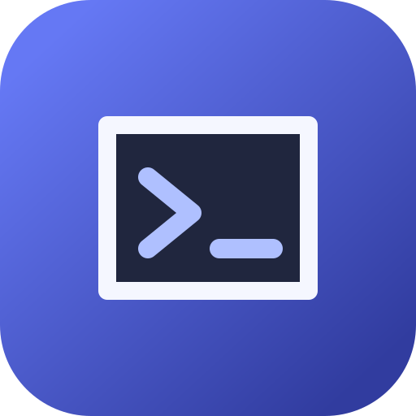
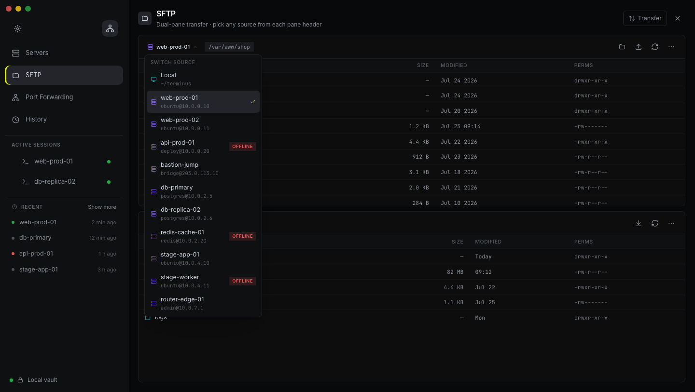

<div align="center">
  <a href="https://buzz.nex.show">
    
  </a>

  <h1>Buzz</h1>

  <p><strong>你的基础设施,一个安全的工作区。</strong></p>

  <p>
    本地终端、SSH、SFTP、端口转发,以及一个 AI shell 智能体,<br />
    集成于一个安全、开源的桌面应用之中。
  </p>

  <p>
    <a href="https://buzz.nex.show"></a>
    <a href="https://github.com/foooag/Buzz/actions/workflows/release.yml"></a>
    <a href="./LICENSE"></a>
    
  </p>

  <p>
    <a href="./README.md"><strong>English</strong></a>
    ·
    <a href="./README.zh-CN.md"><strong>简体中文</strong></a>
  </p>

  <p>
    <a href="https://buzz.nex.show"><strong>官网</strong></a>
    ·
    <a href="https://github.com/foooag/Buzz/releases"><strong>下载</strong></a>
    ·
    <a href="./CONTRIBUTING.md"><strong>贡献指南</strong></a>
  </p>
</div>

<p align="center">
  
</p>

## 本地与远程操作,统一工作区

Buzz 把日常的 shell 操作与远程基础设施收进同一个桌面工作区。凭证、known-host 主机密钥、AI 服务商密钥、资产清单字段以及 AI 历史记录在静态时保持加密,而每一条由 AI 提议的命令都会先经过 Electron 主进程中的风险闸门。

| | 能力 | 给你带来什么 |
| --- | --- | --- |
| `01` | **本地终端** | 基于 `node-pty` 与 `xterm.js` 的原生 PTY shell 会话。 |
| `02` | **远程 SSH** | 支持密码或私钥认证,以及默认拒绝(fail-closed)的主机密钥信任机制。 |
| `03` | **SFTP** | 浏览远程文件、传输数据、解决冲突,并在本地打开文件。 |
| `04` | **端口转发** | 为每台主机启停本地或远程转发规则。 |
| `05` | **AI shell 智能体** | 检视实时会话,通过 Anthropic、OpenAI、DeepSeek、智谱 GLM 或月之暗面 Kimi 接口提出操作建议。回复以流式 Markdown 渲染,代码带语法高亮。 |
| `06` | **加密保险库** | 使用 AES-256-GCM 保护敏感应用数据的静态存储。 |

## 提问。检视。执行。中间有一道闸门。

智能体可以结合实时终端的上下文工作,但它无法在未经许可的情况下静默执行任何高风险操作。

| 1 · 智能体提议 | 2 · 主进程核查 | 3 · 你始终掌握控制权 |
| --- | --- | --- |
| Buzz 为当前任务准备好确切的 shell 命令。 | Electron 主进程评估该命令及其执行上下文。 | 高风险操作需要一个短时效、一次性、与任务、会话、主机、工作目录和命令绑定的批准。在批准前,闸门会展示确切命令、智能体的通俗解释,以及确定性的风险原因。 |

## 安全,从设计开始

- **沙箱化渲染进程** —— `sandbox`、`contextIsolation` 与 `webSecurity` 保持开启;`nodeIntegration` 保持禁用。
- **类型化 IPC 边界** —— `src/renderer/app/ipc.ts` 是渲染进程唯一的桌面命令通道。Electron 核对静态白名单,并通过 Zod 校验过的领域处理器路由命令。
- **默认拒绝的主机信任** —— 未知 SSH 主机需要显式批准,而主机密钥一旦变更即中断连接。
- **静态加密** —— 资产清单字段、SSH 凭证、known-host 主机密钥、AI API 密钥与 AI 历史记录均使用 AES-256-GCM 加密。
- **密钥不进入界面** —— 加密密钥与受保护值保存在 Electron 用户数据目录中,仅所有者可访问,且绝不跨越 IPC 边界。
- **脱敏的失败信息** —— 服务商与传输层错误不会泄露凭证、私钥、原始主机密钥、提示语、已解密的保险库字段或 API 密钥。

256 位的保险库主密钥由应用管理的 AES-256-GCM 密钥保护。Buzz 不使用 macOS Keychain 或 Electron `safeStorage` 来保存该保险库。

## 安装 Buzz

从 [GitHub Releases](https://github.com/foooag/Buzz/releases) 下载打包构建,或使用 Buzz 官方下载服务提供的平台链接。

| 平台 | 安装包 | 下载 |
| --- | --- | --- |
| macOS | Universal · DMG / ZIP | [下载 macOS 版](https://hazel-beta-two.vercel.app/download/darwin) |
| Windows | x64 · NSIS 安装程序 | [下载 Windows 版](https://hazel-beta-two.vercel.app/download/win32) |
| Linux | x64 · AppImage / DEB | [下载 Linux 版](https://hazel-beta-two.vercel.app/download/linux) |

打包后的应用会在启动时自动检查更新。

### 从源码构建

你需要 [Node.js 22+](https://nodejs.org/) 和 [pnpm 10+](https://pnpm.io/)。

```bash
git clone https://github.com/foooag/Buzz.git
cd Buzz
pnpm install
pnpm dev
```

## 开发

| 命令 | 用途 |
| --- | --- |
| `pnpm dev` | 启动 electron-vite(渲染进程 HMR + 主进程/preload 重新构建)并启动桌面应用。 |
| `pnpm dev:web` | 仅启动渲染进程,地址为 `http://127.0.0.1:1420`。 |
| `pnpm typecheck` | 校验严格 TypeScript(渲染进程 + 主进程/preload),不输出文件。 |
| `pnpm test` | 运行 Vitest 单元与组件测试。 |
| `pnpm test:e2e --project=chromium` | 运行 Playwright 浏览器场景测试。 |
| `pnpm test:electron` | 运行真实 Electron 与 preload 的冒烟测试。 |
| `pnpm build` | 类型检查并通过 electron-vite 将主进程、preload 与渲染进程构建到 `out/`。 |
| `pnpm package` | 使用 electron-builder 创建各平台安装程序。 |

## 项目结构

```text
Buzz/
├── src/
│   ├── main/            Electron 主进程(index.ts)、领域模块与 IPC 分发器
│   │   └── domains/     inventory、terminal、ssh、sftp、forwarding、ai、agent
│   ├── preload/         沙箱化 preload 桥接(仅 contextBridge)
│   ├── renderer/        React 19 渲染进程、功能模块、状态存储与 xterm.js 界面
│   └── shared/          跨进程 IPC 契约(命令名称、结果类型)
├── build/               构建工具(electron-builder 钩子、开发监听器)
├── resources/           打包图标
├── tests/               Vitest 单元与组件测试(renderer/、main/)
├── e2e/                 确定性 Playwright 浏览器测试
├── e2e-electron/        真实 Electron 集成场景
└── docs/                架构、设计与发布文档
```

## 发布

推送一个语义化版本标签即可构建 macOS Universal、Windows x64 与 Linux x64 安装程序,并发布到 GitHub Releases:

```bash
git tag v0.1.0
git push origin v0.1.0
```

支持 `v0.1.0-beta.1` 这类预发布标签。发布工作流从标签推导应用版本,运行测试与构建关卡,打包每个平台,并在所有平台任务成功后才创建发布。

## 贡献

欢迎参与贡献。在提交 issue 或 pull request 之前,请先阅读 [CONTRIBUTING.md](./CONTRIBUTING.md),并确保行为变更由测试覆盖。

## 许可证

Buzz 基于 [Apache License 2.0](./LICENSE) 开源。

<div align="center">
  <sub>为 shell 而生。让你始终掌控全局。</sub>
</div>
