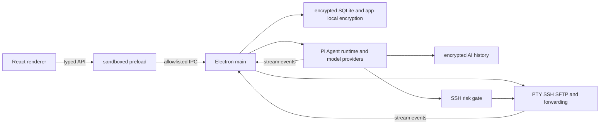

# Electron architecture

Buzz is a pure Electron desktop application. The React renderer is isolated
from operating-system access; all persistence, encryption, PTY, SSH, forwarding,
SFTP, and AI behavior runs in the Electron main process through typed domain
services.

## Security boundary

- Renderer windows use `sandbox: true`, `contextIsolation: true`,
  `nodeIntegration: false`, and `webSecurity: true`.
- `electron/preload.cjs` exposes only allowlisted command invocation, event
  streams, window controls, and updater operations.
- `electron/command-names.ts` is the main-process command allowlist. Each domain
  registers validated Zod handlers; an unregistered command fails closed.
- Sensitive inventory fields, SSH credentials, known-host keys, AI API keys,
  and AI history use AES-256-GCM envelopes bound to record-specific authenticated
  context. The 256-bit master key is protected by an app-managed AES-256-GCM
  key stored with owner-only permissions in the Electron user-data directory.
- The application does not call macOS Keychain, Electron `safeStorage`, or the
  macOS `security` command. Missing app-key material fails closed and is never
  replaced while protected data exists.
- App-local encryption prevents plaintext secrets from being stored in the
  databases and credential files. It does not protect against an attacker who
  can copy the complete Electron user-data directory, because that directory
  intentionally contains the app-managed encryption key.
- Transport and provider errors are sanitized. Credentials, raw host keys,
  private keys, and API keys do not cross IPC or enter logs.

## Lifecycle and streaming

Electron creates domain services after `app.whenReady()`. Terminal, SSH, SFTP,
and forwarding use long-lived opaque stream IDs routed only to the initiating
`webContents`. An AI prompt uses a finite stream that removes both preload and
main-process listeners as soon as the Agent run ends. Agent instances are bound
to their creating Renderer owner; destroying that Renderer closes all of its
Agents. On quit, the main process aborts Agents and waits for them to become
idle before closing model, history, SSH, SQLite, and encryption resources.

## Former Rust to Electron module map

The migration preserves behavior and data contracts, but groups files around
Electron domain ownership instead of copying the former Rust filenames one for
one.

| Former Rust responsibility | Electron implementation | Verification |
| --- | --- | --- |
| Application commands and RPC dispatcher | `electron/main.cts`, `electron/command-names.ts`, `electron/ipc/dispatcher.ts`, `electron/domains/app.ts` | command allowlist and dispatcher tests; Electron smoke test |
| AES-GCM vault crypto and app-local key protection | `electron/domains/inventory/field-cipher.ts`, `master-key.ts`, `app-encryption.ts` | envelope, tamper, context, local-key permissions, reopen, and fail-closed tests |
| Inventory database, repositories, and manager | `electron/domains/inventory/database.ts`, `repository.ts`, `service.ts`, `commands.ts` | migration, CRUD, encryption, service, and command tests |
| Local PTY and session routing | `electron/domains/terminal/runtime.ts`, `commands.ts` | runtime/command tests and real Electron terminal round trip |
| SSH profiles, credentials, known hosts, sessions, and manager | `electron/domains/ssh/runtime.ts`, `credential-vault.ts`, `known-hosts.ts`, `service.ts`, `commands.ts` | unit tests plus real in-process SSH handshake and PTY test |
| Port-forward repository and local, remote, SOCKS runtimes | `electron/domains/forwarding/repository.ts`, `runtime.ts`, `commands.ts` | repository and command/runtime tests |
| SFTP sessions, paths, transfers, conflicts, associations, and Open-With | `electron/domains/sftp/runtime.ts`, `path-safety.ts`, `local-files.ts`, `conflicts.ts`, `associations.ts`, `commands.ts` | transfer, path, association, runtime, command, component, and E2E tests |
| AI provider config, validation, and encrypted repository | `electron/domains/ai/types.ts`, `validation.ts`, `repository.ts`, `service.ts`, `commands.ts` | config validation, encrypted persistence, future-schema, and command tests |
| AI encrypted session history and eviction | `electron/domains/ai/history.ts` | encryption, CRUD, validation, and capacity tests |
| Pi Agent state, steering, compaction, tool dispatch, and automatic history | `electron/domains/ai/agent-runtime.ts` using `pi-agent-core` | prompt, tool, owner, abort, compaction, and full-transcript tests |
| Native Pi model streaming and cancellation | `electron/domains/ai/model-runtime.ts` using `pi-ai` | OpenAI-compatible probe and native stream tests |
| AI shell risk classifier and confirmations | `electron/domains/ai/risk.ts` plus `electron/domains/ssh/runtime.ts` command execution | risk, binding, single-use confirmation, timeout, output, and CWD tests |
| Desktop event channel | `electron/preload.cjs`, `electron/main.cts` | renderer IPC tests and Electron sandbox smoke test |
| Application icons | `assets/icons/` | electron-builder directory package |

## Development and verification

- `pnpm dev` starts Vite and Electron.
- `pnpm test` covers renderer behavior and Electron domain services.
- `pnpm test:e2e` covers deterministic browser workflows.
- `pnpm test:electron` launches the real Electron/preload stack and verifies
  health, encrypted inventory persistence, terminal streaming, and sandboxing.
- `pnpm build` type-checks and builds the renderer and Electron main process.
- `pnpm package` creates installers and updater metadata through
  `electron-builder`.
