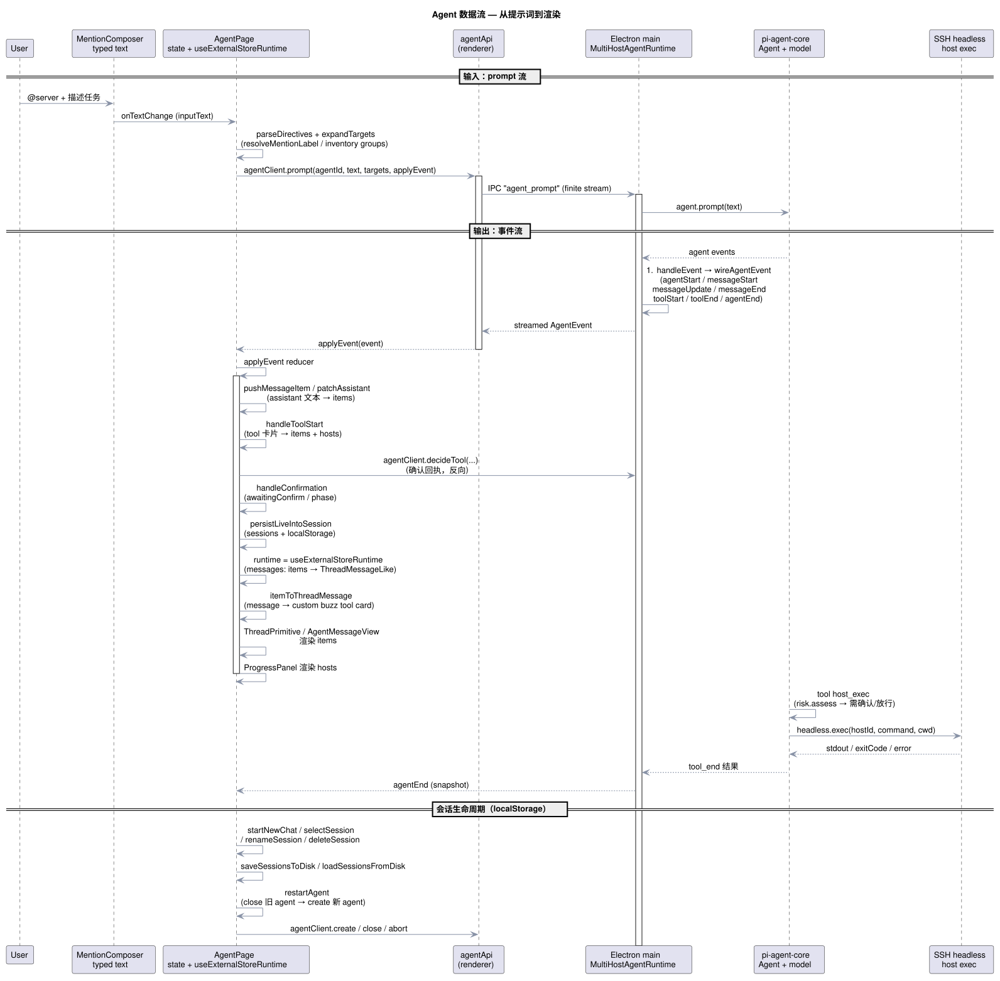
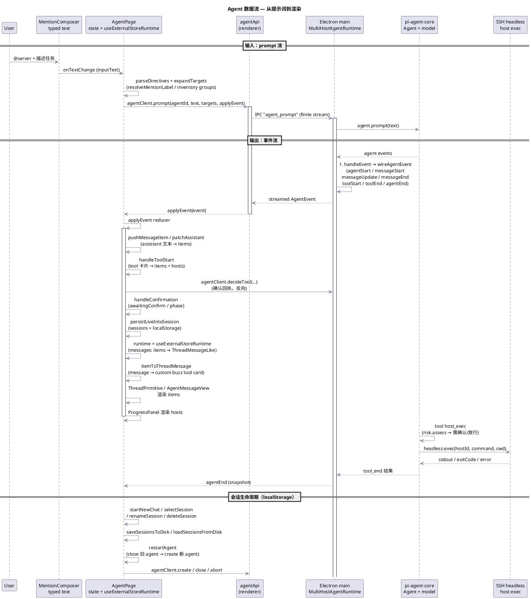

# Agent 数据交互与数据处理设计

> 范围：渲染进程的 [src/features/agent/AgentPage.tsx](../src/features/agent/AgentPage.tsx) 及其周边模块——整个 Agent 功能的**前端数据管道**。后端（Electron 主进程侧的 `MultiHostAgentRuntime`，见 [electron/domains/agent/agent-runtime.ts](../electron/domains/agent/agent-runtime.ts)）作为数据源头与执行体出现。
>
> 设计哲学：**单向数据流 + 事件驱动**。主进程以**事件流**推送实时状态，页面用一个集中式 reducer `applyEvent` 把事件翻译成三份 UI 状态（`items` 消息流、`hosts` 进度轨、运行标记），再同步到 `localStorage` 会话与 assistant-ui runtime 做渲染。状态在 renderer 侧没有第二份权威副本，`agentId` 走 ref 保证同步读写。

## 1. 全景图





## 2. 分层与模块位置

数据在四个区域间流动。下表给出每个区域负责的模块与文件位置。

| 层 | 模块（文件） | 职责 |
| --- | --- | --- |
| **输入 UI** | [composer/MentionComposer.tsx](../src/features/agent/composer/MentionComposer.tsx) | 捕获用户输入，`@` 提及补全（host/group），`onTextChange` 上抛 draft |
| **核心编排** | [AgentPage.tsx](../src/features/agent/AgentPage.tsx) | 唯一的状态拥有者：`items` / `hosts` / `phase` / `sessions` / `running`；`applyEvent` reducer 把事件翻译成 UI 状态；通过 `useExternalStoreRuntime` 接 assistant-ui |
| **IPC 客户端** | [agentApi.ts](../src/features/agent/agentApi.ts) + [app/ipc.ts](../src/app/ipc.ts) | 把 `AgentClient` 方法映射为 IPC 命令（`agent_create` / `agent_prompt` / `agent_abort` / `agent_decide_tool` / `agent_close`），`agent_prompt` 走有限事件流 |
| **类型契约** | [agentTypes.ts](../src/features/agent/agentTypes.ts) | `AgentClient` / `AgentEvent` / `AgentSnapshot` / `AgentToolConfirmation`，前后端共享的线上协议 |
| **数据模型** | [agentItems.ts](../src/features/agent/agentItems.ts) · [progressTypes.ts](../src/features/agent/progressTypes.ts) | `AgentItem`（消息/工具卡片）与 `HostProgress`（每台主机的命令进度轨） |
| **持久化** | [sessionStore.ts](../src/features/agent/sessionStore.ts) | localStorage 会话快照：`load/saveSessionsFromDisk`、`normalizeRestored*`、`summarizeTitle` |
| **辅助解析** | [directiveText.ts](../src/features/agent/directiveText.ts) | `parseDirectives` / `expandTargets` 把 `@` 提及展开成目标 hostId 列表 |
| **外部依赖** | [features/ai/aiApi.ts](../src/features/ai/aiApi.ts)（provider 列表）· [features/inventory/inventoryStore.ts](../src/features/inventory/inventoryStore.ts)（hosts/groups） | 提供模型配置与主机/分组目录 |
| **后端运行时** | [electron/domains/agent/agent-runtime.ts](../electron/domains/agent/agent-runtime.ts) | 主进程 `MultiHostAgentRuntime`：pi-agent-core 的 Agent 循环、工具注册（`host_exec` / `host_list`）、风险确认、SSH 执行 |

## 3. 两条主数据通路

### 3.1 输入通路：提示词 → 后端（Request）

从用户输入到后端执行，共五个步骤，全部在渲染进程内完成解析，后端只拿到已经展开好的 `targets`（hostId 列表）。

```
① MentionComposer 捕获文本
        │  onTextChange → setInputText
② AgentPage 解析指令
        │  parseDirectives(text, resolveMentionLabel)
        │    └─ :host[id]{name=...} / :group[id]{name=...} 显式指令
        │    └─ @label 模糊提及 → resolveMentionLabel 查 inventory
        │  expandTargets(directives, groupHosts)
        │    └─ group → 展开为组内所有 hostId（去重）
③ 组装请求
        │  targets: string[]   （已展开的 hostId 白名单）
④ 调用 agentClient.prompt(agentId, text, targets, applyEvent)
        │
⑤ agentApi → IPC "agent_prompt"（finite event stream）→ 主进程
```

关键点：

- `resolveMentionLabel`（[AgentPage.tsx:150-161](../src/features/agent/AgentPage.tsx#L150-L161)）先在 `hostsRef.current` 中按名字找 host，再在 `groups` 中找 group——**名字优先于分组**。
- `groupHosts`（[AgentPage.tsx:541-548](../src/features/agent/AgentPage.tsx#L541-L548)）从 inventory 的 group→host 关系构建，供分组展开用。
- 提交前有兜底：`sendingRef`（防重入）、`running`（忙碌中不重发）、`agentIdRef.current`（agent 未就绪时报错提示）。

### 3.2 输出通路：后端 → 渲染（Response）

后端不是一次性返回结果，而是**边执行边推事件**。这是整个设计的核心。

```
主进程 Agent 循环（pi-agent-core）
        │  依次产生
        ▼
AgentEvent（线上类型，见 agentTypes.ts）
  agentStart ──────────────→ setRunning(true) · setPhase("streaming")
  messageStart ────────────→ pushMessageItem    （新增 assistant 消息骨架）
  messageUpdate ───────────→ patchAssistant(·, true)（流式文本增量）
  messageEnd ──────────────→ patchAssistant(·, false)（定格）
  toolStart ───────────────→ handleToolStart    （新增 tool 卡片 + hosts 步骤）
  toolEnd ─────────────────→ handleToolEnd      （回填 exitCode/output/status）
  toolConfirmationRequired → handleConfirmation （挂起，等待用户决策）
  agentEnd ────────────────→ 收尾：running=false · phase=done/aborted · 持久化
  historySaveFailed ───────→ setError

                │
                ▼
每个事件经 IPC 流通道 → renderer 的 applyEvent(event)
```

`applyEvent`（[AgentPage.tsx:447-518](../src/features/agent/AgentPage.tsx#L447-L518)）就是一个 switch 型 reducer，事件进来后要么**改写状态**，要么**分发**给子处理器：

- 文本类事件 → `pushMessageItem` / `patchAssistant`，写 `items`（assistant 消息）。
- 工具类事件 → `handleToolStart` / `handleToolEnd`，**同时写两份状态**：
  - `items` 里插入/更新 `ToolCardItem`（命令卡片，渲染进消息流）；
  - `hosts` 里维护对应主机的 `HostProgress`（进度轨，渲染到右侧 ProgressPanel）。
- 确认类事件 → `handleConfirmation` 置 `awaitingConfirm`，弹出 `ConfirmCard`。
- 结束时 `agentEnd` 统一做状态收尾 + 触发会话持久化。

## 4. 会话生命周期：localStorage

`AgentSession` 是**完整会话快照**——消息、进度、草稿、阶段一次存齐，重载后能原样恢复（含命令卡片的展开态）。

| 操作 | 触发 | 关键路径 |
| --- | --- | --- |
| 自动持久化 | `items`/`hosts`/`phase` 变化（有内容时） | `persistLiveIntoSession` → `saveSessionsToDisk` |
| 新建会话 | 顶栏 `+` / HistoryDropdown | `startNewChat`：先持久化离开的会话 → 清空 live → `restartAgent` |
| 切换会话 | HistoryDropdown 点选 | `selectSession`：持久化当前 → `normalizeRestored*` 恢复目标 → `restartAgent` |
| 重命名 / 删除 | HistoryDropdown | 直接改 `sessionsRef` + `saveSessionsToDisk` |
| 启动恢复 | 页面挂载 | `loadSessionsFromDisk` + `loadActiveIdFromDisk`，`useMemo` 找 `activeId` 对应会话 |

三个值得注意的设计决策：

1. **`sessionsRef` 与 `setSessions` 双写**（[AgentPage.tsx:638-689](../src/features/agent/AgentPage.tsx#L638-L689)）。持久化走命令式 ref（同步、可靠），`setSessions` 只负责让 React 重渲染。这样「创建 vs 更新」的判断不依赖 setState 的异步 flush。
2. **`activeIdRef` 是持久化周期中的事实来源**。它与 `setActiveId` 在同一 tick 内赋值，回调读取不会滞后。
3. **恢复时做归一化**：`normalizeRestoredItems` / `normalizeRestoredHosts` / `normalizeRestoredPhase` 把 `streaming`/`running`/`awaiting-confirm` 等瞬时态一律归到稳定终态（`aborted` / `error`），避免重载后出现「卡在半空」的界面。

## 5. 与 assistant-ui runtime 的桥接

页面不直接渲染 `items`，而是把它**投影**成 assistant-ui 的 `ThreadMessageLike`：

```
items（AgentItem[]）
   │  itemToThreadMessage(item)
   ▼
ThreadMessageLike[]
   │  useExternalStoreRuntime({ messages, onNew, onCancel, ... })
   ▼
AssistantRuntimeProvider → ThreadPrimitive.Messages → AgentMessageView
```

映射规则（[AgentPage.tsx:1248-1268](../src/features/agent/AgentPage.tsx#L1248-L1268)）：

- `user` 项 → `{ role: "user", content: text }`。
- `assistant` 项 → `content: [{ type: "text", text }]`，`streaming` 时 `status: { type: "running" }`，结束为 `{ type: "complete" }`。
- `tool` 项 → 空 content + `metadata.custom.buzz = { kind: "tool", card: item }`。渲染层在 `AgentMessageView`（[AgentPage.tsx:1027-1076](../src/features/agent/AgentPage.tsx#L1027-L1076)）里识别这个自定义元数据，转成 `AgentCommandCard` 渲染命令卡片。

runtime 的 `onNew` 回调即发送入口——assistant-ui 捕获用户发送后回调 `runPrompt`，形成闭环。`onCancel` 回调 `handleAbort`。

## 6. 确认（高风险命令）环路

命令是否「高风险」由后端决定，确认状态机如下：

```
CORE 执行 host_exec
  │  risk.assess(command) → verdict
  ├─ "allow"         → 直接执行
  ├─ "reject"        → 抛错，toolEnd(isError=true)
  └─ "needsConfirmation" → toolConfirmationRequired
        │  后端挂起该 tool（TTL 60s），不继续
        ▼
PAGE  handleConfirmation → ConfirmCard 弹出
        │  用户可编辑命令
        ▼
PAGE  resolveConfirmation("run"|"cancel", command?)
        │  agentClient.decideTool(agentId, confirmationId, approved, command)
        ▼
MAIN  entry.pending.settle({ approved, command })
        │  若编辑过命令 → 后端重新风险评估 → 重新放行/拒绝
        ▼
CORE  继续执行 → toolEnd
```

- 后端 `#confirm` 持有 `PendingConfirmation` 的 settle 句柄，**超时（60s）或 abort 均视为拒绝**。
- 前端在 `resolveConfirmation` 里同步回填编辑后的命令（`items` 与 `hosts` 两处都改），与后端最终执行保持一致。

## 7. 渲染层

| 视图 | 状态源 | 组件 |
| --- | --- | --- |
| 消息流 | `items` → runtime → `ThreadPrimitive.Messages` | `AgentMessageView` → `AgentCommandCard` / 普通消息 |
| 右侧进度轨 | `hosts` | `ProgressPanel` → `HostProgressCard` |
| 历史下拉 | `sessions` | `HistoryDropdown` |
| 确认弹窗 | `confirmation` | `ConfirmCard` |
| 凭据缺失横幅 | `credentialHostIds`（从 items 推导） | `HostErrorBanner` |

注意：`credentialHostIds` 不是独立状态，而是**从 `items` 派生**（凡是 `tool` 卡片且 `status === "credential-missing"` 的 host），用 `useMemo` 缓存。这符合「单一权威副本」原则——派生数据永远不该单独存 state。

## 8. 设计要点小结

1. **单向 + 事件驱动**：主进程推事件，页面一个 reducer 消化，无双向绑定、无重复状态源。
2. **一份数据、多份投影**：`items` 同时投影给 assistant-ui runtime、Credential 横幅派生、持久化快照；`hosts` 投影给进度轨与持久化。
3. **ref 与 state 双轨**：`agentIdRef` / `sessionsRef` / `activeIdRef` 保证同步命令式访问，state 只负责渲染。这是「回调永远读到最新值」的关键。
4. **后端是安全边界**：允许的 host 白名单、命令风险评估、确认超时都在主进程强制，前端只做展示与转发。
5. **localStorage 会话即「可恢复的 UI 快照」**：重载后还原的不只是对话文本，而是完整视觉状态。

## 9. 相关文件索引

- 渲染核心：[src/features/agent/AgentPage.tsx](../src/features/agent/AgentPage.tsx)
- IPC 客户端：[src/features/agent/agentApi.ts](../src/features/agent/agentApi.ts) · [src/app/ipc.ts](../src/app/ipc.ts)
- 类型契约：[src/features/agent/agentTypes.ts](../src/features/agent/agentTypes.ts)
- 数据模型：[src/features/agent/agentItems.ts](../src/features/agent/agentItems.ts) · [src/features/agent/progressTypes.ts](../src/features/agent/progressTypes.ts)
- 持久化：[src/features/agent/sessionStore.ts](../src/features/agent/sessionStore.ts)
- 指令解析：[src/features/agent/directiveText.ts](../src/features/agent/directiveText.ts)
- 输入 UI：[src/features/agent/composer/MentionComposer.tsx](../src/features/agent/composer/MentionComposer.tsx) · [mentionAdapter.ts](../src/features/agent/composer/mentionAdapter.ts)
- 视图：[ConfirmCard.tsx](../src/features/agent/ConfirmCard.tsx) · [ProgressPanel.tsx](../src/features/agent/ProgressPanel.tsx) · [HistoryDropdown.tsx](../src/features/agent/HistoryDropdown.tsx) · [HostErrorBanner.tsx](../src/features/agent/HostErrorBanner.tsx)
- 后端运行时：[electron/domains/agent/agent-runtime.ts](../electron/domains/agent/agent-runtime.ts) · [commands.ts](../electron/domains/agent/commands.ts)
