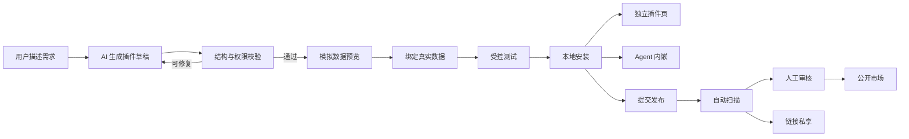
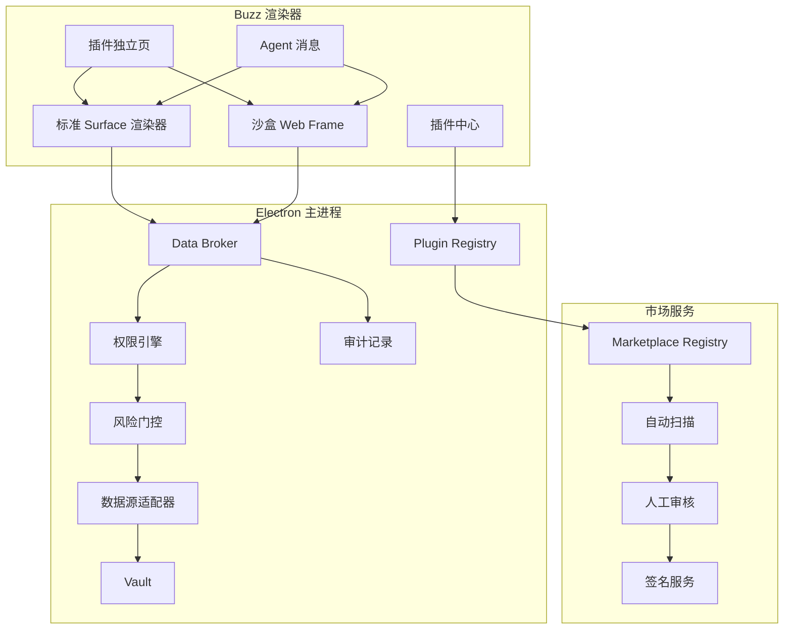
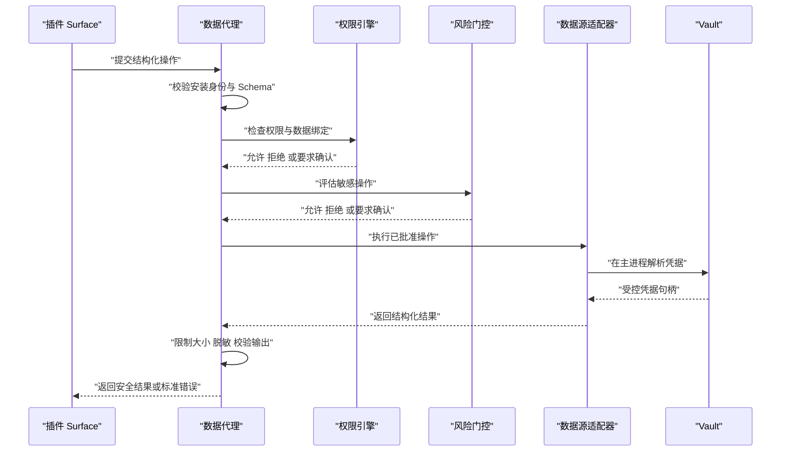

# 产品需求文档：AI 插件系统

- **文档版本**：v1.0
- **日期**：2026-08-14
- **状态**：待评审
- **目标版本**：MVP → Beta
- **目标读者**：产品、设计、安全、桌面端、Agent、平台与市场服务团队

---

## 1. 执行摘要

Buzz 将新增一个以 AI 为创作入口的插件系统。用户只需描述想要的数据工具或操作面板，AI 即可生成可预览、可测试、可安装、可分享的插件。

本产品对插件的核心定义是：

> **插件是数据源契约与 UI 的合集。**

数据源负责声明插件要读取或修改什么；UI 负责把数据组织成页面、卡片、表格、表单、图表和操作入口。插件不携带用户凭据，也不直接访问 Electron、Node.js、Vault 或 Buzz 内部状态。所有数据访问都经过 Buzz 主进程中的 Data Broker，由统一的权限、风险确认、脱敏和审计策略控制。

用户可通过以下方式使用插件：

1. 在独立插件页中长期使用，例如服务器健康看板、发布控制台或告警汇总；
2. 在 Agent 对话中以内嵌卡片使用，例如让 Agent 临时生成巡检结果面板，再将其保存为插件；
3. 从官方市场、本地插件包或私享链接安装其他用户发布的插件。

首版支持 Buzz 内置数据能力与受控 HTTP 数据源；支持读写操作，但采用安装授权与敏感动作运行时确认。AI 默认组合 Buzz 标准组件，只有标准组件无法满足需求时，才生成运行于沙盒 Web Frame 的自定义 UI。

---

## 2. 背景与机会

### 2.1 当前基础

Buzz 已具备建设插件系统所需的关键基础：

- Electron 主进程集中持有 Vault、SSH 凭据、Host Key 与 AI Provider Secret；
- 多主机 Agent 已支持结构化工具调用、流式事件和风险确认；
- assistant-ui 已用于 Agent 消息、工具卡与流式状态展示；
- IPC 使用静态命令白名单与 Zod 校验，渲染器保持沙盒、上下文隔离且无 Node 集成；
- SSH、SFTP、Inventory 与 HTTP 类能力可以收敛为可授权的数据能力。

当前 Agent 的工具由核心代码静态注册，用户无法把一次成功的 AI 交互沉淀为可复用产品，也无法安全地共享自己的数据面板和操作体验。

### 2.2 用户问题

1. **一次性结果无法复用**：Agent 可以完成任务，但相同需求下次仍需重新描述和等待生成。
2. **定制 UI 成本过高**：用户可能懂运维目标，却不具备 React、Electron 或插件安全知识。
3. **数据接入与界面强耦合**：传统插件通常要求开发者同时编写连接器、UI、权限和打包代码。
4. **社区经验难以传播**：优秀的巡检、分析和操作流程无法以安全、可安装的形式共享。
5. **生成代码风险过高**：直接执行 AI 生成的 React 或 Node.js 代码会扩大凭据泄露、供应链攻击和宿主逃逸风险。

### 2.3 产品机会

将 AI 生成能力、声明式 UI、受控数据源和插件市场组合起来，可以让非开发者创建有真实数据和操作能力的 Mini App，同时保持 Buzz “Secrets stay local, risky actions stay gated” 的安全定位。

---

## 3. 产品目标与非目标

### 3.1 产品目标

| 编号 | 目标 | 成功定义 |
| --- | --- | --- |
| G1 | 自然语言创建插件 | 普通用户不写代码即可完成生成、预览、测试和安装 |
| G2 | 数据与 UI 解耦 | 同一插件可由不同用户绑定各自的数据源和凭据 |
| G3 | 安全执行读写操作 | 所有数据访问经过权限判断，敏感动作继续使用 Buzz 风险门控 |
| G4 | 支持个性化 UI | 优先使用标准组件，必要时允许沙盒自定义组件 |
| G5 | 建立分享闭环 | 支持官方市场、本地导入、公开发布和链接私享 |
| G6 | 可持续演进 | 插件注册可逆、接口版本化、更新可审计，避免核心代码堆积分支 |

### 3.2 非目标

首版明确不做：

- 允许插件加载任意 Electron 主进程或 Node.js 代码；
- 插件直接读取 Vault、SSH 私钥、密码、API Key 或 AI Provider Secret；
- 插件直接调用未经允许的 IPC 命令；
- 数据库、MCP、自定义 OAuth Provider 或插件自带后端连接器；
- 组织私有市场、管理员策略中心和企业分发；
- 插件付费、订阅、创作者分成或广告；
- 自动执行没有用户授权的后台任务；
- 保证首版与完整 A2UI wire protocol 双向兼容。

---

## 4. 设计原则与外部思想吸收

### 4.1 UI 是数据，不是任意代码

assistant-ui Generative UI 允许 Agent 生成 JSON 组件树，再由客户端通过组件白名单解析。Buzz 采用这一基本边界，但增加逐组件 props schema、URL 校验、长度限制和动作权限校验，因为组件白名单本身不能约束传入属性。

来源：[assistant-ui Generative UI](https://www.assistant-ui.com/docs/tools/generative-ui)

### 4.2 Catalog、Surface 与增量更新

借鉴 A2UI 的以下思想：

- Catalog 定义 Agent 可以使用的组件及其属性契约；
- Surface 表示可独立创建、更新和销毁的一块 UI；
- UI 结构与数据模型分离；
- 使用稳定组件 ID 和增量更新实现流式渲染；
- 客户端负责把抽象组件映射为本地实现；
- 自定义组件通过 Smart Wrapper 和信任梯度进入受控运行环境。

由于 A2UI 仍在演进，Buzz 首版定义稳定的 `buzz.ui/v1` 中间表示，并保留未来协议适配层，而不直接把外部协议作为本地持久化格式。

来源：[A2UI 项目](https://github.com/a2ui-project/a2ui)、[A2UI Protocol](https://github.com/a2ui-project/a2ui/blob/main/specification/v0_8/docs/a2ui_protocol.md)

### 4.3 Everything is a Plugin，但安全核心不是插件

借鉴 DeepSeek Harness 的 capability seam、作用域注册和可逆 effect：插件把能力挂载到明确的 Registry，禁用或卸载时自动撤销注册；工具、展示和数据能力通过接口组合，而不是修改 Agent loop。

Buzz 不照搬“所有核心都是插件”。Vault、风险策略、签名验证、Data Broker 和 IPC 边界属于可信计算基座，第三方插件只能消费这些能力，不能替换或削弱它们。

来源：[DeepSeek Harness README](https://github.com/deepseek-ai/deepseek-harness/blob/master/README.md)、[DeepSeek Harness Architecture](https://github.com/deepseek-ai/deepseek-harness/blob/master/docs/architecture.md)、[DeepSeek Harness Tools](https://github.com/deepseek-ai/deepseek-harness/blob/master/docs/subsystems/tools.md)

### 4.4 权限只能被收紧

插件层、用户授权层、数据源层和运行时风险策略共同决定一次操作能否执行。后置策略可以追加拒绝或确认，但不能推翻前一层的拒绝。审计 UI 中展示的参数必须与实际执行参数一致。

---

## 5. 用户角色与核心场景

### 5.1 用户角色

| 角色 | 主要目标 |
| --- | --- |
| 插件使用者 | 快速安装可信插件并绑定自己的数据，不关心实现代码 |
| AI 创作者 | 通过自然语言生成、调整和发布插件，不要求前端开发能力 |
| 高级创作者 | 查看源码、调试 schema、自定义沙盒组件并分析兼容性 |
| 市场审核员 | 判断插件是否安全、是否如实声明权限、是否具有可用价值 |
| Buzz 维护者 | 维护 Catalog、Data Broker、权限系统、兼容性和撤回机制 |

### 5.2 核心场景

#### 场景 A：服务器健康看板

用户输入：“做一个 Production 分组健康看板，显示 CPU、内存、磁盘和异常服务，可手动刷新。”AI 生成插件，使用 Inventory 和 SSH 数据源，用户在模拟数据中预览后绑定 Production 分组并安装。

#### 场景 B：带风险确认的操作台

用户输入：“为 staging 做一个 nginx 操作台，可以检查配置、reload 和查看最近错误日志。”查看日志为已授权读操作；reload 命中远程命令策略，在执行前显示准确命令、目标主机和影响并要求确认。

#### 场景 C：HTTP 服务控制台

用户提供 API 文档或描述接口。插件声明允许访问的 HTTPS 域名、方法、路径模板和响应 schema。用户安装时绑定 API Key，Key 保存到 Vault，插件只能获得经过 schema 校验的响应。

#### 场景 D：Agent 结果沉淀为插件

Agent 在对话中生成一次多主机巡检卡片。用户选择“保存为插件”，进入插件工作台补齐名称、数据绑定和权限，再完成测试与安装。

#### 场景 E：社区分享

创作者提交公开版本。平台完成自动扫描、可复现构建与人工审核后上架。其他用户安装时绑定自己的数据源，发布者不会接触安装者的凭据或数据。

#### 场景 F：链接私享

创作者通过不可搜索的链接分享测试版。私享版本仍需完成自动扫描，但不进入公开搜索和排行榜，也不要求公开市场人工审核后才能分享。

---

## 6. 端到端产品流程



### 6.1 创建

1. 用户描述目标、数据来源和期望交互；
2. AI 先生成插件 Definition，不连接真实数据；
3. 系统进行 schema、组件、权限、域名和包结构校验；
4. 对结构性错误最多执行有限轮自动修复；无法修复时展示明确错误，不生成半安装状态；
5. 用户可继续自然语言修改名称、布局、字段、动作和视觉风格。

### 6.2 模拟预览

- 根据数据源输出 schema 生成确定性的模拟数据；
- 预览阶段不读取 Vault、不发起 SSH、不访问网络；
- 展示桌面页和 Agent 内嵌两种尺寸；
- 自定义组件在与正式运行相同的沙盒策略中加载；
- 预览面板显示权限摘要、数据流向和潜在风险。

### 6.3 真实数据测试

- 用户显式绑定 Inventory、主机、分组、SFTP 路径或 HTTP Connection；
- 默认只允许执行被标记为测试安全的读操作；
- 写操作测试必须逐次确认，不提供“全部自动批准”；
- 测试结果显示请求、脱敏响应、耗时、错误与 schema 匹配情况。

### 6.4 安装

- 展示发布者、来源、签名、版本、数据源、网络域名和权限；
- 用户逐项绑定数据源并授权；
- 安装完成后创建 `PluginInstallation`，但不复制用户凭据到插件目录；
- 插件默认出现在插件中心，用户可选择固定到主导航。

### 6.5 发布

- 发布包必须包含 manifest、Definition、源码、构建产物、锁文件、SBOM 和内容哈希；
- 公开发布先自动扫描，再进入人工审核；
- 链接私享完成自动扫描即可生成不可搜索链接；
- 每个已发布版本不可原地修改，只能发布新版本或撤回旧版本。

### 6.6 更新与卸载

- 不增加权限、域名、CSP 能力且 API 兼容的补丁版本可自动更新；
- 新增权限、数据源、域名、自定义组件或放宽 CSP 时暂停更新并要求重新授权；
- 主版本不自动更新；
- 禁用或卸载时撤销 Surface、路由、Agent 展示和事件订阅；
- 删除插件安装状态，但不删除用户拥有或被其他插件复用的 Connection 与凭据。

---

## 7. 功能需求

### 7.1 创作与预览

| 编号 | 需求 | 优先级 |
| --- | --- | --- |
| F1 | 用户通过自然语言创建和迭代插件草稿 | P0 |
| F2 | AI 输出必须经过确定性 schema 校验和有限轮自动修复 | P0 |
| F3 | 使用模拟数据预览，禁止访问真实数据源 | P0 |
| F4 | 支持独立页与 Agent 卡片两种预览尺寸 | P0 |
| F5 | 允许高级用户查看 Definition、源码、构建日志和权限差异 | P1 |
| F6 | 支持从 Agent 当前 Surface 保存为插件草稿 | P1 |

### 7.2 数据源与动作

| 编号 | 需求 | 优先级 |
| --- | --- | --- |
| F7 | 支持 Inventory、SSH、SFTP 和受控 HTTP 数据源 | P0 |
| F8 | 数据源输入与输出使用受支持的 JSON Schema 子集 | P0 |
| F9 | 插件通过 Data Broker 访问数据，不能直接调用内部 IPC | P0 |
| F10 | 支持查询、刷新、筛选、提交表单和受控写操作 | P0 |
| F11 | 敏感操作复用现有风险确认与一次性授权 | P0 |
| F12 | 支持取消、超时、速率限制、响应大小限制和错误标准化 | P0 |
| F13 | HTTP 数据源支持域名、协议、方法和路径范围声明 | P0 |

### 7.3 UI Runtime

| 编号 | 需求 | 优先级 |
| --- | --- | --- |
| F14 | 提供版本化 Buzz 标准组件 Catalog | P0 |
| F15 | 支持 Surface 创建、数据 patch、结构 patch 和销毁 | P0 |
| F16 | 每个标准组件都必须具有 props schema 与安全适配器 | P0 |
| F17 | 支持按需生成沙盒自定义组件 | P1 |
| F18 | 自定义组件只能通过版本化消息桥调用 Data Broker | P0 |
| F19 | 单个自定义组件崩溃不得影响宿主和其他插件 | P0 |
| F20 | 插件主题跟随 Buzz 主题 token，同时限制任意全局样式 | P1 |

### 7.4 安装与市场

| 编号 | 需求 | 优先级 |
| --- | --- | --- |
| F21 | 支持本地 `.buzzplugin` 文件导入 | P0 |
| F22 | 支持官方市场搜索、详情、安装、更新和评价入口 | P1 |
| F23 | 支持公开发布和链接私享 | P1 |
| F24 | 公开发布采用自动扫描与人工审核 | P1 |
| F25 | 插件来源、签名、权限与审核状态对用户可见 | P0 |
| F26 | 支持版本撤回、恶意版本禁用和安全公告 | P1 |

---

## 8. 非功能需求

| 编号 | 类别 | 要求 |
| --- | --- | --- |
| N1 | 安全 | 凭据与 Secret 永不进入插件包、插件 frame、日志或市场服务 |
| N2 | 隔离 | 自定义 UI 无 Node、Electron、父页面 DOM 与任意网络访问 |
| N3 | 可靠性 | 插件错误隔离，单插件失败不影响 Buzz 核心功能 |
| N4 | 性能 | Surface 增量更新，不因单字段变化重建整个插件页 |
| N5 | 可审计 | 授权、敏感操作、版本变化和撤回具备非敏感审计记录 |
| N6 | 兼容性 | 插件 API、Catalog、消息桥和包格式均显式版本化 |
| N7 | 可撤销 | 插件的路由、Surface、事件和 Agent 注册必须可逆 |
| N8 | 可测试 | Data Broker、权限、schema、沙盒、市场包和升级路径可确定性测试 |
| N9 | 可访问性 | 标准 Catalog 满足键盘操作、语义标签和可读错误提示 |
| N10 | 跨平台 | macOS、Windows 和 Linux 使用一致的插件契约与权限语义 |

---

## 9. 产品架构



### 9.1 可信计算基座

以下模块由 Buzz 核心维护，第三方插件不可替换：

- Plugin Registry；
- 包校验与签名验证；
- Data Broker；
- Permission Engine；
- 风险门控；
- Vault 与 Connection Repository；
- 沙盒 frame 创建策略与消息桥；
- 审计与恶意版本撤回机制。

### 9.2 Plugin Registry

职责：

- 发现本地与市场插件；
- 校验包结构、版本、签名、哈希和兼容范围；
- 安装、启用、禁用、更新与卸载；
- 为每个安装实例创建隔离作用域；
- 注册或撤销 Surface、路由、Agent 展示能力和数据绑定；
- 维护健康状态、崩溃次数和隔离熔断状态。

插件启用产生的所有注册必须返回 disposer。禁用或卸载按注册逆序执行 disposer，即使其中一个撤销失败，也要继续撤销其他注册并记录错误。

### 9.3 Data Broker

Data Broker 是插件访问数据和执行动作的唯一入口。它不向 UI 暴露底层对象、凭据或任意 IPC 能力。



### 9.4 数据源适配器

首版适配器：

| Kind | 允许能力 | 关键限制 |
| --- | --- | --- |
| `buzz.inventory` | 查询 Vault、分组、主机的非敏感视图 | 不返回 credentialRef 的可利用细节或任何 Secret |
| `buzz.ssh` | 在明确主机范围内执行非交互命令 | 复用 Host Key、超时、目标限制和 Shell 风险门控 |
| `buzz.sftp` | 列目录、读写、上传、下载、重命名、删除 | 路径范围与写操作权限分离，危险动作确认 |
| `http` | 调用预声明 HTTPS API | 域名、方法、路径、重定向、超时、大小与响应 schema 限制 |

适配器分为 Service Definition、Service Provider 和 Consumer 三层。插件只能引用稳定的 Service Definition；具体 Provider 由 Buzz 核心实现和升级。

### 9.5 Agent 集成

- Agent 可查询已安装插件及可用 Surface；
- Agent 可在消息中渲染 `plugin-surface` part；
- Agent 可把当前生成的 Surface 保存为插件草稿；
- Agent 触发插件 Action 时与用户点击使用同一 Data Broker；
- 插件 Action 不直接成为无范围的全局模型工具，只在当前安装、当前 Surface 和已绑定数据源作用域内可见；
- Agent 不能替用户批准安装权限或敏感运行时确认。

---

## 10. 插件包与公共契约

### 10.1 包结构

```text
example.buzzplugin
├── manifest.json
├── definition.json
├── source/
│   └── custom-ui/
├── dist/
│   └── custom-ui/
├── package-lock.json
├── sbom.json
├── build.json
└── checksums.json
```

无自定义 UI 的插件可以省略 `source/`、`dist/` 和前端锁文件，但仍必须包含 manifest、Definition 和校验文件。

### 10.2 Manifest

```ts
interface PluginManifest {
  apiVersion: "buzz.plugin/v1";
  id: `${string}/${string}`;
  version: string;
  name: string;
  description: string;
  publisher: {
    id: string;
    name: string;
  };
  compatibility: {
    buzz: string;
    catalogs: string[];
  };
  entrySurfaces: string[];
  dataSources: DataSourceDefinition[];
  permissions: PluginPermission[];
  customUi?: CustomUiBundle;
}
```

约束：

- `id` 由不可变 publisher slug 与 plugin slug 组成；
- `version` 使用 SemVer；
- 已发布版本的 manifest 与内容不可变；
- `compatibility` 必须声明 Buzz 版本和 Catalog 版本范围；
- manifest 不允许嵌入凭据、用户数据或环境相关绝对路径。

### 10.3 数据源与操作

```ts
interface DataSourceDefinition {
  id: string;
  kind: "buzz.inventory" | "buzz.ssh" | "buzz.sftp" | "http";
  title: string;
  bindingSchema: JsonSchema;
  operations: DataOperation[];
}

interface DataOperation {
  id: string;
  mode: "query" | "action";
  inputSchema: JsonSchema;
  outputSchema: JsonSchema;
  permission: string;
  timeoutMs?: number;
  cache?: {
    strategy: "none" | "memory";
    ttlMs?: number;
  };
}
```

### 10.4 Surface

```ts
interface PluginSurface {
  id: string;
  catalogId: string;
  rootId: string;
  components: PluginComponentNode[];
  initialState?: Record<string, JsonValue>;
  actions?: PluginAction[];
}

interface PluginComponentNode {
  id: string;
  component: string;
  props?: Record<string, JsonValue>;
  children?: string[];
  bindings?: Record<string, StateBinding>;
}

interface PluginAction {
  id: string;
  dataSourceId: string;
  operationId: string;
  input: Record<string, JsonValue | StateBinding>;
  confirmation: "none" | "permission" | "runtime-risk";
}
```

### 10.5 Installation

```ts
interface PluginInstallation {
  installationId: string;
  pluginId: string;
  version: string;
  source: "marketplace" | "private-link" | "local";
  enabled: boolean;
  bindings: Record<string, string>;
  grants: PermissionGrant[];
  pinnedSurfaces: string[];
  updatePolicy: "manual" | "safe-patches";
  installedAt: string;
  updatedAt: string;
}
```

`bindings` 只保存 Connection 或 Host Scope 的不透明 ID。凭据仍由 Vault 管理，不写入安装记录。

### 10.6 沙盒消息桥

```ts
type PluginBridgeRequest =
  | { type: "surface.ready"; requestId: string }
  | { type: "data.invoke"; requestId: string; actionId: string; input: JsonValue }
  | { type: "surface.resize"; requestId: string; height: number };

type PluginBridgeResponse =
  | { type: "bridge.ready"; requestId: string; capabilities: string[] }
  | { type: "data.result"; requestId: string; result: JsonValue }
  | { type: "data.error"; requestId: string; error: PluginPublicError };
```

桥接要求：

- 发送方 origin、installationId、surfaceId、requestId 必须匹配；
- payload 必须可损失无关地序列化为 JSON，并在边界验证；
- frame 不得指定任意 Data Broker operation，只能引用当前 Definition 中已注册 Action；
- 宿主忽略未知消息类型并记录非敏感诊断；
- frame 销毁后，所有未完成请求必须取消。

---

## 11. 标准组件 Catalog

### 11.1 MVP 组件类别

| 类别 | 组件示例 |
| --- | --- |
| 布局 | Page、Section、Stack、Grid、Tabs、Divider |
| 展示 | Text、Badge、Metric、Progress、EmptyState、Alert |
| 数据 | Table、KeyValue、List、LogViewer、CodeBlock |
| 表单 | Input、Select、Checkbox、RadioGroup、Textarea、Form |
| 图表 | LineChart、BarChart、AreaChart、PieChart |
| 动作 | Button、RefreshButton、ConfirmAction |
| 运维 | HostStatus、CommandResult、TransferProgress、RiskSummary |

### 11.2 Catalog 安全要求

每个组件必须：

- 定义严格 props schema，默认 `additionalProperties: false`；
- 限制文本、数组、嵌套深度和渲染数量；
- 不透传 `dangerouslySetInnerHTML`、事件代码或动态组件名；
- 对 `href`、`src` 和颜色等敏感属性使用安全适配器；
- 不允许 `javascript:`、`data:text/html` 或未授权远程资源；
- 将用户动作转换为已注册 Action ID，而不是直接执行回调；
- 提供键盘、焦点、加载、空状态和错误状态。

---

## 12. 自定义 UI 沙盒

### 12.1 使用条件

AI 只有在标准 Catalog 无法表达明确需求时，才建议生成自定义组件。生成前向用户说明原因和新增风险面。

适用例子：

- 特殊拓扑图；
- 复杂时间轴；
- 标准图表无法表达的交互式可视化；
- 需要高密度定制布局的监控组件。

不适用例子：普通表单、数据表、指标卡、按钮和日志列表。

### 12.2 运行策略

- 使用独立沙盒 Web Frame 和隔离 origin；
- `sandbox` 不授予同源提升、弹窗、下载、顶层导航或表单外发；
- CSP 默认 `default-src 'none'`，脚本、样式和字体仅允许包内资源；
- 网络访问只能通过 Data Broker，不开放 `connect-src`；
- 禁止 Node integration、preload bridge、Electron remote 与父页面 DOM；
- frame 尺寸变化通过受限桥接请求，由宿主限制最大高度；
- 连续崩溃达到阈值后禁用自定义 Surface，并保留标准错误页和诊断入口。

### 12.3 源码透明与构建

- 发布必须包含源码、依赖锁文件、构建命令、构建环境声明和 SBOM；
- 市场在干净环境中重新构建并比较产物哈希；
- 不允许构建阶段下载未锁定的可执行文件；
- 原始产物、重建产物或依赖树不一致时拒绝签名；
- 用户可在市场详情页查看源码仓库、依赖风险和最后审核时间。

---

## 13. 权限与安全模型

### 13.1 权限层级

| 层级 | 示例 | 用户体验 |
| --- | --- | --- |
| 展示权限 | 渲染标准组件、读取插件本地 UI 状态 | 安装说明，无逐次确认 |
| 数据查询权限 | 读取指定主机状态、访问指定 HTTPS API | 安装时按数据源授权 |
| 数据写入权限 | 上传文件、调用写 HTTP 接口 | 安装时授权，执行时按风险判断 |
| 敏感操作权限 | 删除文件、重启服务、危险 Shell 命令 | 每次显示准确影响并一次性确认 |
| 禁止能力 | 读取 Secret、任意 IPC、Node、任意网络 | 不可申请 |

### 13.2 信任梯度

| 等级 | 来源 | 默认策略 |
| --- | --- | --- |
| T0 | 本地未签名导入 | 明显警告、默认手动更新、完整授权流程 |
| T1 | 链接私享且通过自动扫描 | 显示未公开状态、默认手动更新 |
| T2 | 市场已审核并签名 | 可启用安全补丁自动更新 |
| T3 | Buzz 官方插件 | 同样经过权限与运行时风险门控，不享有 Secret 绕过能力 |

信任等级影响展示、安装和更新策略，不影响 Vault 隔离与敏感操作确认。官方插件不能绕过核心安全边界。

### 13.3 HTTP 安全策略

- 首版只允许 HTTPS，开发模式可单独允许 loopback HTTP；
- 域名必须在 manifest 中精确声明，不默认允许子域名；
- DNS 解析后阻止未授权的 loopback、link-local、私网或 metadata 地址；
- 重定向后的目标重新执行完整策略；
- Header 中的 Secret 由 Connection 模板注入，不返回插件；
- 限制方法、Content-Type、请求体、响应体、超时和重试次数；
- 对 Cookie 与浏览器会话隔离，不复用用户网页登录态。

### 13.4 数据最小化

- Data Broker 只返回 output schema 声明的字段；
- 错误信息不包含命令环境、凭据、Token、私钥、原始 Host Key 或完整响应 Header；
- 日志记录插件、动作、目标不透明 ID、结果状态、耗时和风险决定，不记录 Secret 与完整敏感输出；
- 插件不得将用户数据上传到发布者服务，除非该域名和字段用途在权限页明确声明并由用户授权。

---

## 14. 市场与供应链治理

### 14.1 发布状态

```text
draft → scanning → review → published
                   ↘ rejected
published → deprecated → withdrawn
published → security-revoked
```

### 14.2 自动扫描

自动扫描至少包括：

- manifest、Definition 和 JSON Schema 校验；
- 组件、Action 与权限引用完整性；
- 权限与实际数据调用的一致性；
- 域名、URL、CSP 和沙盒能力分析；
- Secret、凭据、恶意文案与可疑外传模式扫描；
- 依赖漏洞、许可证、锁文件与 SBOM 分析；
- 沙盒逃逸、动态代码、远程脚本和混淆代码检测；
- 可复现构建和产物哈希比对；
- 在模拟 Data Broker 中运行确定性 smoke test。

### 14.3 人工审核

人工审核公开插件的：

- 描述与实际功能是否一致；
- 权限是否最小化且用途说明清楚；
- 危险动作是否具有准确文案与合理确认；
- UI 是否存在诱导、伪装系统界面或隐藏行为；
- 插件是否具有基本可用性和明确价值；
- 自定义组件是否确有必要。

### 14.4 撤回与应急

- `withdrawn`：普通下架，不破坏已安装版本，但停止新安装；
- `security-revoked`：确认恶意或高危，客户端同步撤回清单后默认禁用；
- 撤回信息必须带版本范围、原因、建议操作和修复版本；
- 离线客户端保留最近一次已验证撤回清单，并在重新联网时更新；
- 市场签名私钥不进入普通应用构建或 CI 日志。

---

## 15. 错误与失败体验

| 失败 | 用户体验 | 系统行为 |
| --- | --- | --- |
| AI 输出无效 | 显示具体字段错误和修复结果 | 有限轮修复后停止，不创建安装 |
| 数据未绑定 | Surface 显示绑定引导 | 不调用 Data Broker operation |
| 权限被拒绝 | 显示需要的权限和设置入口 | 失败关闭，不自动扩大权限 |
| 风险操作被取消 | 卡片标记为已取消 | 不执行，不重试 |
| 输出 schema 不匹配 | 显示数据源返回格式异常 | 丢弃不可信结果并记录诊断 |
| 自定义 frame 崩溃 | 显示可重载错误页 | 隔离 frame，达到阈值后熔断 |
| 插件版本不兼容 | 阻止启用并说明版本要求 | 保留安装数据，等待兼容更新 |
| 签名或哈希错误 | 明确提示包已损坏或不可验证 | 拒绝安装或更新 |
| 市场不可用 | 已安装插件继续运行 | 禁止新下载，稍后重试 |

---

## 16. 指标与验收标准

### 16.1 产品指标

Beta 阶段建议跟踪：

| 指标 | 定义 | Beta 目标 |
| --- | --- | --- |
| 首次预览成功率 | 代表性创建任务在不超过两轮自动修复后得到可渲染预览 | ≥ 80% |
| 首次可用时间 | 从提交描述到出现可交互模拟预览的中位数 | ≤ 60 秒 |
| 草稿安装转化率 | 已进入预览的草稿最终完成本地安装的比例 | ≥ 40% |
| 安装成功率 | 兼容且有效的市场插件完成安装与首次加载的比例 | ≥ 99% |
| 插件隔离率 | 插件异常未导致 Buzz 主窗口崩溃的比例 | 100% |
| 增权再授权率 | 增加权限的更新被正确暂停并要求重新授权的比例 | 100% |
| Secret 暴露事件 | 插件 frame、市场包或普通日志中出现 Secret | 0 |

目标值在 Beta 数据评审后校准，不作为绕过安全验收的理由。

### 16.2 功能验收

- 用户能生成服务器健康看板并绑定自己的主机分组；
- 同一插件由另一用户安装时不会携带原用户的绑定和凭据；
- 插件在独立页和 Agent 消息中使用相同 Definition 正确渲染；
- SSH 与 SFTP 危险动作展示准确目标和参数并获得一次性确认；
- HTTP 请求无法访问未声明域名或通过重定向绕过策略；
- 未知组件、非法 props、未知 Action 和错误输出 schema 均失败关闭；
- 自定义 frame 无法访问 Node、Electron、父 DOM、任意网络与 Vault；
- 禁用和卸载后不存在残留路由、Surface、Action 或事件监听；
- 新增权限或域名的更新不会静默安装；
- 被安全撤回的版本在客户端同步撤回清单后默认禁用。

---

## 17. 测试策略

### 17.1 单元与契约测试

- manifest、Definition、JSON Schema 和版本范围解析；
- Catalog props 校验与危险 URL 拒绝；
- Permission Engine 的 allow、deny、ask 与单调收紧；
- Data Broker 输入冻结、输出校验、脱敏、取消和超时；
- Registry 注册、逆序撤销和部分撤销失败；
- 安装、更新权限 diff、撤回和卸载状态机；
- 插件桥消息 origin、身份、请求关联和 payload 校验。

### 17.2 集成测试

- 标准 Surface → Data Broker → Inventory、SSH、SFTP、HTTP；
- Agent `plugin-surface` 事件与已安装插件作用域；
- 风险确认批准、拒绝、超时和 Agent abort；
- 自定义 frame 加载、CSP、消息桥、崩溃隔离和熔断；
- Vault 凭据在主进程解析且不跨 IPC；
- 市场包重建、签名验证和恶意版本撤回。

### 17.3 端到端测试

1. 自然语言生成服务器健康看板；
2. 模拟预览不触发任何真实数据调用；
3. 绑定测试主机并完成只读查询；
4. 安装后在插件页与 Agent 中打开；
5. 执行需要确认的远程操作；
6. 发布为私享链接并由另一测试用户安装；
7. 发布增加权限的新版本并验证重新授权；
8. 撤回恶意测试版本并验证客户端禁用。

### 17.4 安全测试

- frame 逃逸、DOM 越权、Node 探测和协议混淆；
- SSRF、DNS rebinding、重定向绕过和私网探测；
- schema 递归炸弹、超大 JSON、深层嵌套和组件数量攻击；
- XSS、危险 URL、Markdown 注入与伪装系统确认框；
- 权限混淆、Action ID 替换、重放和跨插件请求；
- 包路径穿越、符号链接、Zip Bomb、哈希替换和签名降级；
- 日志、错误和审计记录中的 Secret 泄露。

---

## 18. 里程碑

### M1：可信插件基座

- 定义 `.buzzplugin`、manifest、Definition 和 Installation 契约；
- 实现 Plugin Registry、作用域注册与可逆卸载；
- 实现标准 Catalog 与 Surface Runtime；
- 实现 Inventory、SSH、SFTP、HTTP Data Broker；
- 支持本地导入、权限授权和独立插件页。

**退出标准**：使用手写 Definition 完成健康看板和 nginx 操作台验收，Secret 不跨 IPC，卸载无残留。

### M2：AI 创作与自定义 UI

- 实现自然语言生成、结构校验与有限轮修复；
- 实现模拟数据预览和真实数据测试；
- 支持从 Agent Surface 保存草稿；
- 实现沙盒自定义组件、源码展示和本地可复现构建；
- 支持 Agent 内嵌插件 Surface。

**退出标准**：代表性创建任务达到 Beta 预览成功率目标，自定义 frame 通过隔离安全测试。

### M3：共享与市场

- 实现 Marketplace Registry、上传、下载和签名；
- 实现自动扫描、人工审核后台和公开市场；
- 实现链接私享、版本更新、权限 diff 和撤回；
- 实现来源、审核、依赖和权限透明页面。

**退出标准**：完成跨用户安装、增权再授权、可复现构建和安全撤回演练。

### M4：生态扩展评估

在安全和市场数据成熟后评估：

- MCP 数据源；
- 数据库只读连接器；
- 第三方 OAuth Provider；
- 经过更强隔离的自定义数据连接器；
- 组织私有市场与管理员策略；
- 创作者商业化能力。

M4 仅为探索方向，不属于本 PRD 首版承诺。

---

## 19. 风险与缓解

| 风险 | 影响 | 缓解措施 |
| --- | --- | --- |
| 模型生成 UI 不稳定 | 预览失败或交互不完整 | 使用严格 schema、标准 Catalog、有限修复和模拟验收 |
| A2UI 协议继续变化 | 外部兼容成本 | 本地持久化使用 `buzz.ui/v1`，通过适配层演进 |
| 自定义 UI 扩大攻击面 | 数据外传或宿主逃逸 | 沙盒 frame、零网络、Data Broker、源码与可复现构建 |
| 权限说明过于复杂 | 用户机械同意 | 按数据源分组、展示具体目标、敏感动作仍逐次确认 |
| 市场审核成为瓶颈 | 发布等待时间增长 | 自动扫描分级、标准组件插件快速通道、人工聚焦高风险项 |
| 插件更新破坏布局 | 用户工作流中断 | SemVer、兼容范围、预发布验证、主版本不自动更新 |
| HTTP 能力被用于 SSRF | 内网与元数据泄露 | 域名声明、解析后检查、重定向复验、私网策略和大小限制 |
| 插件生态碎片化 | 组件与能力难以兼容 | 版本化 Catalog、稳定 Data Source Definition 和迁移工具 |

---

## 20. 首版决策汇总

| 决策 | 结论 |
| --- | --- |
| 插件定义 | 数据源契约与 UI 的合集 |
| 创作者 | 普通用户通过自然语言创建 |
| 数据源 | Buzz Inventory、SSH、SFTP 与受控 HTTP |
| 操作范围 | 读写均可，安装授权加敏感动作运行时确认 |
| 生成流程 | 模拟预览 → 真实数据测试 → 安装或发布 |
| 使用位置 | 独立插件页与 Agent 内嵌 |
| 标准 UI | Buzz Catalog 与声明式 Surface |
| 自定义 UI | 按需生成，运行于沙盒 Web Frame |
| 源码策略 | 发布包必须带源码，市场执行可复现构建 |
| 分发 | 官方市场、本地导入、公开发布、链接私享 |
| 市场治理 | 自动扫描加人工审核 |
| 首版排除 | 自定义主进程代码、数据库、MCP、付费与组织市场 |

本 PRD 的核心安全不变量是：**插件可以描述数据和体验，但只有 Buzz 可信基座可以接触凭据、决定权限并执行真实操作。**
