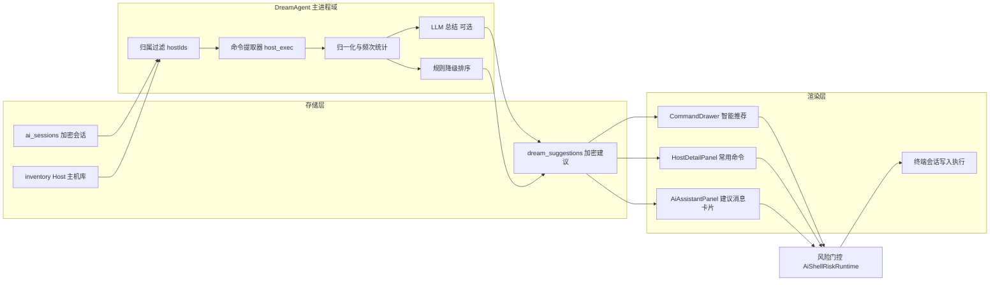
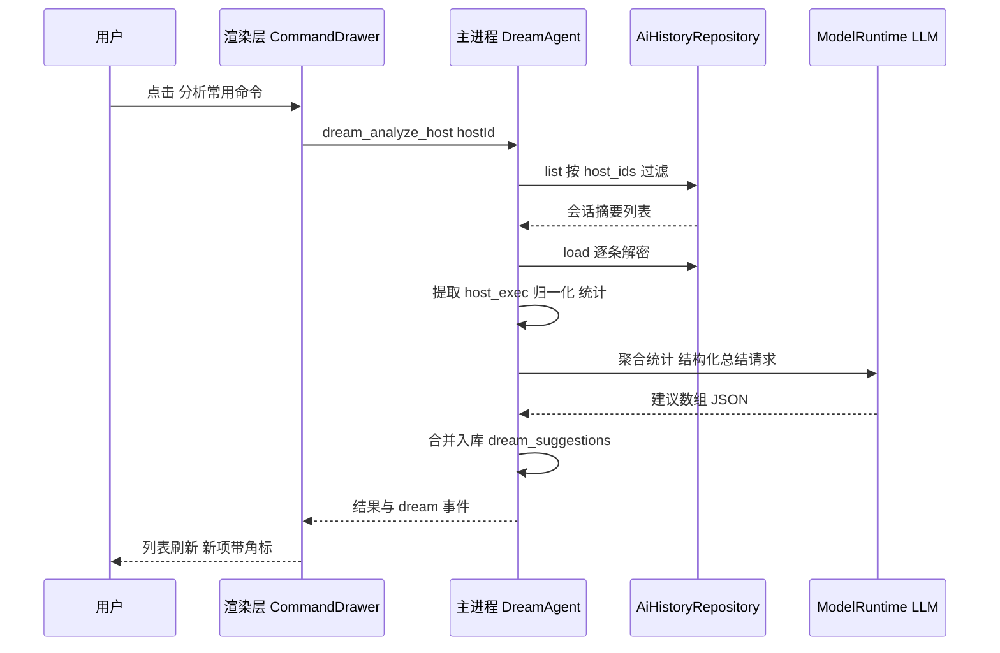

# 产品需求文档（PRD）：Buzz Dream Agent —— 按服务器分析历史会话并生成快捷执行指令

- **文档版本**：v1.1
- **日期**：2026-08-16
- **状态**：草案
- **修订记录**：v1.1 新增右侧 AI 助手面板「建议消息」交互（F15、场景 G、§5.6）
- **目标读者**：产品 / 主进程与渲染层研发 / 测试
- **关联技术方案**：Implementation Plan 待补（`docs/superpowers/plans/`）

---

## 1. 背景与目标

### 1.1 背景

Buzz 已具备完整的 AI Agent 能力：多主机运维 Agent（`src/main/domains/agent/agent-runtime.ts`，`host_exec` / `host_list` 工具）、单终端 AI 助手（`src/main/domains/ai/agent-runtime.ts`）、加密会话历史（`src/main/domains/ai/history.ts`，AES-256-GCM，512MB LRU 淘汰）以及命令快捷片段（`src/renderer/features/shell/commandSnippets.ts`，全局 localStorage + `CommandDrawer` 运行）。

随着使用积累，用户的运维知识大量沉淀在 Agent 历史会话中：同一台服务器上反复让 Agent 执行的 `docker ps`、`journalctl -u nginx`、`df -h` 等命令，每次都要重新输入或重新描述。

**现状局限**：

1. 会话历史只可整段回看，**无法按服务器聚合**——`ai_sessions` 表只有 `ssh_session_id` 列，多主机 Agent 会话固定写空串（见 `history.ts` 的 `validate` 注释），目标主机信息只存在于加密消息体内；
2. **没有命令级提取与分析**：历史中 `host_exec` 工具调用携带了完整的命令、参数与执行结果（成功/失败），但从未被二次利用；
3. 快捷片段（`CommandSnippet`）是**全局手工维护**的，与服务器无关，也没有频次/成功率信息，用户不会主动沉淀；
4. 高频命令重复输入的摩擦大，尤其对管理几十台主机的运维人员。

### 1.2 目标

新增 **Dream Agent**（`src/main/domains/dream/`）：在主进程后台「复盘做梦」式地分析历史 AI 会话，**按服务器（inventory Host）聚合**，把用户反复使用的命令总结为**快捷执行指令（Suggested Command）**，让用户在命令抽屉与服务器详情页**一眼看到、一键执行**：

- 输入侧：自动从加密会话历史中提取 `host_exec` 命令（含终端 AI 会话中的命令类工具调用），按 `hostId` 聚合，统计频次与成功率；
- 总结侧：调用用户已配置的 AI 供应商，将高频命令归纳、命名、描述风险，生成结构化建议；无可用供应商时降级为纯频次规则模式；
- 输出侧：在 `CommandDrawer` 新增「智能推荐 · 按服务器」分区，在 `HostDetailPanel` 新增「常用命令」卡片；**用户打开某主机 SSH 终端后，右侧 AI 助手面板（`AiAssistantPanel`）在对话顶部展示该主机的 Dream 建议消息卡片，点击即可直接执行**；支持采纳（Pin）、编辑、忽略、一键执行；
- 执行侧：默认写入该服务器已打开的终端会话（复用 `runCommandSnippet` 路径）；危险命令仍经 `AiShellRiskRuntime` 风险门控。

### 1.3 非目标（本期不做）

- 不抓取远端 `~/.bash_history` / `zsh_history`（列为开放问题，涉及远端隐私）；
- 不做定时/自动执行（生成的指令永远由用户主动触发）；
- 不做跨服务器的全局命令分析（严格按单主机维度）；
- 不改变现有全局 `CommandSnippet` 池的语义（Pin 时可选「另存为全局片段」）；
- 不做跨设备同步（建议数据与库共存于本机加密存储）。

---

## 2. 用户与场景

### 2.1 目标用户

通过 Buzz 管理多台 Linux 服务器、已使用 Agent 栏或终端 AI 助手积累了一定历史会话的运维/工程人员。

### 2.2 核心场景

**场景 A（查看推荐）**：用户打开命令抽屉，切到「智能推荐 · db-primary」，看到 Dream Agent 总结的常用指令：「查看 nginx 错误日志 `journalctl -u nginx -e --since today`（近 30 天使用 17 次，成功率 100%）」，点击即写入当前 `db-primary` 终端执行。

**场景 B（手动触发分析）**：用户在 `db-primary` 的服务器详情页点「分析常用命令」，Dream Agent 解密该主机的全部历史会话，30 秒内刷新出建议列表。

**场景 C（空闲自动分析 / “做梦”）**：用户挂机 10 分钟，Dream Agent 自动逐台复盘有新会话落库的主机，托盘无打扰；用户回来时推荐已更新，列表项带「新」角标。

**场景 D（危险命令）**：某建议命令含 `rm -rf`（来自历史中一次经确认的操作）。执行时仍弹出风险确认卡片（60s 单次令牌），用户批准后才写入终端。

**场景 E（无 AI 供应商降级）**：用户从未配置任何 AI 供应商。Dream Agent 以纯规则模式工作：按命令文本归一化去重、按频次与成功率排序直接生成建议，仅缺少 AI 概括的名称与描述（以命令首行作为名称）。

**场景 F（隐私清理）**：用户在设置中一键「清除全部 Dream 分析数据」，建议表清空；亦可彻底关闭 Dream Agent。

**场景 G（右侧 AI 助手建议消息）**：用户打开 `db-primary` 的 SSH 终端，右侧 AI 助手对话框顶部出现「Dream 为你梳理的常用操作」卡片组（如「查看 nginx 错误日志」使用 17 次 · 成功率 100%）。用户点击某卡片，命令经风险门控后直接写入该终端并执行，无需任何输入。建议卡片为轻量展示区，不进入对话消息流，也不写入 AI 会话历史。

---

## 3. 需求详细描述

### 3.1 功能需求

| 编号 | 需求 | 优先级 | 说明 |
|---|---|---|---|
| F1 | 会话归属主机落库 | P0 | `ai_sessions` 新增 `host_ids` 列（JSON 文本）；保存会话时由主进程写入：终端 AI 会话经 `sshSessionId → hostId` 解析，多主机 Agent 会话写 `allowedHosts`；历史兼容用现有 `ALTER TABLE ... ADD COLUMN` 迁移模式 |
| F2 | 存量会话回填 | P1 | 首次升级后对存量会话做一次性尽力回填：解密消息体，从 `host_exec` 调用参数与 directive 文本中提取 hostId 写入 `host_ids`；失败会话跳过不阻塞 |
| F3 | 命令提取流水线 | P0 | 主进程解密加载某主机全部会话，提取 assistant 消息中 `host_exec` 工具调用的 `command` 参数及对应 toolResult 的成功/失败；命令文本归一化（trim、合并等价空白）后统计频次与成功率 |
| F4 | LLM 总结生成建议 | P0 | 复用 `src/main/domains/ai/model-runtime.ts` 以用户已配置供应商生成结构化建议（JSON：`title`、`command`、`description`、`riskHint`、`confidence`）；输入仅为聚合统计（命令+次数+成功率+会话标题），**不发送完整对话原文**；无供应商时降级为规则模式（F5） |
| F5 | 规则降级模式 | P0 | 无供应商/调用失败时按频次×成功率排序直接产出建议，名称取命令首行；保证功能可用性不依赖网络 |
| F6 | 建议加密存储 | P0 | 新表 `dream_suggestions`（字段见 §4.2），命令等敏感字段经现有 `AesGcmFieldCipher` 加密；按 `host_id` 索引 |
| F7 | 命令抽屉「智能推荐」分区 | P0 | `CommandDrawer` 新增「智能推荐」页签，按服务器分组展示建议（名称、命令、使用次数、成功率、风险标记、「新」角标）；支持搜索过滤 |
| F8 | 服务器详情「常用命令」卡片 | P1 | `HostDetailPanel` 新增卡片：该主机 Top N 建议 + 「分析常用命令」手动触发按钮 + 分析状态（空闲/进行中/最近一次时间） |
| F9 | 建议生命周期管理 | P0 | 每条建议可：采纳（Pin 置顶）、编辑（名称/命令）、忽略（Dismiss，不再出现）、删除；Pin 后可选「另存为全局片段」（写入现有 `CommandSnippet` 池） |
| F10 | 一键执行 | P0 | 点击执行时：若该主机有已打开终端会话，写入激活会话（复用 `TerminalWorkspace.runCommandSnippet` 路径并回车）；无已打开会话时引导用户先连接（与现有片段 Run 行为一致） |
| F11 | 风险门控 | P0 | 建议命令在写入终端/执行前一律过 `AiShellRiskRuntime` 评估；危险命令走现有确认卡片流；建议列表中的 `riskHint` 仅作展示提示 |
| F12 | 空闲自动分析 | P1 | 应用空闲 ≥10 分钟且存在「该主机自上次分析后有新会话落库」时，后台逐台触发分析（串行、每台间隔节流）；任何键盘/终端活动立即暂停；可在设置中关闭 |
| F13 | 设置与数据控制 | P1 | 设置页新增 Dream Agent 区块：总开关、自动分析开关、数据保留策略（默认保留 90 天建议）、「清除全部分析数据」按钮 |
| F14 | 分析状态与事件 | P1 | 主进程通过事件向渲染层推送分析进度（`dream:event`，状态机 `idle → analyzing → done/failed`），供抽屉与详情页展示 |
| F15 | 右侧 AI 助手「建议消息」卡片 | P0 | `AiAssistantPanel`（`src/renderer/features/ai/AiAssistantPanel.tsx`）按当前 `sshSessionId` 解析 hostId，在**消息列表上方**渲染 Dream 建议卡片组（Top 3–5，`pinned → confidence` 排序，含名称、命令、次数/成功率、风险标记）：点击卡片 = 走 F10 执行路径（写入该终端并回车）+ F11 风险门控；卡片组提供「换一批」刷新与「收起」折叠；刷新时机 = 面板挂载 / 会话切换 / `dream:analysis-progress` done 事件；已忽略（dismissed）建议永不出现；卡片为**临时 UI 层**，不写入 `AiAgentMessage[]` 消息流与会话历史；hostId 不可解析时不渲染 |

### 3.2 非功能需求

| 编号 | 需求 | 约束 |
|---|---|---|
| N1 | 安全：明文不出主进程 | 会话解密、命令提取、LLM 调用全部在主进程；IPC 只返回聚合后的建议条目，永不返回会话原文；与 `AGENTS.md` 安全要求一致 |
| N2 | 安全：建议加密落库 | `dream_suggestions` 的 `command` 字段经 `AesGcmFieldCipher` 加密，密钥管理复用现有 vault 体系 |
| N3 | 安全：LLM 最小披露 | 送入模型的仅是命令文本统计与脱敏标题；供应商调用沿用现有 `repository.ts` 的加密 API Key |
| N4 | 资源占用 | 分析任务串行、低优先级执行；单主机分析超时上限 120s；空闲分析时 CPU 占用不构成前台可感知卡顿 |
| N5 | 兼容性 | 不新增 npm 依赖（复用 `pi-agent-core` / `model-runtime` / 现有 UI 原语）；Electron ^43、React ^19、TS ^5.6 |
| N6 | 可测试性 | 新增 `dream_*` IPC 命令需注册于 `src/shared/ipc/command-names.ts` 并配命令契约测试（`tests/main/domains/dream/`）；提取器为纯函数便于单测 |
| N7 | 一致性：设计系统 | UI 沿用 shadcn 原语（`@/components/ui/...`）、lucide 图标与现有 Tailwind token |
| N8 | 历史容量兼容 | 分析不复制会话数据；`ai_sessions` 的 512MB LRU 淘汰照常生效，被淘汰会话自然退出分析范围 |

---

## 4. 数据与架构设计

### 4.1 分析流水线（架构）



### 4.2 数据模型

**`ai_sessions` 迁移**（`history.ts` 内追加）：

```sql
ALTER TABLE ai_sessions ADD COLUMN host_ids TEXT NOT NULL DEFAULT '[]';
CREATE INDEX IF NOT EXISTS idx_ai_sessions_host_ids ON ai_sessions(host_ids);
```

- `host_ids`：JSON 字符串数组，如 `["host-a","host-b"]`；保存时主进程写入，查询用 `LIKE '%"host-a"%'` 前置过滤后内存精确判定。

**新表 `dream_suggestions`**（`src/main/domains/dream/repository.ts`）：

| 字段 | 类型 | 说明 |
|---|---|---|
| `id` | TEXT PK | UUID |
| `host_id` | TEXT NOT NULL | 关联 inventory Host，索引 |
| `title` | TEXT NOT NULL | 建议名称（LLM 生成或命令首行） |
| `encrypted_command` | BLOB NOT NULL | AES-GCM 加密的命令文本 |
| `description` | TEXT | LLM 生成的一句话说明 |
| `usage_count` / `success_count` | INTEGER | 历史频次与成功次数 |
| `source_session_ids` | TEXT | JSON 数组，溯源会话 |
| `confidence` | REAL | LLM 置信度 0–1；规则模式按频次归一 |
| `risk_hint` | TEXT NULL | 风险提示（如「会删除文件」） |
| `status` | TEXT NOT NULL | `suggested` / `pinned` / `dismissed` |
| `is_new` | INTEGER NOT NULL | 1 = 本次分析新增，用于「新」角标 |
| `created_at` / `updated_at` / `analyzed_at` | TEXT | 时间戳 |

**IPC 结果类型**（`src/shared/ipc/dream/`）：`DreamSuggestion { id, hostId, hostName, title, command, description, usageCount, successCount, confidence, riskHint, status, isNew, updatedAt }`——wire 字段 camelCase，命令以明文返回（其本身来自用户历史，属操作数据而非凭据）。

### 4.3 IPC 契约（注册于 `command-names.ts`）

| 命令名 | 入参（Zod） | 出参 |
|---|---|---|
| `dream_analyze_host` | `{ hostId: string }` | `DreamAnalysisResult { hostId, suggestionCount, mode: "llm" \| "rules", durationMs }` |
| `dream_list_suggestions` | `{ hostId?: string, includeDismissed?: boolean }` | `DreamSuggestion[]`（按 `pinned → confidence` 排序） |
| `dream_update_suggestion` | `{ id, patch: { title?, command?, status? } }` | `DreamSuggestion` |
| `dream_delete_suggestion` | `{ id }` | `void` |
| `dream_export_snippet` | `{ id }` | `{ snippetId }`（写入全局 `CommandSnippet` 由渲染层执行，主进程仅回显规范化命令） |
| `dream_get_status` | `{ hostId?: string }` | `DreamStatus { state, hostId?, lastAnalyzedAt? }` |
| `dream_clear_data` | `{ hostId?: string }` | `void`（缺省 hostId 清全部） |

事件（复用现有事件通道模式）：`dream:analysis-progress`，payload `{ hostId, state: "analyzing" | "done" | "failed" }`。

### 4.4 分析触发时序（手动 + 空闲）



空闲自动分析（F12）复用同一入口，由主进程空闲计时器触发，逐台串行调用内部管线（不经 IPC）。

---

## 5. UI / UX 设计要点

1. **CommandDrawer**：现有「命令片段」页签旁新增「智能推荐」页签；左侧主机列表（沿用库存分组），右侧建议卡列表；卡片布局 = 名称 + 命令 mono 文本（`bg-carbon` 行内块）+ 次数/成功率徽标 + 操作（执行 / 采纳 / 编辑 / 忽略）。
2. **HostDetailPanel**：新增「常用命令」折叠卡片（默认收起，Top 5），底部「重新分析」文字按钮与最近分析时间。
3. **空态文案**：「还没有分析结果——先通过 Agent 对这台服务器执行几次操作，或点击立即分析」。
4. **风险视觉**：`riskHint` 非空时命令前缀 `TriangleAlert`（lucide）黄色图标；执行仍走门控确认。
5. **降级模式标识**：规则模式生成的建议卡带「规则」小徽标，提示未经过 AI 总结。
6. **AiAssistantPanel 建议消息卡片**（F15）：
   - 位置：消息列表**顶部**、输入框之上，以独立分区呈现，标题「Dream 为你梳理的常用操作」（lucide `Sparkles` 图标 + 主机名），与下方对话流视觉分离（浅色底 + 圆角卡片组）；
   - 卡片：单行布局 = 名称 + 命令 mono 摘要（超长省略，悬停 tooltip 展示全文）+ `使用 N 次 · 成功率 P%` 徽标；`riskHint` 非空加黄色 `TriangleAlert`；悬停浮出操作（执行 `Play` / 采纳 `Pin` / 忽略 `X`）；
   - 交互：点击卡片主体即执行（写入当前 SSH 终端并回车）；执行前过风险门控，危险命令弹出现有确认卡片；采纳后置顶并持久化 `pinned`；忽略即时移除（带撤销 toast）；
   - 数量与折叠：默认展示 Top 3，最多 5，尾部「换一批」；分区可「收起」，收起状态按主机记忆（localStorage）；无建议时整分区不占位；
   - 生命周期：不产生 `AiAgentMessage`，不污染会话历史与 `ConversationHistoryPanel`；随面板挂载/会话切换重新拉取，`dream:analysis-progress` done 时静默刷新。

---

## 6. 安全与隐私

| 项 | 约束 |
|---|---|
| 凭据/密钥 | 不分析、不发送、不落建议表；命令中若检测到疑似密钥模式（长 token、`AKIA`、`-----BEGIN`）则该条直接丢弃并计数 |
| IPC 边界 | 只传 `hostId` 与聚合建议；会话原文、解密缓冲永不跨 IPC |
| LLM 披露 | 仅命令统计与脱敏会话标题出网；用户可在设置中关闭「使用 AI 总结」（退化为规则模式） |
| 数据归属 | 建议数据与 SQLite 库同机存储，加密；删除主机时级联删除其建议 |
| 审计 | `dream_clear_data` 与自动分析触发写入现有主进程日志（不含命令内容） |

---

## 7. 里程碑与验收标准

### M1：数据归属与迁移（P0）
- [ ] `ai_sessions.host_ids` 迁移 + 保存路径写入（终端会话与多主机 Agent 两条路径）。
- [ ] 存量回填命令（一次性、尽力而为、可重入）。
- [ ] `tests/main/domains/ai/` 历史仓库迁移用例通过。

### M2：分析管线与存储（P0）
- [ ] 提取器（纯函数）+ 归一化 + 频次统计；规则降级排序。
- [ ] `dream_suggestions` 加密仓库；`dream_*` IPC 注册 + 契约测试。
- [ ] 单主机分析 ≤120s，超时安全失败。

### M3：LLM 总结（P0）
- [ ] 结构化输出解析与校验（非法输出回退规则模式）。
- [ ] 置信度合并与 `is_new` 标记。

### M4：UI 与执行（P0）
- [ ] CommandDrawer 智能推荐分区 + HostDetailPanel 常用命令卡片。
- [ ] AiAssistantPanel 建议消息卡片组（F15）：渲染、点击执行、采纳/忽略、收起记忆。
- [ ] 一键执行写入已打开终端；风险门控确认流。
- [ ] 采纳/编辑/忽略/另存为全局片段。
- [ ] 渲染层测试（fake dreamApi 模式）+ Playwright 冒烟。

### M5：自动化与设置（P1）
- [ ] 空闲触发器（暂停/节流/串行）。
- [ ] 设置区块（总开关、自动分析、AI 总结开关、清除数据）。
- [ ] `dream:event` 进度推送。

**验收场景**：在真实数据下走通场景 A（查看并执行推荐）、场景 C（空闲自动分析）、场景 D（危险命令确认）、场景 E（无供应商降级）、场景 G（打开 SSH 后右侧 AI 面板出现建议卡片并点击执行）；`pnpm typecheck`、`pnpm test`、`pnpm test:electron` 全绿。

---

## 8. 测试策略

- **主进程**（`tests/main/domains/dream/`）：提取器对伪造 `AiAgentMessage[]` 的提取/归一化/统计；LLM 输出解析（含非法 JSON 回退）；仓库加密读写与级联删除；全部 `dream_*` 命令契约测试；空闲触发器的暂停/恢复逻辑（假时钟）。
- **历史仓库**（`tests/main/domains/ai/`）：`host_ids` 迁移、保存写入、LIKE 过滤正确性；回填幂等。
- **渲染层**（`tests/renderer/`）：CommandDrawer 推荐分区渲染/搜索/操作；HostDetailPanel 卡片；AiAssistantPanel 建议卡片（有/无建议、会话切换刷新、点击执行调用注入 fake API、忽略后不再出现、收起状态记忆、不写入消息流断言）；执行调用注入 fake API；`deterministicDreamApi.ts` 与真实 API 签名对齐。
- **e2e**：Playwright 冒烟（打开抽屉 → 切换智能推荐 → 看到种子数据卡片）。

---

## 9. 风险与开放问题

| 风险/问题 | 说明 | 缓解/决策 |
|---|---|---|
| R1 存量会话无主机归属 | 历史消息体格式演进可能导致提取失败 | 回填为尽力而为 + 失败计数日志；F2 降级 P1 |
| R2 LLM 总结质量 | 命令泛化可能改变语义（如把主机名参数化掉） | `command` 字段必须取自历史真实命令原文，LLM 仅命名/描述/归类，不得改写命令本体（prompt 硬约束 + 出参校验命令必须在历史集合内） |
| R3 空闲分析与用户操作冲突 | 分析期间用户恢复操作 | 任何输入立即 abort 当前分析（保留已有结果），下次空闲重试 |
| R4 隐私顾虑（命令出网） | 部分用户不接受命令发送给供应商 | 「使用 AI 总结」默认跟随现有供应商配置但可独立关闭；规则模式完全离线 |
| R5 建议卡片打扰感 | 打开终端即见推荐可能干扰专注用户 | 分区可收起且按主机记忆；无建议不占位；已忽略建议永不回流 |
| O1 远端 shell history 采集 | 是否读取 `~/.bash_history` 作为补充源 | 本期不做，收集反馈后单独立项 |
| O2 建议自动执行/编排 | 高频命令是否可绑定快捷键一键运行 | 快捷键绑定列入下期，先验证推荐准确度 |

---

## 10. 附：术语表

| 术语 | 说明 |
|---|---|
| Dream Agent | 主进程后台「复盘做梦」式分析域（`src/main/domains/dream/`），按服务器总结历史会话中的常用命令 |
| Suggested Command / 建议指令 | Dream Agent 产出的一条快捷执行指令（`dream_suggestions` 记录），状态为 suggested / pinned / dismissed |
| 规则模式 | 无 LLM 参与的降级路径：按频次×成功率排序直接产出建议 |
| host_exec | 多主机 Agent 的命令执行工具，其调用参数是本需求的核心数据源 |
| 采纳（Pin） | 用户确认某建议进入常用置顶列表；另存为全局片段则进入现有 `CommandSnippet` 池 |
| 建议消息卡片 | `AiAssistantPanel` 顶部按当前主机渲染的 Dream 建议临时展示区（F15），不进入对话消息流与会话历史 |
