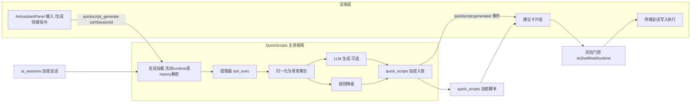
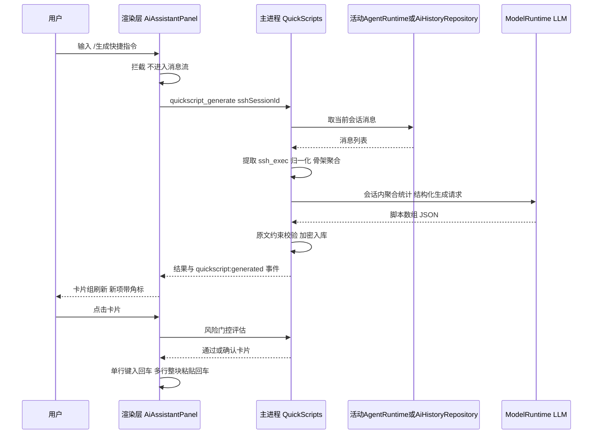

# 产品需求文档（PRD）：Buzz AI 快捷指令 —— 从当前会话生成快捷执行脚本

- **文档版本**：v1.2
- **日期**：2026-08-17
- **状态**：草案
- **修订记录**：
  - v1.2 重构：放弃后台静默「做梦」分析（原 Dream Agent）。改为**用户显式触发**：在 AI 助手输入 `/生成快捷指令`，AI 复盘**当前会话**的命令执行过程，生成快捷执行脚本并保存，在右侧 AI 助手面板建议卡片一键执行。移除：空闲自动分析、CommandDrawer「智能推荐」分区、HostDetailPanel「常用命令」卡片、`ai_sessions.host_ids` 迁移与存量回填、跨会话按主机聚合分析。
  - v1.1 新增右侧 AI 助手面板「建议消息」交互（F15、场景 G、§5.6）。
- **目标读者**：产品 / 主进程与渲染层研发 / 测试
- **关联技术方案**：Implementation Plan 待补（`docs/superpowers/plans/`）

---

## 1. 背景与目标

### 1.1 背景

Buzz 已具备单终端 AI 助手（`src/main/domains/ai/agent-runtime.ts`，`ssh_exec` 工具）、加密会话历史（`src/main/domains/ai/history.ts`，AES-256-GCM）以及命令快捷片段（`src/renderer/features/shell/commandSnippets.ts`，全局 localStorage + `CommandDrawer` 运行）。

用户在一次 AI 助手会话里往往会让 AI 执行一组反复出现的命令（`journalctl -u nginx -e`、`cd /app && docker compose logs api` 等）。会话结束后，这些执行过程——命令、参数、成败——就沉没在加密历史里，下次还要重新描述一遍；而全局 `CommandSnippet` 是手工维护的，与上下文无关，用户不会主动沉淀。

**现状局限**：

1. 会话只可整段回看，`ssh_exec` 调用携带的命令与执行结果（成功/失败）从未被二次利用；
2. 快捷片段是全局手工维护，无来源上下文、无频次/成功率信息；
3. 高频操作重复输入/重复描述的摩擦大。

### 1.2 目标

新增 **AI 快捷指令（Quick Scripts）** 域（`src/main/domains/quickscripts/`）：用户在右侧 AI 助手输入框显式输入 `/生成快捷指令`，AI 复盘**当前终端会话**的命令执行过程，总结生成 1–5 条**快捷执行脚本（Quick Script）**并加密保存；随后在 `AiAssistantPanel` 顶部建议卡片区展示，点击即经风险门控写入当前 SSH 终端执行。

- 输入侧：仅分析当前会话内的 `ssh_exec` 调用与对应结果（命令、cwd、成败、频次、链式序列），**不扫描全部历史、不做跨会话/跨主机聚合**；
- 生成侧：复用 `src/main/domains/ai/model-runtime.ts` 以用户已配置供应商生成结构化脚本（`title`、`script`、`description`、`riskHint`、`confidence`）；**命令本体必须逐字来自会话原文**，LLM 仅命名/描述/组合；无可用供应商时降级为纯规则模式；
- 展示侧：`AiAssistantPanel` 建议卡片组（临时 UI 层，不进入对话消息流与会话历史）；支持采纳（Pin）、编辑、忽略、删除；
- 执行侧：写入该终端会话——单行命令键入+回车，**多行脚本整块 bracketed paste 写入**；危险命令一律经 `AiShellRiskRuntime` 风险门控。

### 1.3 非目标（本期不做）

- 不做后台/空闲自动分析（已从 v1.1 方案移除；生成永远由用户显式触发）；
- 不做跨会话、跨服务器的全局命令分析（严格限定当前会话）；
- 不抓取远端 `~/.bash_history` / `zsh_history`；
- 不做定时/自动执行（生成的脚本永远由用户点击触发）；
- 不做命令参数模板化/占位符替换（列入开放问题）；
- 不改变现有全局 `CommandSnippet` 池的语义（仅提供「另存为全局片段」可选出口）；
- 不做多主机 Agent 会话（`host_exec`）的分析——本期仅覆盖终端 AI 会话（`ssh_exec`）。

---

## 2. 用户与场景

### 2.1 目标用户

通过 Buzz 连接 Linux 服务器、并在右侧 AI 助手中积累过一段操作过程的运维/工程人员。

### 2.2 核心场景

**场景 A（显式生成）**：用户在 `db-primary` 的 SSH 终端里让 AI 排查过几轮 nginx 问题后，在 AI 助手输入 `/生成快捷指令` 并发送。数秒后，面板顶部建议卡片区出现「查看 nginx 错误日志」「重启 api 容器并追踪日志」等卡片（标注「本会话使用 5 次 · 成功率 100%」），新卡片带「新」角标。

**场景 B（一键执行）**：用户点击「查看 nginx 错误日志」卡片，命令经风险门控后直接写入当前终端并回车执行，无需任何输入。多行脚本整块粘贴执行，不会被 shell 逐行截断。

**场景 C（危险脚本确认）**：某脚本含 `sudo systemctl restart nginx`。点击执行时仍弹出风险确认卡片（60s 单次令牌），用户批准后才写入终端；卡片上的 `riskHint` 仅为展示提示。

**场景 D（无 AI 供应商降级）**：用户从未配置任何 AI 供应商，或本次生成调用失败。规则模式生效：取当前会话内按频次×成功率排序的高频命令（或命令链）原文直接生成脚本，标题取命令首行，卡片带「规则」小徽标，完全离线可用。

**场景 E（无可分析内容）**：会话尚无任何 `ssh_exec` 调用。建议区显示轻量内联提示「当前会话还没有命令执行记录，先让 AI 执行几次操作吧」，不弹窗、不报错。

**场景 F（隐私清理）**：用户在设置中一键「清除全部快捷指令数据」；亦可对单条卡片删除/忽略（忽略后永不回流）。

---

## 3. 需求详细描述

### 3.1 功能需求

| 编号 | 需求 | 优先级 | 说明 |
|---|---|---|---|
| F1 | Slash 命令拦截 | P0 | `AiAssistantPanel` 输入框拦截**完全匹配** `/生成快捷指令`（trim 后，不进入消息流、不发送给模型），转为调用生成 IPC；别名 `/quick-script` 等价；无 `sshSessionId` 或无活动 AI 会话时不响应并轻提示；键入 `/` 时浮出命令提示菜单（本期仅此一条，P1） |
| F2 | 当前会话执行过程提取 | P0 | 主进程获取当前会话消息：优先从活动 agent 运行时上下文读取，否则按 `sshSessionId` 取最近一条已保存会话解密加载；提取 assistant 消息中 `ssh_exec` 工具调用的 `command`/`cwd` 参数及对应 toolResult 的成功/失败；**归一化仅合并引号外的连续空格/Tab，保留换行**；链式命令（`&&`、`\|\|`、`\|`、`;`）额外按「结构骨架」（命令名序列）二次聚合，骨架桶内取最高频原文，频次累加，防止微变体稀释 |
| F3 | LLM 生成快捷脚本 | P0 | 复用 `model-runtime` 以用户已配置供应商生成结构化脚本：输入仅为当前会话的**聚合统计**（命令/骨架 + 次数 + 成功率 + cwd + 会话标题），**不发送完整对话原文**；输出 JSON 数组 1–5 条 `{ title, script, description, riskHint, confidence }`；`script` 的每一行必须逐字来自会话命令原文（允许整链原样组合），prompt 硬约束 + 出参校验，非法行丢弃、整批非法回退规则模式 |
| F4 | 规则降级模式 | P0 | 无供应商/调用失败/输出非法时：按频次×成功率排序取当前会话 Top 命令（或命令链）原文直接生成脚本，名称取命令首行；保证功能不依赖网络 |
| F5 | 脚本加密存储 | P0 | 新表 `quick_scripts`（字段见 §4.2），`script` 等敏感字段经现有 `AesGcmFieldCipher` 加密；按 `host_id` 索引；删除主机时级联删除 |
| F6 | 建议卡片渲染与刷新 | P0 | `AiAssistantPanel` 按当前 `sshSessionId → hostId` 拉取并渲染卡片组（Top 3–5，`pinned → confidence` 排序）：名称、脚本 mono 摘要（超长省略、悬停 tooltip 全文）、来源会话统计徽标（使用 N 次 · 成功率 P%）、`riskHint` 黄色 `TriangleAlert`、「新」角标；「换一批」与「收起」（按主机 localStorage 记忆）；刷新时机 = 面板挂载 / 会话切换 / `quickscript:generated` 事件；**卡片为临时 UI 层，不产生 `AiAgentMessage`、不写入会话历史**；已忽略（dismissed）永不出现；hostId 不可解析时不渲染 |
| F7 | 一键执行与风险门控 | P0 | 点击卡片主体即执行：先经 `AiShellRiskRuntime` 评估，危险命令走现有确认卡片流；通过后写入当前 SSH 终端——**单行 = 键入 + 回车；多行 = bracketed paste 整块写入 + 回车**（禁止逐字符逐行模拟，避免多行脚本被 shell 中途执行）；执行成功后卡片执行计数 +1 |
| F8 | 建议生命周期管理 | P0 | 每条脚本可：采纳（Pin 置顶）、编辑（名称/脚本内容）、忽略（Dismiss，不再出现，带撤销 toast）、删除；P1：「另存为全局片段」（写入现有 `CommandSnippet` 池） |
| F9 | 生成反馈与失败态 | P0 | 生成中建议区标题行显示进行中状态（如「正在复盘本会话…」）；完成（含生成条数）/ 失败 / 无可分析内容（场景 E）均有轻量内联反馈，不弹窗打断 |
| F10 | 数据控制 | P1 | 设置页新增 Quick Scripts 区块：「清除全部快捷指令数据」按钮、按主机清除；清除操作写入主进程审计日志（不含脚本内容） |

### 3.2 非功能需求

| 编号 | 需求 | 约束 |
|---|---|---|
| N1 | 安全：明文不出主进程 | 会话解密、命令提取、LLM 调用全部在主进程；IPC 只返回结构化脚本条目，永不返回会话原文；与 `AGENTS.md` 安全要求一致 |
| N2 | 安全：脚本加密落库 | `quick_scripts` 的 `script` 字段经 `AesGcmFieldCipher` 加密，密钥管理复用现有 vault 体系 |
| N3 | 安全：LLM 最小披露 | 送入模型的仅是**当前会话**的命令文本统计、cwd 与脱敏会话标题；供应商调用沿用现有 `repository.ts` 的加密 API Key；可在设置中关闭「使用 AI 生成」（退化为规则模式，完全离线） |
| N4 | 资源与时效 | 单次生成超时上限 60s，超时安全失败并回退规则模式；分析为用户触发的短任务，不做常驻后台进程 |
| N5 | 兼容性 | 不新增 npm 依赖（复用 `pi-agent-core` / `model-runtime` / 现有 UI 原语）；Electron ^43、React ^19、TS ^5.6 |
| N6 | 可测试性 | 新增 `quickscript_*` IPC 命令需注册于 `src/shared/ipc/command-names.ts` 并配命令契约测试（`tests/main/domains/quickscripts/`）；提取器为纯函数便于单测 |
| N7 | 一致性：设计系统 | UI 沿用 shadcn 原语（`@/components/ui/...`）、lucide 图标与现有 Tailwind token |
| N8 | 凭据防护 | 命令/脚本中若检测到疑似密钥模式（长 token、`AKIA`、`-----BEGIN`）则该条直接丢弃并计数，不入库不出网 |

---

## 4. 数据与架构设计

### 4.1 生成与执行流水线（架构）

### 4.2 数据模型

**新表 `quick_scripts`**（`src/main/domains/quickscripts/repository.ts`）：

| 字段 | 类型 | 说明 |
|---|---|---|
| `id` | TEXT PK | UUID |
| `host_id` | TEXT NOT NULL | 来源终端对应 inventory Host，索引；删主机级联删除 |
| `source_session_id` | TEXT NOT NULL | 来源 AI 会话 id，溯源 |
| `title` | TEXT NOT NULL | 脚本名称（LLM 生成或命令首行） |
| `encrypted_script` | BLOB NOT NULL | AES-GCM 加密的脚本文本（单行命令或多行脚本） |
| `description` | TEXT | LLM 生成的一句话说明 |
| `source_usage_count` / `source_success_count` | INTEGER | 来源会话内的执行次数与成功次数 |
| `executed_count` | INTEGER NOT NULL DEFAULT 0 | 用户通过卡片执行的次数 |
| `confidence` | REAL | LLM 置信度 0–1；规则模式按会话内频次归一 |
| `risk_hint` | TEXT NULL | 风险提示（如「会重启服务」） |
| `status` | TEXT NOT NULL | `suggested` / `pinned` / `dismissed` |
| `is_new` | INTEGER NOT NULL | 1 = 最近一次生成新增，用于「新」角标 |
| `created_at` / `updated_at` | TEXT | 时间戳 |

**IPC 结果类型**（`src/shared/ipc/quickscripts/`）：`QuickScript { id, hostId, hostName, title, script, description, sourceUsageCount, sourceSuccessCount, executedCount, confidence, riskHint, status, isNew, createdAt, updatedAt }`——wire 字段 camelCase，脚本以明文返回（其本身来自用户会话操作数据，非凭据）。

### 4.3 IPC 契约（注册于 `command-names.ts`）

| 命令名 | 入参（Zod） | 出参 |
|---|---|---|
| `quickscript_generate` | `{ sshSessionId: string }` | `QuickScriptGenerationResult { hostId, createdCount, mode: "llm" \| "rules" \| "empty", durationMs }` |
| `quickscript_list` | `{ hostId: string, includeDismissed?: boolean }` | `QuickScript[]`（按 `pinned → confidence` 排序） |
| `quickscript_update` | `{ id, patch: { title?, script?, status? } }` | `QuickScript` |
| `quickscript_delete` | `{ id }` | `void` |
| `quickscript_export_snippet` | `{ id }` | `{ snippetId }`（P1；写入全局 `CommandSnippet` 由渲染层执行，主进程仅回显规范化命令） |
| `quickscript_clear_data` | `{ hostId?: string }` | `void`（缺省 hostId 清全部） |

事件（复用现有事件通道模式）：`quickscript:generated`，payload `{ hostId, sshSessionId, createdCount, mode: "llm" | "rules" | "empty" }`。

### 4.2bis 生成时序

---

## 5. UI / UX 设计要点

1. **Slash 命令提示**：输入框键入 `/` 时浮出轻量命令菜单（本期仅「生成快捷指令 · 复盘本会话生成快捷脚本」，lucide `Sparkles` 图标），回车/点击补全；精确匹配触发，未匹配的 `/xxx` 按普通文本发送（P0 仅做精确匹配，菜单为 P1）。
2. **生成进度**：建议区标题行显示加载态与「正在复盘本会话…」；完成显示「已生成 N 条」；失败/空内容内联轻提示；不弹窗。
3. **建议卡片组**（`AiAssistantPanel` 消息列表顶部、输入框之上，独立分区）：
   - 标题「快捷指令」+ `Sparkles` 图标 + 主机名，与对话流视觉分离（浅色底 + 圆角卡片组）；
   - 卡片单行布局 = 名称 + 脚本 mono 摘要（超长省略，悬停 tooltip 全文）+ `本会话使用 N 次 · 成功率 P%` 徽标 + 执行计数徽标；`riskHint` 非空加黄色 `TriangleAlert`；悬停浮出操作（执行 `Play` / 采纳 `Pin` / 编辑 `Pencil` / 忽略 `X`）；
   - 交互：点击卡片主体即执行（先过风险门控，危险命令弹现有确认卡片）；采纳后置顶并持久化 `pinned`；忽略即时移除（带撤销 toast）；
   - 数量与折叠：默认 Top 3，最多 5，尾部「换一批」；分区可「收起」，按主机记忆（localStorage）；无脚本时整分区不占位；
   - 生命周期：不产生 `AiAgentMessage`，不污染会话历史与 `ConversationHistoryPanel`。
4. **空态文案**：「当前会话还没有命令执行记录——先让 AI 执行几次操作，再输入 /生成快捷指令」。
5. **风险视觉**：`riskHint` 非空时脚本前缀 `TriangleAlert` 黄色图标；执行仍走门控确认。
6. **降级模式标识**：规则模式生成的卡片带「规则」小徽标。

---

## 6. 安全与隐私

| 项 | 约束 |
|---|---|
| 凭据/密钥 | 不分析、不发送、不落脚本表；命令中若检测到疑似密钥模式（长 token、`AKIA`、`-----BEGIN`）则该条直接丢弃并计数（N8） |
| IPC 边界 | 只传 `sshSessionId`/`hostId` 与结构化脚本；会话原文、解密缓冲永不跨 IPC |
| LLM 披露 | 仅**当前会话**的命令统计与脱敏会话标题出网；用户可在设置中关闭「使用 AI 生成」（退化为完全离线的规则模式） |
| 数据归属 | 脚本数据与 SQLite 库同机存储，加密；删除主机时级联删除 |
| 审计 | `quickscript_clear_data` 写入现有主进程日志（不含脚本内容） |
| 执行安全 | 一律经 `AiShellRiskRuntime`；多行脚本整块粘贴，不绕过终端换行语义 |

---

## 7. 里程碑与验收标准

### M1：提取与存储（P0）
- [ ] 提取器（纯函数）：`ssh_exec` 提取、归一化（保留换行）、链式骨架聚合、频次/成功率统计。
- [ ] `quick_scripts` 加密仓库（含级联删除）；`quickscript_*` IPC 注册 + 契约测试。

### M2：生成（P0）
- [ ] 会话加载（活动 runtime 优先，history 解密兜底）。
- [ ] LLM 结构化输出解析、**原文逐字约束校验**（非法行丢弃、整批非法回退规则模式）。
- [ ] 规则降级排序与 `is_new` 标记。

### M3：UI 与执行（P0）
- [ ] Slash 命令拦截（不进入消息流断言）。
- [ ] AiAssistantPanel 建议卡片组：渲染、刷新时机、采纳/编辑/忽略、收起记忆。
- [ ] 点击执行：风险门控确认流；单行键入回车、多行 bracketed paste 整块写入。
- [ ] 渲染层测试（fake quickScriptApi 模式）+ Playwright 冒烟。

### M4：数据控制（P1）
- [ ] 设置区块（AI 生成开关、清除数据）。
- [ ] 「另存为全局片段」。
- [ ] 审计日志。

**验收场景**：在真实数据下走通场景 A（输入 `/生成快捷指令` 生成卡片）、场景 B（点击执行写入终端，多行脚本不被截断）、场景 C（危险脚本确认）、场景 D（无供应商降级）、场景 E（空会话轻提示）；`pnpm typecheck`、`pnpm test`、`pnpm test:electron` 全绿。

---

## 8. 测试策略

- **主进程**（`tests/main/domains/quickscripts/`）：提取器对伪造 `AiAgentMessage[]` 的提取/归一化（含换行保留、引号内空格不合并）/骨架聚合统计；LLM 输出解析与原文约束校验（含非法 JSON、改写命令的回退）；仓库加密读写与级联删除；全部 `quickscript_*` 命令契约测试；密钥模式丢弃（N8）。
- **渲染层**（`tests/renderer/`）：slash 拦截（触发生成 IPC 且**不产生 `AiAgentMessage`**）；建议卡片（有/无脚本、会话切换刷新、点击执行调用注入 fake API、多行脚本走整块粘贴路径断言、忽略后不再出现、收起状态记忆）；`deterministicQuickScriptApi.ts` 与真实 API 签名对齐。
- **e2e**：Playwright 冒烟（打开 SSH 终端 → AI 面板输入 `/生成快捷指令` → 种子会话生成卡片 → 点击执行写入终端）。

---

## 9. 风险与开放问题

| 风险/问题 | 说明 | 缓解/决策 |
|---|---|---|
| R1 LLM 改写命令本体 | 生成可能改变语义（如把主机名/路径参数化掉） | `script` 每行必须逐字来自会话原文（prompt 硬约束 + 出参校验，非法行丢弃/回退规则模式）；LLM 仅命名/描述/组合 |
| R2 多行/链式脚本语义 | 归一化误并换行会改变脚本语义；逐行写入会被 shell 中途执行 | 归一化保留换行、仅合并引号外空格；执行统一走 bracketed paste 整块写入；骨架聚合防止链式微变体被频次稀释 |
| R3 隐私顾虑（命令出网） | 部分用户不接受命令发送给供应商 | 仅当前会话聚合统计出网（不含对话原文）；「使用 AI 生成」可独立关闭；规则模式完全离线 |
| R4 建议卡片打扰感 | 生成后卡片常驻可能干扰专注用户 | 分区可收起且按主机记忆；无脚本不占位；已忽略永不回流 |
| R5 中文触发词输入法兼容 | `/生成快捷指令` 依赖输入法状态 | 精确 trim 匹配 + 英文别名 `/quick-script`；P1 slash 提示菜单点选补全 |
| O1 参数模板化 | 脚本中路径/服务名是否可替换为占位符 | 本期不做，收集反馈后单独立项 |
| O2 多步工作流编排 | 是否支持把脚本拆为多步执行+检查点 | 列入下期，先验证单脚本准确度 |
| O3 多主机 Agent 会话支持 | `host_exec` 会话是否也可触发生成 | 本期不覆盖，作为下期扩展（数据源与归属模型不同） |

---

## 10. 附：术语表

| 术语 | 说明 |
|---|---|
| Quick Script / 快捷脚本 | 用户显式触发生成的一条快捷执行脚本（`quick_scripts` 记录），状态为 suggested / pinned / dismissed；可为单行命令或多行脚本 |
| `/生成快捷指令` | `AiAssistantPanel` 输入框的 slash 触发词（别名 `/quick-script`），拦截后不进入消息流 |
| 规则模式 | 无 LLM 参与的降级路径：按当前会话频次×成功率排序直接产出脚本，完全离线 |
| ssh_exec | 终端 AI 助手的命令执行工具，其调用参数是本需求的核心数据源 |
| 结构骨架 | 链式命令按命令名序列归并的聚合键，用于把参数微变体聚合到同一桶，桶内取最高频原文 |
| 采纳（Pin） | 用户确认某脚本进入常用置顶列表；另存为全局片段则进入现有 `CommandSnippet` 池 |
| 建议消息卡片 | `AiAssistantPanel` 顶部按当前主机渲染的快捷脚本临时展示区，不进入对话消息流与会话历史 |
