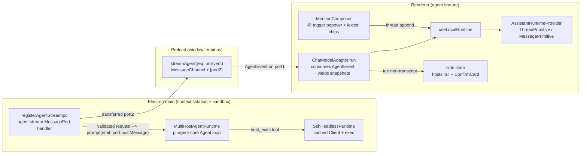
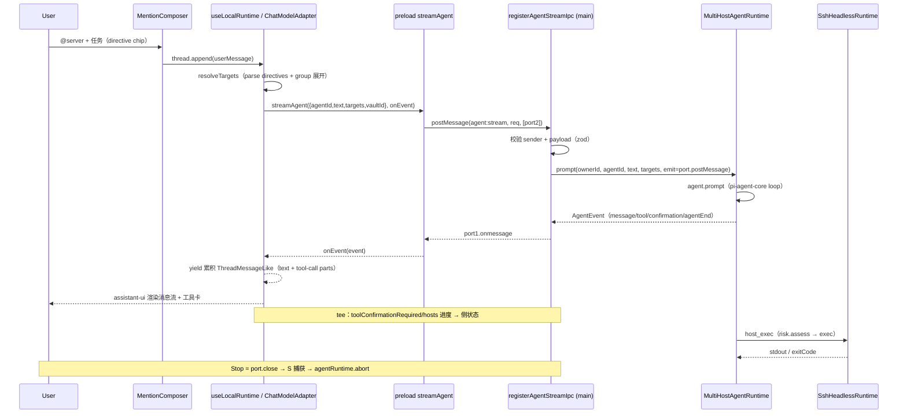

# Agent 栏（左侧多主机运维 Agent）Implementation Plan

> **For agentic workers:** REQUIRED SUB-SKILL: Use superpowers:subagent-driven-development (recommended) or superpowers:executing-plans to implement this plan task-by-task. Steps use checkbox (`- [ ]`) syntax for tracking.
>
> **关联：** 需求见 [PRD](../../prd/2026-08-05-agent-sidebar.md)。本计划取代 `2026-08-10-replace-assistant-ui-with-ai-sdk-ui.md`（该方案曾改为 Vercel AI SDK `useChat`，已实现又整体回退删除，见 commit `ae5339f`/`2d169ff`）；回到 PRD §4 的原选型 **Assistant UI**，UI 原语参考官方示例 `xulux-base-demo`（`@assistant-ui/react@0.15.13`），Electron↔assistant-ui 通信参考 [官方 Electron 指南](https://www.assistant-ui.com/docs/guides/electron) Pattern 2（local main process）。

**Goal:** 在 Buzz 客户端左侧新增「Agent」栏：用户在输入框用 `@` 选择服务器/分组下达运维命令，Agent 经主进程无头 SSH 通道对多台主机自主执行，右侧按主机展示操作进度。交互层采用 **Assistant UI（`@assistant-ui/react@0.15.13`）** 的聊天原语与 `@` 提及；渲染层经官方 Electron 指南推荐的 **`useLocalRuntime` + `ChatModelAdapter`** 接入主进程，IPC 走 **`MessagePort` 预加载桥**（per-request 专用通道，port-close → 主进程 abort）。

**Architecture:** 后端复用自研 AI Agent 栈（`AiAgentRuntime` + `pi-agent-core`/`pi-ai` + `AiShellRiskRuntime` + 加密历史），新增主进程 **无头 SSH 主机通道**（`SshHeadlessRuntime`，缓存 `connectClient` 返回的 ssh2 `Client`、按需 `exec`）与 `host_exec`/`host_list` 工具、目标白名单。**通信层（参考官方 Electron 指南）：** 主进程 `registerAgentStreamIpc` 在 `agent:stream` 通道上接收 `MessagePort`，校验 sender+payload 后跑 `MultiHostAgentRuntime.prompt(...)`，事件经 `port.postMessage` 回流；preload 暴露窄接口 `window.terminus.streamAgent(request, onEvent): () => void`（`MessageChannel`+`postMessage`+`[port2]`，返回 stop）。**渲染层：** `AgentPage` 建 agent（`agent_create` invoke）→ `useLocalRuntime(ipcAgentModel)` 里 `ChatModelAdapter.run` 把用户消息+targets 经 `streamAgent` 发出，消费 `AgentEvent` 流并 yield 累积的 `ThreadMessageLike` 快照（text + tool-call parts）；同时 tee 非转录事件（确认/进度）给侧状态。`@` 提及用 `unstable_useMentionAdapter` + `ComposerPrimitive.Unstable_TriggerPopover*`。

**Tech Stack:** Electron ^43 · React ^19 · TypeScript ^5.6 · Vite ^5（electron-vite）· Zustand ^5 · **Tailwind ^4**（Task 1 先行全渲染层迁移）· shadcn/ui（new-york，Radix）· ssh2 · `@earendil-works/pi-agent-core`/`pi-ai` 0.83（**替代指南示例里的 `ai`/`@ai-sdk/openai`，不装 ai-sdk**）· `@assistant-ui/react` 0.15.13 + `@assistant-ui/react-lexical` 0.2.9（**pin 精确版本**）· Vitest。

---

## 与官方示例 / 指南的关系（重要）

- **`xulux-base-demo`（UI 原语参考）** 是 `Tailwind v4 + @base-ui/react + lucide@1 + zod@4` 的 Next 应用。Task 1 把 Buzz 升到 **Tailwind v4** 后，示例的 v4 className 可直接借鉴；但 Buzz 仍是 **Radix + lucide@0.468 + zod@3**，**不引 `@base-ui/react`/lucide@1/zod@4**，所以示例的 `badge.tsx`/`select.tsx`/`model-selector.tsx`（Base UI 实现）不拷贝，用 Buzz 现有 shadcn 原语。我们从示例只借 **headless assistant-ui 原语**（`ComposerPrimitive.Unstable_TriggerPopover*`、`unstable_useMentionAdapter`、`Unstable_DirectiveFormatter`/`unstable_defaultDirectiveFormatter`、`createDirectiveText`、`ThreadPrimitive`/`MessagePrimitive`、`useAssistantToolUI`、`LexicalComposerInput`）+ 组装结构 + directive 语法（`:type[label]{name=id}`）。
- **官方 Electron 指南（通信参考）** Pattern 2「local main process」：`MessagePort` 预加载桥 + data-only 协议 + `useLocalRuntime`/`ChatModelAdapter` + main 校验 sender/payload + `contextIsolation`/`sandbox`/`nodeIntegration:false`。**不通过 IPC 传 SDK client / runtime / callback / AbortSignal / File**。指南 main 用 `streamText`（ai-sdk），Buzz 用 `MultiHostAgentRuntime.prompt`（pi-agent-core）——**采纳指南的通信范式，不采纳其模型后端**。指南说「tools/reasoning 需显式扩展协议」——Buzz 的 `AgentEvent`（`toolStart`/`toolUpdate`/`toolEnd`/`toolConfirmationRequired`/...）正是这种扩展。

---

## Global Constraints

- **凭据永不跨 IPC。** SSH 认证材料解析与建连全部在主进程；`SshRuntime.connectClient` 已在内部经 `SshCredentialVault.get(profile.credentialRef)` 解析，IPC 只传 `hostId`/`targets`。与 `AGENTS.md` Security 节一致。
- **Electron↔assistant-ui 通信遵循官方 Electron 指南 Pattern 2：** `MessagePort` 预加载桥（per-request 专用通道）+ data-only 协议（`src/shared/agent-stream.ts`，三端共享）+ `useLocalRuntime`/`ChatModelAdapter`（`@assistant-ui/react`）；`BrowserWindow` 保持 `contextIsolation:true`/`sandbox:true`/`nodeIntegration:false`；main 校验 sender（`event.sender === mainWindow.webContents && senderFrame === mainFrame`）+ payload（zod）；**不通过 IPC 传 callback/`AbortSignal`/`File`**；Stop = port-close → 主进程 `agentRuntime.abort`。Buzz 用 `pi-agent-core` 替代指南的 ai-sdk 后端（不装 `ai`/`@ai-sdk/*`）。
- **风险门控必须经过。** 所有远程命令经 `AiShellRiskRuntime.assess`；`reject` 抛错，`needsConfirmation` 走 60s 单次确认令牌（复用 `AiAgentRuntime.#confirm`）；UI 侧 `agentClient.decideTool`（invoke）回执。
- **IPC 三件套：** 生命周期命令（`agent_create`/`agent_steer`/`agent_abort`/`agent_decide_tool`/`agent_close`）加入 `src/shared/ipc/command-names.ts` 的 `COMMANDS` + domain `commands.ts` zod schema + 契约测试；**流式 prompt 不走 dispatcher**，走专用 `agent:stream` `MessagePort` 通道（`src/shared/agent-stream.ts` 协议 + `src/main/domains/agent/stream-ipc.ts` handler + `src/preload/index.cjs` 的 `streamAgent`）。
- **Tailwind v4（Task 1 先行）。** 全渲染层升 v4（CSS-first `@theme`、`@import "tailwindcss"`、`@tailwindcss/postcss`、重命名工具类 `shadow-sm`→`shadow-xs` 等）。**Task 1 必须先合并**（独立 PR 推荐），后续 agent UI 任务方可直接用 demo 的 v4 className。
- **版本约束：** 新增依赖满足 Electron ^43/React ^19/TS ^5.6/Vite ^5；`@assistant-ui/*` pin 精确版本（`0.15.13`/`0.2.9`），`unstable_` 符号封装在 `src/renderer/features/agent/composer/` 与 `src/renderer/components/assistant-ui/` 薄适配器内。
- **不引入：** `ai`/`@ai-sdk/*`（用 pi-agent-core，不装 ai-sdk）、`@assistant-ui/react-ai-sdk`（不用 HTTP `AssistantChatTransport`，用 `useLocalRuntime`+`ChatModelAdapter`）、`@assistant-ui/react-markdown`（本期不做富文本 markdown，见 PRD 非目标）、`@base-ui/react`（与现有 Radix 重复）。
- **并发与超时：** 同一任务内主机连接并发 ≤ 4（`SshHeadlessRuntime` 信号量）；单条命令默认 30s（1s–300s 可覆盖，沿用 `SshRuntime.executeCommand` 的 `Math.min(300_000, Math.max(1_000, t))`）。
- **样式：** 两空格、双引号、分号、strict TS；`PascalCase` 组件、`camelCase` hook；复用 `@/` 与 `cn()`；shadcn/ui new-york 原语置于 `src/renderer/components/ui/`；`lucide-react` 图标；Tailwind v4 token（`@theme` 的 `--color-*`），不用 ad-hoc 色。保留既有自定义 CSS（`stream-caret`/`standby-dot`/`rise-in`/`pop-in`/`scroll-thin`/`spin`/`c-dim`）。
- **测试目录沿用 `AGENTS.md`：** 主进程 → `tests/main/domains/{ssh,agent}/`；渲染层 → `tests/renderer/features/agent/`。渲染层测试用 `@/` 别名注入 fake；主进程测试用相对路径 import `src/main`。
- **TDD：** 先写失败测试，看它失败，实现，看它通过，提交。每个任务收绿（`pnpm typecheck && pnpm test`）。

---

## Architecture (data flow)





**两条通路（与 `docs/agent-dataflow.md` 一致）：** 转录通路（`ChatModelAdapter.run` 消费 `AgentEvent`、yield 累积快照 → assistant-ui 渲染消息流+工具卡）与执行通路（adapter 把 `toolConfirmationRequired`/`hosts` 事件 tee 给 AgentPage 侧状态 → ProgressPanel + ConfirmCard）。assistant-ui 拥有 thread 状态；侧状态由事件派生，不存第二份转录副本。

---

## File Structure

**通信层（新增）：**
- Create `src/shared/agent-stream.ts` — data-only 协议：`AGENT_STREAM_CHANNEL = "agent:stream"`、`AgentStreamRequest`、`AgentStreamEvent = AgentEvent`（三端共享，三 bundle 都能 import）。
- Modify `src/preload/index.cjs` — `window.terminus.streamAgent(request, onEvent): () => void`（`MessageChannel`+`ipcRenderer.postMessage(channel, req, [port2])`+`port1.onmessage`，返回 stop；per 官方指南）。
- Modify `src/renderer/app/electron.d.ts` — 给 `TerminusDesktopBridge` 加 `streamAgent<AgentStreamEvent>(req, onEvent): () => void`。
- Create `src/main/domains/agent/stream-ipc.ts` — `registerAgentStreamIpc(mainWindow, agentRuntime)`：`ipcMain.on(AGENT_STREAM_CHANNEL)`，校验 sender+payload，`port.start()`，跑 `agentRuntime.prompt(...)` 以 `port.postMessage` 为 emit，`port.once("close")→abort`，`mainWindow.once("closed")→removeListener`。

**主进程（新增/修改）：**
- Create `src/main/domains/ssh/headless.ts` — `SshHeadlessRuntime`：缓存 `connectClient` 的 `Client`、并发闸、按需 `exec`。
- Modify `src/main/domains/ssh/runtime.ts` — 导出 `executeOnClient(client, command, opts)`（从既有私有 `#executeOnClient` 抽出）。
- Create `src/main/domains/agent/{agent-types,directives,host-resolution,agent-runtime,commands}.ts`。
- Modify `src/shared/ipc/command-names.ts` — `COMMANDS` 新增 `agent_create`/`agent_steer`/`agent_abort`/`agent_decide_tool`/`agent_close`（**无 `agent_prompt`**——走 MessagePort）。
- Modify `src/main/index.ts` — 构造 headless/agentRuntime；`registerAgentStreamIpc(mainWindow, agentRuntime)`；handler 表追加 `...createAgentCommandHandlers(agentRuntime)`。

**渲染层（新增/修改）：**
- Create `src/renderer/components/assistant-ui/{composer-trigger-popover,directive-text}.tsx` — 本地包原语，Buzz 主题（v4 className 可借 demo）。
- Create `src/renderer/features/agent/{agentTypes,agentApi,directiveText,agentItems}.ts`。
- Create `src/renderer/features/agent/composer/{mentionAdapter,MentionComposer}.tsx`。
- Create `src/renderer/features/agent/useAgentRuntime.ts` — `useLocalRuntime(ipcAgentModel)` + `ChatModelAdapter`（消费 `streamAgent` 事件、yield 快照、tee 侧状态）+ `useAssistantToolUI` 注册 `host_exec`。
- Create `src/renderer/features/agent/{AgentPage,MessageViews,ProgressPanel,ConfirmCard,HostErrorBanner,HistoryDropdown}.tsx`。
- Modify `src/renderer/features/workspace/{WorkspaceShell,PrimaryNavigation}.tsx` + `src/renderer/app/App.tsx` — `Destination` 加 `"agent"` + 导航 + render 分支。

**Tailwind v4 迁移（Task 1）：** `package.json`、`postcss.config.js`、`tailwind.config.ts`、`src/renderer/styles/globals.css`、`components.json`、全渲染层 className。

**测试：** `tests/main/domains/{ssh/headless,agent/*}.test.ts`、`tests/renderer/features/agent/**/*.test.tsx`、`tests/preload/agent-stream.test.ts`（可选）。

---

### Task 1: Tailwind v3 → v4 迁移（全渲染层，前置）

> **全渲染层变更**（每个用 Tailwind 的组件都受影响），与 agent 功能正交。**必须先合并**（推荐独立 PR），后续 agent UI 任务才能直接用 demo 的 v4 className。

**Files:**
- Modify: `package.json`（`tailwindcss` ^3.4 → ^4，加 `@tailwindcss/postcss`，去 `autoprefixer`，`tailwindcss-animate` → `tw-animate-css`）
- Modify: `postcss.config.js`（`tailwindcss`+`autoprefixer` → `@tailwindcss/postcss`）
- Modify/Delete: `tailwind.config.ts`（CSS-first `@theme` 迁移；或 `@config "./tailwind.config.ts"` 过渡）
- Modify: `src/renderer/styles/globals.css`（`@tailwind base/components/utilities` → `@import "tailwindcss"` + `@theme`/`@theme inline` + `@custom-variant dark`）
- Modify: `components.json`（shadcn tailwind 指向 v4）
- Modify: 全渲染层 className（重命名 `shadow-sm`→`shadow-xs`、`rounded-sm`→`rounded-xs`、`ring`→`ring-3`、`outline-none`→`outline-hidden`、`blur`→`blur-sm` 等）

**Interfaces:**
- Consumes: 现有 `tailwind.config.ts`（`darkMode:["class"]`、content globs、`theme.extend.colors`＝shadcn HSL `hsl(var(--*))` + brand hex、fontFamily、fontSize scale、letterSpacing、fontWeight `w510`/`w590`、borderRadius、`tailwindcss-animate` 插件）、`postcss.config.js`（`tailwindcss`+`autoprefixer`）、`globals.css`（`@tailwind base/components/utilities` + `:root` HSL vars + 自定义类）。
- Produces: Tailwind v4 渲染层（CSS-first `@theme`、`@import "tailwindcss"`、`@tailwindcss/postcss`、重命名工具类已迁移、`var(--color-acid-lime)` 等主题变量生效、既有视觉零回归）。

- [ ] **Step 1: 官方升级工具自动迁移**（干净 git 状态，暂存所有改动）

```bash
npx @tailwindcss/upgrade@next
```
该工具自动：升 `tailwindcss` 到 v4、PostCSS 改 `@tailwindcss/postcss`、`@tailwind`→`@import "tailwindcss"`、把 `tailwind.config.ts` 的 theme 迁到 `@theme`（或留 `@config` 过渡）、重命名 `shadow-sm`→`shadow-xs` 等破坏性工具类。审阅 diff。

- [ ] **Step 2: 手动收尾 `globals.css` 的 `@theme`**
  - brand hex 直接进 `@theme`：`--color-void:#08090a`/`--color-carbon`/.../`--color-acid-lime:#e4f222`/...（生成 `bg-void`/`text-acid-lime` 等）。
  - shadcn HSL token 用 `@theme inline { --color-background: hsl(var(--background)); --color-primary: hsl(var(--primary)); ... }`（保留 `:root` 的 HSL channel vars 与 dark 切换；`inline` 使工具类保留 `var()` 引用而非 resolve）。
  - fontFamily/fontSize/fontWeight/borderRadius 进 `@theme`（`--font-sans`/`--text-caption`/`--radius` 等）。
  - `darkMode:["class"]` → `@custom-variant dark (&:where(.dark, .dark *))`（Buzz dark-only，确认 `<html class="dark">`）。
  - 动画插件：`pnpm add tw-animate-css`，`globals.css` 顶部 `@import "tw-animate-css"`（替代 `tailwindcss-animate`）；若 `tailwindcss-animate` 在 v4 兼容则保留，二选一。

- [ ] **Step 3: 修正 v3 悬空引用**
  - `globals.css:119` 的 `.stream-caret::after { color: var(--color-acid-lime); }` —— v3 下 `--color-acid-lime` 不自动暴露（悬空），**v4 的 `@theme` 会自动暴露 `--color-*`**，升级后此引用生效。确认 caret 颜色正确。

- [ ] **Step 4: `components.json`**
  - shadcn 的 `tailwind.config`/`css` 指向 v4 结构；`cssVariables: true` 保留。确认 `pnpm dlx shadcn@latest add ...` 仍可正常添加原语。

- [ ] **Step 5: 视觉回归**
  - Run: `pnpm typecheck` → PASS
  - Run: `pnpm test` → PASS（既有渲染层测试全绿；若有快照/类名断言失败，按重命名表更新）
  - Run: `unset ELECTRON_RUN_AS_NODE && pnpm test:electron` → 真实启动冒烟
  - `pnpm dev` 逐屏比对（Servers/SFTP/Forwarding/History/Terminal/Settings），重点查阴影/圆角/ring/outline 是否因重命名走样。

- [ ] **Step 6: 提交**（建议拆 2 commit：`chore(tailwind): upgrade to v4` + `style(tailwind): migrate renamed utilities`）

---

### Task 2: 主进程无头 SSH 通道 `SshHeadlessRuntime`

**Files:**
- Modify: `src/main/domains/ssh/runtime.ts`（导出 `executeOnClient`）
- Create: `src/main/domains/ssh/headless.ts`
- Test: `tests/main/domains/ssh/headless.test.ts`

**Interfaces:**
- Consumes: `SshRuntime.connectClient(input: CreateSshProfile, connectionId: string, streamId?: string): Promise<Client>`（`runtime.ts:125`，内部经 `#credentials.get(profile.credentialRef)` 解析凭据、`#knownHosts` 校验 host key）；`CreateSshProfile`（`runtime.ts:18`）；`SshCommandResult = { stdout; stderr; exitCode: number|null; truncated }`（`runtime.ts:50`）。
- Produces:
  - `export async function executeOnClient(client: Client, command: string, opts: { cwd?: string; timeoutMs: number; signal?: AbortSignal }): Promise<SshCommandResult>`（从既有 `#executeOnClient` 抽出，**无 PTY、无终端 preamble**；超时 `AI_TIMEOUT`、中止 `AI_ABORTED`，沿用截断）
  - `export type HeadlessExecResult = SshCommandResult`
  - `export class SshHeadlessRuntime { constructor(ssh: SshRuntime, concurrency = 4, exec = executeOnClient); async open(hostId: string, profile: CreateSshProfile, streamId?: string): Promise<void>; async exec(hostId: string, command: string, opts?: { cwd?: string; timeoutMs?: number }): Promise<HeadlessExecResult>; async close(hostId: string): Promise<void>; async closeAll(): Promise<void>; hosts(): string[] }`

> **修正原方案 bug：** headless 不能调 `ssh.executeCommand(sessionId,…)`——`connectClient` **不注册 session**（只有 `open()` 才注册）。正确做法：缓存 `connectClient` 返回的 `Client`，经 `executeOnClient` 直接 `client.exec`。

- [ ] **Step 1: 写失败测试**（`tests/main/domains/ssh/headless.test.ts`：open 走 `connectClient`、exec 用缓存的 client、未开主机抛 `DomainError`、并发上限 ≤ concurrency）。示例见原 `fakeSsh()`+`profile()` 结构（fake `connectClient` 返回 `{ end }`；`execSpy` 注入断言并发峰值）。
- [ ] **Step 2: 运行确认失败** — `npx vitest run tests/main/domains/ssh/headless.test.ts`
- [ ] **Step 3: 抽出 `executeOnClient`（runtime.ts）** — 把既有私有 `#executeOnClient` 提为模块级 `export async function`，签名同上，**不带终端 preamble**（`\r\n$ ${command}\r\n` 广播留在 `executeCommand` 内）。让 `executeCommand` 改为 `return executeOnClient(client, command, {...})`，保持既有行为。若与 preamble/会话耦合深，最小可行：新增 `executeOnClient`（独立实现，复用 cwd 包装+截断常量），`executeCommand` 不改。
- [ ] **Step 4: 实现 `SshHeadlessRuntime`** — `#conns: Map<hostId, {connectionId, client}>`；`open` 调 `connectClient(profile, "headless:"+hostId, streamId)`、缓存 client；`exec` 经 `#gate`（信号量，`while active.size>=limit await race`）调 `executeOnClient`；`close` 调 `client.end()`。
- [ ] **Step 5: 运行确认通过**
- [ ] **Step 6: 提交** — `git commit -m "feat(ssh): add headless host channel for agent multi-host exec"`

---

### Task 3: 指令（directive）解析与目标展开

**Files:**
- Create: `src/main/domains/agent/directives.ts`
- Test: `tests/main/domains/agent/directives.test.ts`

**Interfaces:**
- Produces: `MentionTarget = { type:"host"|"group"; id; label }`；`parseDirectives(text): MentionTarget[]`（regex `:(host|group)\[([^\]]*)\]\{name=([^}]+)\}`，与 `unstable_defaultDirectiveFormatter` 一致）；`expandTargets(targets, groupHosts): string[]`（去重保序）；`assertAllowedTargets(hostIds, allowed: Set): void`（越权抛 `DomainError("AGENT_TARGET_NOT_ALLOWED")`）。

- [ ] **Step 1–5:** TDD（host+group 解析、去重保序、越权、空串→`[]`）。实现即上方 regex + Set 去重。提交 `feat(agent): parse @-mention directives and expand targets`。

---

### Task 4: `MultiHostAgentRuntime`（镜像 `AiAgentRuntime`）

**Files:**
- Create: `src/main/domains/agent/agent-types.ts`
- Create: `src/main/domains/agent/agent-runtime.ts`
- Test: `tests/main/domains/agent/agent-runtime.test.ts`

**Interfaces:**
- Consumes: `AiModelRuntime`（`model`/`stream`）、`AiHistoryRepository`（`save: AiSessionSummary`，同步）、`AiShellRiskRuntime`（`assess`/`authorize`/`discard`）、`SshHeadlessRuntime`、`InventoryRepository.listHosts(vaultId)`/`listGroups(vaultId)`、`parseDirectives`/`expandTargets`/`assertAllowedTargets`、pi-agent-core `Agent`、pi-ai `Type`、`createActiveContextCompactor`（`ai/agent-runtime.ts:381`）。
- Produces:
  - `agent-types.ts`：
    ```ts
    import type { AiAgentMessage, AiToolConfirmation } from "../ai/agent-types.js";
    export type AgentSnapshot = { agentId: string; providerConfigId: string; status: "idle" | "running" | "waitingForConfirmation"; hosts: string[]; messages: AiAgentMessage[]; errorMessage?: string };
    export type AgentEvent =
      | { type: "agentStart" } | { type: "messageStart"; message: AiAgentMessage }
      | { type: "messageUpdate"; message: AiAgentMessage } | { type: "messageEnd"; message: AiAgentMessage }
      | { type: "toolStart"; toolCallId: string; toolName: string; args: unknown }
      | { type: "toolUpdate"; toolCallId: string; toolName: string; partialResult: unknown }
      | { type: "toolEnd"; toolCallId: string; toolName: string; result: unknown; isError: boolean }
      | { type: "toolConfirmationRequired"; confirmation: AiToolConfirmation }
      | { type: "agentEnd"; snapshot: AgentSnapshot } | { type: "historySaveFailed" };
    export type AgentCreateInput = { providerConfigId: string; vaultId?: string; targets?: string[] };
    ```
    （复用 AI 域 `AiAgentMessage`/`AiToolConfirmation`——wire 格式就是 `AiAgentMessage`，**不**发明 `AgentWireMessage`。）
  - `class MultiHostAgentRuntime { constructor(models, history, risk, headless, inventory); create(ownerId, input): AgentSnapshot; async prompt(ownerId, agentId, text, targets: string[], emit): Promise<AgentSnapshot>; steer/abort/decideTool/close/closeOwner/closeAll }`

> **结构与 `AiAgentRuntime` 同构**：相同 `Agent` 构造（`initialState`/`streamFn`/`transformContext: createActiveContextCompactor(...)`/`steeringMode:"one-at-a-time"`/`followUpMode:"one-at-a-time"`/`toolExecution:"sequential"`）、相同 `#confirm`（60s 单次令牌、emit `toolConfirmationRequired`）、相同 `#handleEvent`（pi-agent-core 事件 → `AgentEvent`，`agent_end` 时 `history.save({ title:"Ops agent task", providerConfigId, sshSessionId:"", messages })`）。差异：(1) 工具 `host_exec`/`host_list`；(2) `prompt` 接 `targets`、写 `entry.allowedHosts`、`entry.vaultId`；(3) `host_exec` 先 `assertAllowedTargets([hostId], allowed)`→`#findHost`→`headless.open`→`risk.assess`→`#confirm`→`risk.authorize`→`headless.exec`。

- [ ] **Step 1: 写失败测试** — fake models/history/risk/headless/inventory；断言 `create` 返回 `snapshot.hosts`、`prompt` 触发 `agentEnd`、`targets` 越权被拒（最小覆盖；完整工具链路在 Task 13 集成测试）。
- [ ] **Step 2: 运行确认失败**
- [ ] **Step 3: 实现 `agent-types.ts`**
- [ ] **Step 4: 实现 `agent-runtime.ts`** — `host_exec` 工具（`Type.Object({hostId, command, cwd?, timeoutMs?})`、`execute` 内 `assertAllowedTargets`→`#findHost`→`resolveHeadlessProfile`→`headless.open`→`risk.assess`→`#confirm`→`risk.authorize`→`headless.exec`→`{content:[{type:"text",text:JSON.stringify(result)}], details:result}`）+ `host_list` 工具；`#confirm`/`#handleEvent`/`#findHost`/`#groupHosts` 照搬 `AiAgentRuntime` 同名结构；`entry` 加 `allowedHosts: Set<string>`、`vaultId?: string`。
- [ ] **Step 5: 运行确认通过**
- [ ] **Step 6: 提交** — `git commit -m "feat(agent): add multi-host agent runtime with host_exec/host_list tools"`

---

### Task 5: 库存主机解析（Host → headless profile）

**Files:**
- Create: `src/main/domains/agent/host-resolution.ts`
- Test: `tests/main/domains/agent/host-resolution.test.ts`

**Interfaces:**
- Produces: `resolveHeadlessProfile(host: Host): CreateSshProfile`（`Host.address`→`hostname`、`Host.identity?`→`identityId`、`port?`/`authKind?`/`credentialRef?` 默认值；凭据不在此解析——`connectClient` 内部经 `credentialRef` 取，缺失抛 `SSH_CREDENTIAL_UNAVAILABLE`→`MultiHostAgentRuntime.openHost` 转 `AGENT_HOST_CREDENTIAL_MISSING`）。

- [ ] **Step 1–5:** TDD。`resolveHeadlessProfile` 实现：`{ hostId: host.id, hostname: host.address, port: host.port ?? 22, username: host.username, authKind: host.authKind ?? "password", credentialRef: host.credentialRef ?? "", identityId: host.identity ?? null, keepaliveInterval: null }`。接入 `MultiHostAgentRuntime`：`entry.vaultId` 决定库存作用域（渲染层传 `useInventoryStore.activeVaultId`），`#findHost` 从 `inventory.listHosts(entry.vaultId)` 找（`AGENT_HOST_NOT_FOUND`），`#groupHosts()` 由 `listGroups`+`listHosts` 反查（`Host.groupId`→组内 hostIds），`openHost` catch `SSH_CREDENTIAL_UNAVAILABLE`/`SSH_PROFILE_INVALID` 转 `AGENT_HOST_CREDENTIAL_MISSING`。提交 `feat(agent): resolve inventory hosts into headless ssh profiles`。

---

### Task 6: 通信层 + IPC（MessagePort stream + 生命周期命令）+ 主进程接线

> **参考 [官方 Electron 指南](https://www.assistant-ui.com/docs/guides/electron) Pattern 2。** 流式 prompt 走 `MessagePort`（指南机制），生命周期走 dispatcher。

**Files:**
- Create: `src/shared/agent-stream.ts` — data-only 协议（三端共享）
- Create: `src/main/domains/agent/stream-ipc.ts` — `MessagePort` handler
- Modify: `src/preload/index.cjs` — `window.terminus.streamAgent`
- Modify: `src/renderer/app/electron.d.ts` — `streamAgent` 类型
- Modify: `src/shared/ipc/command-names.ts` — `COMMANDS` 加 `agent_create`/`agent_steer`/`agent_abort`/`agent_decide_tool`/`agent_close`（**无 `agent_prompt`**）
- Create: `src/main/domains/agent/commands.ts` — `createAgentCommandHandlers(runtime)`（生命周期 only）
- Modify: `src/main/index.ts` — 构造 + 注册
- Test: `tests/main/domains/agent/{commands,stream-ipc}.test.ts`

**Interfaces:**
- Consumes: `MultiHostAgentRuntime`、`CommandDispatcher`/`CommandContext`（`src/main/ipc/dispatcher.ts`）、zod、`success`/`failure`/`DomainError`。
- Produces:
  ```ts
  // src/shared/agent-stream.ts
  export const AGENT_STREAM_CHANNEL = "agent:stream";
  export type AgentStreamRequest = { agentId: string; text: string; targets: string[]; vaultId?: string };
  export type AgentStreamEvent = AgentEvent; // 复用 src/main/domains/agent/agent-types.ts（或镜像定义于 shared）
  ```
  ```ts
  // preload（window.terminus.streamAgent）—— per 官方指南 step 2
  streamAgent(request: AgentStreamRequest, onEvent: (e: AgentStreamEvent) => void): () => void;
  //   实现：new MessageChannel → port1.addEventListener("message", e=>onEvent(e.data)) → port1.start()
  //        → ipcRenderer.postMessage(AGENT_STREAM_CHANNEL, request, [port2])
  //        → 返回 () => { port1.removeEventListener; port1.close() }
  ```
  ```ts
  // src/main/domains/agent/stream-ipc.ts —— per 官方指南 step 3
  export function registerAgentStreamIpc(mainWindow: BrowserWindow, runtime: MultiHostAgentRuntime): void;
  //   ipcMain.on(AGENT_STREAM_CHANNEL, (event, request: unknown) => {
  //     const [port] = event.ports; if (!port) return;
  //     if (event.sender !== mainWindow.webContents || event.senderFrame !== mainWindow.webContents.mainFrame) { port.close(); return; }
  //     if (!isAgentStreamRequest(request)) { port.postMessage({ type: "agentEnd", snapshot: {...isError} }); port.close(); return; } // 或专用 error 事件
  //     port.start();
  //     const ownerId = String(event.sender.id);
  //     const ac = new AbortController();
  //     port.once("close", () => ac.abort());
  //     void runtime.prompt(ownerId, request.agentId, request.text, request.targets, (e) => port.postMessage(e))
  //       .finally(() => port.close());
  //   });
  //   mainWindow.once("closed", () => ipcMain.removeListener(AGENT_STREAM_CHANNEL, handler));
  ```
  生命周期 handler（dispatcher）：`agent_create`（`z.object({providerConfigId, vaultId: id.optional(), targets})`→`runtime.create`）、`agent_steer`/`agent_abort`/`agent_decide_tool`（`{agentId, confirmationId, approved}`）/`agent_close`——直传，无 `emit`/`streamId`。

- [ ] **Step 1: 写失败测试**（`commands.test.ts`：`isCommandName` 对 5 个生命周期名 true，`agent_create` 透传 `vaultId`，无 `agent_prompt`；`stream-ipc.test.ts`：fake `BrowserWindow`+`ipcMain`+port，校验 sender 不匹配→`port.close`、payload 非法→拒、合法→`runtime.prompt` 用 `port.postMessage` 作 emit 且 port-close 触发 abort）。
- [ ] **Step 2: 运行确认失败**
- [ ] **Step 3: 实现 `src/shared/agent-stream.ts`**（data-only 协议；`AgentStreamEvent` 在 shared 镜像 `AgentEvent` 字段，避免 shared 反向依赖 main——或把 `AgentEvent` 提到 shared）。
- [ ] **Step 4: 实现 `stream-ipc.ts`**（per 指南 step 3，把 `streamText` 换成 `runtime.prompt`；`isAgentStreamRequest` zod 校验 sender+payload；port-close→abort）。
- [ ] **Step 5: preload + electron.d.ts** 加 `streamAgent`（per 指南 step 2）。
- [ ] **Step 6: 注册命令名 + 实现 `commands.ts`**（5 个生命周期；`command(schema,op)` 照搬 `ai/commands.ts`）。
- [ ] **Step 7: 主进程接线**（`src/main/index.ts` 的 `start()`）：`const headless = new SshHeadlessRuntime(sshRuntime); const agentRuntime = new MultiHostAgentRuntime(aiService.models, aiService.history, aiService.risk, headless, inventoryRepository);`；handler 表追加 `...createAgentCommandHandlers(agentRuntime)`；`createWindow()` 内 `registerAgentStreamIpc(mainWindow, agentRuntime)`（创建 trusted window 后）；`destroyed`/`before-quit` 加 `agentRuntime.closeOwner(ownerId)`/`closeAll()`+`headless.closeAll()`（顺序 AI→agent→terminal）。
- [ ] **Step 8: 运行确认通过**
- [ ] **Step 9: 提交** — `git commit -m "feat(agent): messageport stream ipc + lifecycle commands (per electron guide)"`

---

### Task 7: 引入 assistant-ui 依赖 + 本地原语封装

**Files:**
- Modify: `package.json`
- Create: `src/renderer/components/assistant-ui/{composer-trigger-popover,directive-text}.tsx`
- Test: `tests/renderer/components/assistant-ui/composer-trigger-popover.test.tsx`

**Interfaces:**
- Consumes（**精确版本**）：`@assistant-ui/react@0.15.13`、`@assistant-ui/react-lexical@0.2.9`。`ComposerPrimitive.Unstable_TriggerPopoverRoot`/`.Unstable_TriggerPopover`（`{char,adapter?,isLoading?}`）/`.Directive`/`.Action`/`.Unstable_TriggerPopoverCategories`/`CategoryItem`/`Items`/`Item`/`Back`；`unstable_useMentionAdapter({categories,items?,formatter?,onInserted?,iconMap?,fallbackIcon?})→{adapter,directive:{formatter,onInserted?},iconMap?,fallbackIcon?}`；`unstable_defaultDirectiveFormatter`（`serialize(item):string`+`parse(text):readonly({kind:"text",text}|{kind:"mention",type,label,id})[]`）；`createDirectiveText(formatter,{iconMap?,fallbackIcon?}):TextMessagePartComponent`；`unstable_useTriggerPopoverScopeContext()`。
- Produces: 本地 `ComposerTriggerPopover`（`char`、`directive|action` 二选一、`iconMap`/`fallbackIcon`/labels）——结构照搬示例，**Tailwind v4 className 可直接借**（Task 1 后），换 Buzz token（`bg-carbon`/`border-graphite`/`text-paper`/`text-fog`/`text-acid-lime`/active `data-[highlighted]:bg-graphite`），chip 用 Buzz `Badge`；本地 `DirectiveText`（`createDirectiveText(unstable_defaultDirectiveFormatter,...)` 的 memo 版，不依赖 markdown）。

- [ ] **Step 1: 安装依赖（pin 精确版本）** — `pnpm add @assistant-ui/react@0.15.13 @assistant-ui/react-lexical@0.2.9`；`pnpm list` 确认版本与 react 19 peer。
- [ ] **Step 2: 核对安装版 API 面**（落地前校验，避免 unstable_/runtime 符号漂移）：
  ```bash
  grep -rn "useLocalRuntime\|ChatModelAdapter\|unstable_useMentionAdapter\|Unstable_TriggerPopover\|createDirectiveText\|useAssistantToolUI" node_modules/@assistant-ui/react/dist/index.d.ts | head
  ```
  确认 `useLocalRuntime`、`ChatModelAdapter`、`ThreadMessageLike`、上述 `unstable_` 符号都在。若安装版与本文不符，以安装版为准并更新适配器。
- [ ] **Step 3–6:** TDD（`ComposerTriggerPopover` 接 `char="@"`+`directive={{}}` 渲染外层；`DirectiveText` 把 `:host[db]{name=h1}` 渲染为含 `db` 的 chip）。实现用 v4 className + Buzz token。提交 `feat(agent): add assistant-ui deps + buzz-styled wrappers`。

---

### Task 8: 渲染层 wire 类型 + `AgentClient`（MessagePort）+ 指令解析

**Files:**
- Create: `src/renderer/features/agent/{agentTypes,agentApi,directiveText}.ts`
- Test: `tests/renderer/features/agent/{agentTypes,agentApi,directiveText}.test.ts`

**Interfaces:**
- Consumes: `window.terminus.streamAgent`（Task 6）、`callCommand`/`unwrapResult`（`src/renderer/app/ipc.ts`）、`COMMANDS.agent*`（5 个生命周期）、`AiAgentMessage`/`AiToolConfirmation`（`@/features/ai/aiAgentTypes`，复用）、`AgentStreamRequest`/`AgentStreamEvent`（`@shared/agent-stream`）。
- Produces:
  ```ts
  // agentTypes.ts —— 与 src/shared/agent-stream.ts + src/main/domains/agent/agent-types.ts 对齐
  export type AgentSnapshot = { agentId; providerConfigId; status: "idle"|"running"|"waitingForConfirmation"; hosts: string[]; messages: AiAgentMessage[]; errorMessage?: string };
  export type AgentEvent = AgentStreamEvent; export type AgentToolConfirmation = AiToolConfirmation;
  export type AgentClient = {
    create(input: { providerConfigId: string; vaultId?: string; targets?: string[] }): Promise<AgentSnapshot>;
    streamPrompt(agentId: string, text: string, targets: string[], onEvent: (e: AgentEvent) => void): () => void; // 返回 stop
    steer(agentId: string, text: string): Promise<void>;
    abort(agentId: string): Promise<void>;
    decideTool(agentId: string, confirmationId: string, approved: boolean): Promise<void>;
    close(agentId: string): Promise<void>;
  };
  ```
  ```ts
  // directiveText.ts —— 与主进程 directives.ts 对称的纯函数
  export function parseDirectives(text: string): MentionTarget[];
  export function expandTargets(targets: MentionTarget[], groupHosts: Record<string, string[]>): string[];
  export function resolveTargets(text: string, groupHosts: Record<string,string[]>): string[];
  ```

> **`streamPrompt` 不走 `callFiniteStreamingCommand`**（那是旧的 invoke+streamId 通道），改走 `window.terminus.streamAgent`（MessagePort，per 指南），返回 stop 函数（`ChatModelAdapter` 的 cleanup 调它）。

- [ ] **Step 1: 写失败测试** — `agentApi.streamPrompt` 调 `window.terminus.streamAgent` 且透传 `{agentId,text,targets,vaultId}`、返回 stop；`create`/`decideTool` 等走 `callCommand`+`COMMANDS.agent*`；`resolveTargets` 对 `:group[prod]{name=g1}` 在 `groupHosts={g1:["a","b"]}` 下返回 `["a","b"]`。注入 jsdom + fake `window.terminus`。
- [ ] **Step 2: 运行确认失败**
- [ ] **Step 3: 实现** — `agentApi.ts`（`create`/`steer`/`abort`/`decideTool`/`close` → `callCommand`；`streamPrompt` → `window.terminus.streamAgent`）；`directiveText.ts`（regex 与主进程一致）。
- [ ] **Step 4: 运行确认通过**
- [ ] **Step 5: 提交** — `git commit -m "feat(agent): renderer agent client (messageport) + directive resolution"`

---

### Task 9: `@` 提及输入框（`MentionComposer`）

**Files:**
- Create: `src/renderer/features/agent/composer/{mentionAdapter,MentionComposer}.tsx`
- Test: `tests/renderer/features/agent/composer/MentionComposer.test.tsx`

**Interfaces:**
- Consumes: `unstable_useMentionAdapter`（返回 `{adapter,directive,fallbackIcon}` 直接 spread 进本地 `ComposerTriggerPopover`）、`ComposerPrimitive.Unstable_TriggerPopoverRoot`/`.Root`/`.Send`/`.Cancel`、`LexicalComposerInput`（`directiveChip`/`placeholder`/`submitMode`/`cancelOnEscape`/`formatter`）、本地 `ComposerTriggerPopover`（Task 7）、`DirectiveChip`、`useInventoryStore`。
- Produces: `MentionComposer`；`useAgentMentionAdapter()` 组装 hosts/groups 为 categories（`{id:"hosts",label:"Servers",items:hosts.map(h=>({id:h.id,type:"host",label:h.name,description:h.address,icon:"server"}))}`+groups）；**默认 formatter**（即吐 `:host[name]{name=id}`/`:group[name]{name=id}`）。

- [ ] **Step 1–5:** TDD（注入 inventory；键入 `uptime`+Enter→`onSend("uptime")`；选 `@` host→`onSend` 含 `:host[...]{name=h1}`）。`mentionAdapter.ts` 用 `unstable_useMentionAdapter({categories,iconMap:{server:Server,folder:Folder,...},fallbackIcon:Server})`；`MentionComposer.tsx` 结构同示例（`Unstable_TriggerPopoverRoot`>`Root`>`LexicalComposerInput`+`Send`，外挂 `ComposerTriggerPopover char="@" {...mention}`），v4 className + Buzz token。提交 `feat(agent): assistant-ui @-mention composer`。

---

### Task 10: `AgentPage` + `useLocalRuntime`/`ChatModelAdapter` + 消息/工具渲染

> **参考 [官方 Electron 指南](https://www.assistant-ui.com/docs/guides/electron) Pattern 2 step 4。** 用 `useLocalRuntime`+`ChatModelAdapter` 把 IPC 事件流适配为 assistant-ui 快照（替代旧方案的 `useExternalStoreRuntime`）。

**Files:**
- Create: `src/renderer/features/agent/useAgentRuntime.ts`
- Create `src/renderer/features/agent/{MessageViews,AgentPage,agentItems}.tsx`
- Test: `tests/renderer/features/agent/{agentItems,AgentPage}.test.tsx`

**Interfaces:**
- Consumes: `useLocalRuntime`+`ChatModelAdapter`+`AssistantRuntimeProvider`+`ThreadPrimitive`/`MessagePrimitive`+`useAssistantToolUI`（`@assistant-ui/react`）、本地 `DirectiveText`、`MentionComposer`、`AgentClient`、`AgentStreamEvent`、`aiConfigApi`/`aiSessionApi`、`useInventoryStore`。
- Produces:
  - `agentItems.ts`：`HostProgress`（进度轨模型）、`reduceHostProgress(event, hosts)`（从 `toolStart/Update/End` 的 `args.hostId` 聚合每主机命令/输出/状态）、`reduceConfirmation(event, confirmation)`、`deriveCredentialHostIds(toolEvents)`。**注意**：转录状态（消息/工具卡）由 assistant-ui runtime 拥有，不再自维护 `items`；本文件只负责**侧状态** reducer（hosts/confirmation）。
  - `useAgentRuntime.ts`：
    ```ts
    const ipcAgentModel: ChatModelAdapter = {
      async *run({ messages, abortSignal }) {
        // 1) 取最新 user message 文本
        const last = messages[messages.length-1];
        const text = last.content.filter(p=>p.type==="text").map(p=>p.text).join("\n");
        // 2) resolveTargets（parse directives + inventory groupHosts）
        const targets = resolveTargets(text, groupHostsRef.current);
        // 3) streamAgent（MessagePort）+ 侧 tee
        let stop: (() => void) | undefined;
        const stream = new ReadableStream<AgentStreamEvent>({ start(controller) {
          stop = agentClient.streamPrompt(agentIdRef.current!, text, targets, (e) => {
            controller.enqueue(e);            // 转录
            sideDispatch(e);                   // 侧状态 tee（hosts/confirmation）
          });
          abortSignal.addEventListener("abort", () => { stop?.(); controller.error(abortSignal.reason); }, { once:true });
        }, cancel() { stop?.(); } });
        // 4) 消费累积 → yield ThreadMessageLike（text + tool-call parts）
        const reader = stream.getReader(); let acc: ThreadMessageLike = { role:"assistant", content:[] };
        while (true) { const { done, value: e } = await reader.read(); if (done) break;
          acc = applyEventToSnapshot(acc, e);   // messageStart/Update/End 累积 text；toolStart/End 追加 tool-call part
          yield { content: acc.content, status: e.type==="agentEnd" ? { type:"complete" } : { type:"running" } }; }
      }
    };
    export function useAgentRuntime(agentClient, agentIdRef, groupHostsRef, sideDispatch) {
      return useLocalRuntime(ipcAgentModel);
    }
    ```
    （per 指南 step 4：`ChatModelAdapter` yield 完整快照；renderer 累积；cleanup 关 port = Stop。）
  - `MessageViews.tsx`：`ThreadPrimitive.Messages` render-prop 分派 user/assistant；user `MessagePrimitive.Parts components={{Text:DirectiveText}}`；assistant `MessagePrimitive.GroupedParts` 内 `text`→文本、`tool-call`→`part.toolUI ?? <ToolFallback/>`；`useAssistantToolUI({toolName:"host_exec", render:HostExecCard})` 注册工具卡（从 part 的 `args.hostId`/`args.command`/`result`/`state` 渲染命令/输出/状态）。
  - `AgentPage.tsx`：状态拥有者（`agentIdRef`/`hosts`/`confirmation`/`providers`/`providerId`/`sessions`）；effect 建 agent（`agentClient.create({providerConfigId, vaultId, targets})`，`vaultId` 取 `useInventoryStore.activeVaultId`）、cleanup close；`sideDispatch` 用 `reduceHostProgress`/`reduceConfirmation` 更新侧状态；`AssistantRuntimeProvider runtime={useAgentRuntime(...)}` 包面板；`aiSessionApi` 历史加载（用 assistant-ui thread API 把 saved `AiAgentMessage[]` 灌入 thread）；右侧 `ProgressPanel`、`ConfirmCard`、`HostErrorBanner`。

> **转录 vs 执行双通路：** 转录由 assistant-ui runtime 拥有（`ChatModelAdapter` yield 快照），执行（hosts/confirmation）由 adapter 的 `sideDispatch(e)` tee 到 AgentPage 侧状态。**不存第二份转录副本**。确认流：`toolConfirmationRequired`（tee 到侧状态）→ ConfirmCard → 用户决定 → `agentClient.decideTool`（invoke）→ 主进程 `decideTool` → agent 继续 → 流恢复 → adapter yield 更新后的 tool-call part。

- [ ] **Step 1: 写失败测试** — `agentItems.test.ts`：喂 `toolStart`(hostId=h1)+`toolEnd` 序列，断言 `reduceHostProgress` 产出 h1 的命令步/状态。`AgentPage.test.tsx`：注入 fake `AgentClient`（`streamPrompt` 推 fake `AgentEvent` 流），渲染后 `client.create` 被调；composer 键入 `uptime{Enter}` 后 assistant 消息出现、`streamPrompt` 收到 `["h1"]` 之类 targets、`agentEnd` 后 assistant-ui 进入 idle。**覆盖 `agentEnd` 缺失时由 prompt resolve/abort 同步 phase** 的边角（commit `30c521c`/`94b4050` 修复过的回归：只推 `messageEnd` 不推 `agentEnd`，stream 结束后 running 也应变 false）。
- [ ] **Step 2: 运行确认失败**
- [ ] **Step 3: 实现 `agentItems.ts`**（侧状态 reducer，纯函数单测）。
- [ ] **Step 4: 实现 `useAgentRuntime.ts` + `MessageViews.tsx` + `AgentPage.tsx`**；`HostExecCard`（Buzz token，`<code>`/`<pre>`+`scroll-thin`）。
- [ ] **Step 5: 运行确认通过** — `npx vitest run tests/renderer/features/agent`
- [ ] **Step 6: 提交** — `git commit -m "feat(agent): agentpage on useLocalRuntime/ChatModelAdapter (electron guide pattern)"`

---

### Task 11: 左侧 `Agent` destination + 导航接线

**Files:**
- Modify: `src/renderer/features/workspace/{WorkspaceShell,PrimaryNavigation}.tsx`
- Modify: `src/renderer/app/App.tsx`
- Test: `tests/renderer/features/workspace/PrimaryNavigation.test.tsx`、`tests/renderer/features/agent/AgentPage.destination.test.tsx`

**Interfaces:**
- Consumes: `Destination = "servers"|"sftp"|"forwarding"|"history"|"terminal"`（`WorkspaceShell.tsx:18`）；`destinations` 数组（`{id:Destination,label,icon:LucideIcon}`，`PrimaryNavigation.tsx:9`）；`App.tsx` 三元 render 链（`App.tsx:306` 起）+ `api?:...=realApi` 注入默认（`App.tsx:55`）。
- Produces: `Destination` 加 `"agent"`；`destinations` 加 `{id:"agent",label:"Agent",icon:Sparkles}`；`App.tsx` render 链加 `: destination==="agent" ? <AgentPage agentClient={agentApi} providerApi={aiConfigApi} /> :`。

- [ ] **Step 1–5:** TDD（`PrimaryNavigation` 渲染 `Agent` 链接；点击切 `"agent"`；`AgentPage` 挂载）。注意 `"terminal"` 不在 nav（仅程序可达），`"agent"` 进 nav。提交 `feat(agent): add left-sidebar agent destination + nav entry`。

---

### Task 12: ProgressPanel + ConfirmCard + 凭据缺失 + 供应商/会话/空态

**Files:**
- Create: `src/renderer/features/agent/{ProgressPanel,ConfirmCard,HostErrorBanner,HistoryDropdown}.tsx`
- Modify: `src/renderer/features/agent/AgentPage.tsx`
- Test: `tests/renderer/features/agent/{ProgressPanel,ConfirmCard}.test.tsx`、扩展 `AgentPage.test.tsx`

**Interfaces:**
- Produces: `ProgressPanel({hosts, onDecide?})`（按主机分组，phase 用 `Check`/`TriangleAlert`/`Loader2 spin`，命令卡可展开 output，`awaitingConfirmation` 显 Approve/Deny）；`ConfirmCard({confirmation,onDecide})`（沿用 `AiAssistantPanel` 确认弹层样式，`agentClient.decideTool`）；`HostErrorBanner({hostIds,onConnect})`（凭据缺失引导去 Servers 页）；`HistoryDropdown`（new/load/delete/rename）；供应商 `<select>` + 空态（无可用供应商→"Configure an AI provider in Settings…"）+ 加载态。

- [ ] **Step 1–5:** TDD（`ProgressPanel` 按主机分组、`awaitingConfirmation` 卡有 Approve/Deny；`ConfirmCard` 显 reason 且 Approve 触发 `onDecide(true)`；`AgentPage` 空供应商列表显配置引导）。实现接入 `AgentPage`（侧状态 `confirmation`→ConfirmCard；派生 `credentialHostIds`→HostErrorBanner）。提交 `feat(agent): progress panel, confirm card, credential guidance, ux`。

---

### Task 13: 集成验收 + e2e 冒烟 + 回归保护

**Files:**
- Test: `tests/main/domains/agent/integration.test.ts`、`tests/renderer/features/agent/agent.e2e.test.tsx`
- Create: `e2e/agent.spec.ts`（曾在 `2d169ff` 被删，重建）

- [ ] **Step 1: 主进程集成测试** — fake `SshHeadlessRuntime` 记录 exec 序列，断言「h1 `docker ps` → h2 `docker run`」跨主机调用序列成立、白名单生效（越权主机不执行）。
- [ ] **Step 2: 渲染层 e2e 组件测试** — fake `streamPrompt` 推完整 `AgentEvent` 流（`agentStart`→`messageStart`→`toolStart`→`toolEnd`→`agentEnd`），断言消息流+工具卡+ProgressPanel+收尾 phase 正确；port-close（stop）触发 abort。
- [ ] **Step 3: Playwright 冒烟**（`e2e/agent.spec.ts`）— 打开 Agent 面板、`@` 弹 Servers/Groups、选 host 后输入框含 directive、发送后面板 running。
- [ ] **Step 4: 走查验收清单（对照 PRD §7）**
  - [ ] **M1** 后端多主机：无头通道+`host_exec`/`host_list`+targets+风险门控+契约测试（Task 2–6）
  - [ ] **M2** `@` 提及+面板骨架+消息/工具卡渲染（Task 7–11）
  - [ ] **M3** 右侧进度区+确认卡+凭据缺失引导（Task 12）
  - [ ] **M4** 供应商/会话/键盘/空态/中止（Task 12）
- [ ] **Step 5: 全量门禁**
  - `pnpm typecheck` → PASS
  - `pnpm test` → PASS
  - `unset ELECTRON_RUN_AS_NODE && pnpm test:electron` → 真实启动冒烟通过（见 memory `electron-run-as-node-env`）
  - `pnpm test:e2e` 的 `e2e/agent.spec.ts` 与 `ai-providers`/`sftp` 有已知 baseline 失败（见 memory `browser-e2e-preexisting-failures`），非回归。
- [ ] **Step 6: 提交** — `git commit -m "test(agent): multi-host integration + e2e smoke + acceptance"`

---

## Self-Review

**1. Spec 覆盖：** PRD F1–F9/N1–N7/M1–M4 均有对应——F1（Task 11）、F2（Task 7/9）、F3（Task 4/13）、F4（Task 12）、F5（Task 2/5）、F6（Task 4 `#confirm` + Task 12 ConfirmCard）、F7（Task 12）、F8（Task 12 HostErrorBanner）、F9（Task 2 `connectClient` 复用 `#knownHosts`/`hostKeyVerificationRequired` + Task 12 对话框；P1）。N1–N7 写入 Global Constraints（含通信安全：contextIsolation/sandbox/校验 sender+payload/不传 callback）。

**2. 通信对齐官方 Electron 指南：** Pattern 2「local main process」——`MessagePort` 预加载桥（`src/preload/index.cjs:streamAgent` 用 `MessageChannel`+`postMessage([port2])`）+ data-only 协议（`src/shared/agent-stream.ts`）+ `useLocalRuntime`/`ChatModelAdapter`（Task 10）+ main 校验 sender+payload（`stream-ipc.ts`）+ port-close→abort。Buzz 用 `pi-agent-core` 替代指南的 ai-sdk 后端（不装 `ai`/`@ai-sdk/*`）。指南「tools/reasoning 扩展协议」即 Buzz 的 `AgentEvent`。

**3. Tailwind v4 纳入：** Task 1 先行全渲染层迁移（`@tailwindcss/upgrade` + `@theme`/`@theme inline`/`@custom-variant dark` + 重命名工具类 + 修正 `var(--color-acid-lime)` 悬空引用），后续 agent UI 任务可直接借 demo v4 className；不引 `@base-ui/react`/lucide@1/zod@4。

**4. 与真实代码对齐：** 路径 `src/main`/`src/renderer`/`src/shared`/`src/preload`；wire 用 `AiAgentMessage`（非 `AgentWireMessage`）；`SshHeadlessRuntime` 用真实 `connectClient`（缓存 `Client`）+ 抽出的 `executeOnClient`（修正原 `executeCommand` bug）；`resolveHeadlessProfile` 用真实 `Host.address`/`identity`；`vaultId` 贯通（Task 4/5/6/8/10）；assistant-ui 0.15.13 真实 API（`unstable_useMentionAdapter` spread、`serialize`/`parse` formatter、`useLocalRuntime`/`ChatModelAdapter`、`Unstable_TriggerPopover*`、`useAssistantToolUI`、`LexicalComposerInput`）；Task 7 Step 2 落地前复核安装版 `.d.ts`。

**5. 占位符：** 无 TBD/TODO。`#confirm`/`#handleEvent` 与 `AiAgentRuntime` 同构（注明照搬行号）；`ChatModelAdapter.run` 的 `applyEventToSnapshot` 给出语义 + 单测锁定接口。

**6. 类型一致性：** `host_exec(hostId,command,cwd?,timeoutMs?)` 在 Task 4 定义、Task 5 `resolveHeadlessProfile` 与 Task 2 `HeadlessExecResult` 对齐；`AgentEvent` 在 shared（`agent-stream.ts`）/main（`agent-types.ts`）/renderer（`agentTypes.ts`）三处同构；`Destination` 加 `"agent"`（Task 11）在 `WorkspaceShell`/`PrimaryNavigation`/`App` 一致。

---

## Execution Handoff

Plan saved to `docs/superpowers/plans/2026-08-05-agent-sidebar.md`（按官方示例 + 官方 Electron 指南 + 真实代码全量重写，纳入 Tailwind v4 升级，取代已删除的 `2026-08-10-replace-assistant-ui-with-ai-sdk-ui.md`）。

**建议顺序（独立 PR 策略）：**
1. **Task 1（Tailwind v4）独立 PR 先合** —— 全渲染层影响，与 agent 功能正交，单独回归。
2. **Task 2–6（后端 + 通信层）** —— 可独立绿；Task 6 的 MessagePort stream-ipc 是通信核心。
3. **Task 7（assistant-ui 依赖 + API 复核）** —— 落地前 `.d.ts` 校验。
4. **Task 8–12（渲染层）** —— 依赖 Task 7；Task 10 是 runtime 桥核心。
5. **Task 13（集成/e2e/验收）**。

**Two execution options:** (1) Subagent-Driven（推荐，`superpowers:subagent-driven-development`）；(2) Inline（`superpowers:executing-plans`）。**前置：** 先 `unset ELECTRON_RUN_AS_NODE` 再跑 `pnpm test:electron`。
