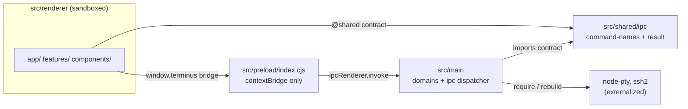

# Production Electron Directory Restructure Implementation Plan

> **For agentic workers:** REQUIRED SUB-SKILL: Use superpowers:subagent-driven-development (recommended) or superpowers:executing-plans to implement this plan task-by-task. Steps use checkbox (`- [ ]`) syntax for tracking.

**Goal:** Reorganize Buzz into a production-grade, electron-vite-style monorepo layout — unified `src/{main,preload,renderer,shared}`, a single `out/` build output, a shared cross-process IPC contract, and tidied docs — without changing runtime behavior.

**Architecture:** Adopt `electron-vite` as the single build orchestrator (replacing the split `tsc -p electron/tsconfig.json` + `vite build`). Source moves under `src/`: the Electron main process and preload become `src/main` and `src/preload`; the existing React app moves wholesale into `src/renderer`; a new `src/shared` holds the IPC command contract consumed by **both** processes (eliminating the duplicated `result.ts` and the renderer's hardcoded command strings). Build output collapses to `out/{main,preload,renderer}`; packaging stays on `electron-builder` → `release/`. Native modules (`node-pty`, `ssh2`) remain externalized and rebuilt by `electron-builder` unchanged.

**Tech Stack:** Electron 43, electron-vite 5, Vite 5, React 19, TypeScript 5.6, Vitest 2, Playwright 1.61, electron-builder 26, pnpm 10. `"type": "module"` stays set.

## Critical runtime decision (read before Task 7)

The repo today runs the **main process as CommonJS** (`electron/main.cts`, compiled to `dist-electron/main.cjs`) and relies on `__dirname` (`electron/main.cts:17`). With `"type": "module"` set, electron-vite's **default** output is ESM (`.mjs`), which would break `__dirname` and change the main-process module system. **To preserve identical runtime behavior, this plan forces CommonJS output** via `rollupOptions.output.format: "cjs"` + `entryFileNames: "[name].cjs"` for both `main` and `preload`. The `package.json` `main` field therefore points at `./out/main/index.cjs`. This is the lowest-risk choice and is called out explicitly in Task 7.

## Global Constraints

- Preserve every existing security property from `AGENTS.md`: renderer stays sandboxed (`sandbox`, `contextIsolation`, `webSecurity` on; `nodeIntegration` off); secrets never cross the IPC boundary; the renderer's only desktop seam is the typed IPC bridge.
- Keep the `@/` path alias working for **all** existing renderer imports without rewriting them — `@/` is repointed at `src/renderer` (not `src`).
- Keep `git mv` for every source move so file history is preserved. Never copy-then-delete.
- Every task ends with the repo in a **green, runnable** state: `pnpm typecheck` clean, `pnpm test` green, and (where the task touches build/packaging) `pnpm build` succeeds and the app launches.
- Node tooling version: pnpm `10.22.0` (from `packageManager`); do not change it.
- Output directory names after restructure: `out/` (build artifacts), `release/` (packaged installers). The old `dist/` and `dist-electron/` are deleted and gitignored.
- `e2e-electron/smoke.spec.ts` launches Electron with `args: [process.cwd()]` and reads the `main` field — so any change to the `main` field must keep `out/main/index.cjs` buildable from a clean `pnpm build`.

---

## Target File Structure

```
buzz/
├── src/
│   ├── main/                      # Electron main process  (was electron/)
│   │   ├── index.cts              #   was electron/main.cts
│   │   ├── command-names.ts       #   moved here in Task 6, promoted to src/shared in Task 8
│   │   ├── domains/               #   was electron/domains/*  (agent ai app forwarding inventory sftp ssh terminal)
│   │   └── ipc/                   #   was electron/ipc/*  (dispatcher, domain-error; result.ts leaves in Task 8)
│   ├── preload/
│   │   └── index.cjs              # was electron/preload.cjs
│   ├── renderer/                  # React app  (was src/)
│   │   ├── index.html             #   was ./index.html
│   │   ├── main.tsx               #   was src/main.tsx
│   │   ├── app/                   #   was src/app/  (App.tsx, ipc.ts, providers.tsx, electron.d.ts)
│   │   ├── components/            #   was src/components/
│   │   ├── features/              #   was src/features/
│   │   ├── shared/                #   was src/shared/  (renderer-internal: result.ts, schemas, theme, i18n, utils)
│   │   └── styles/                #   was src/styles/
│   └── shared/                    # NEW — cross-process IPC contract, single source of truth
│       └── ipc/
│           ├── command-names.ts   #   was electron/command-names.ts, refactored to named COMMANDS
│           └── result.ts          #   unifies src/shared/result.ts + electron/ipc/result.ts
├── build/                         # build tooling  (was electron/*.mjs)
│   ├── before-build.mjs
│   ├── clean-output.mjs
│   └── watch-dev.mjs
├── resources/                     # packaging icons  (was assets/)
│   └── icons/
├── tests/
│   ├── main/                      # was tests/electron/  (relative imports rewritten to src/main)
│   ├── renderer/                  # was tests/src/       (@/ alias unchanged → src/renderer)
│   └── setup.ts
├── e2e/   e2e-electron/           # Playwright suites (testDir unchanged)
├── docs/
│   ├── reports/                   # NEW — holds FORK_REPORT.md + SANITIZATION_REPORT.md (moved from repo root)
│   └── (DESIGN.md, ELECTRON_ARCHITECTURE.md, RELEASING.md, agent-dataflow.*, handoffs/, prd/, superpowers/)
├── out/                           # build output  (was dist/ + dist-electron/)
├── release/                       # electron-builder output (kept)
├── electron.vite.config.ts        # NEW — unified build orchestrator
├── tsconfig.json                  # renderer + shared + tests (paths: @ → src/renderer, @shared → src/shared)
├── tsconfig.node.json             # was electron/tsconfig.json — main + preload (NodeNext)
├── vite.config.ts                 # KEPT, renderer-only — powers `dev:web` + Playwright webServer
├── vitest.config.ts               # aliases + include/exclude updated
├── tailwind.config.ts  postcss.config.js  components.json
├── package.json  pnpm-workspace.yaml  pnpm-lock.yaml
├── .vscode/  .github/  .mcp.json  .env.example  setup.sh
└── AGENTS.md  CLAUDE.md  README.md  CONTRIBUTING.md  LICENSE
```

### Module boundary (after)



### Aliases (after — defined in `tsconfig.json`, `vite.config.ts`, `vitest.config.ts`, `electron.vite.config.ts`)

- `@/*` → `src/renderer/*` (renderer-internal; preserves all existing `@/...` imports verbatim)
- `@shared/*` → `src/shared/*` (cross-process IPC contract)

Main/preload import the contract via **relative** paths (e.g. `../../shared/ipc/command-names.js`) — they are bundled, so relative is simplest and unambiguous.

---

## Task Interfaces (what each task hands to the next)

- **Task 1** produces a green baseline + feature branch every later task builds on.
- **Task 6** produces `src/main/index.cts` exporting `start()` exactly as today (entrypoint `void start()`), with internal imports updated to the new relative layout. Later tasks do not change its signature.
- **Task 7** produces `out/main/index.cjs` + `out/preload/index.cjs` + `out/renderer/index.html` and a `package.json` whose `main` = `./out/main/index.cjs`. Task 8+ rely on `pnpm build` producing exactly these paths.
- **Task 8** produces `src/shared/ipc/command-names.ts` exporting `COMMANDS` (named-const object), plus the **existing** exports `COMMAND_NAMES`, `CommandName`, `isCommandName` (now derived) so `src/main` and `tests/main` keep compiling unchanged. Renderer imports `COMMANDS` via `@shared/ipc/command-names`.

---

## Task 1: Capture green baseline and create the restructure branch

**Files:**
- None (verification + git only)

**Interfaces:** Produces a clean `feature/electron-vite-restructure` branch with a recorded green baseline.

- [ ] **Step 1: Confirm working tree is clean**

Run: `git status --porcelain`
Expected: empty output (clean tree). If not clean, commit or stash existing work first.

- [ ] **Step 2: Create the restructure branch**

```bash
git checkout -b feature/electron-vite-restructure
```

- [ ] **Step 3: Record the green baseline (typecheck)**

Run: `pnpm typecheck`
Expected: exits 0, no errors. Note: the root `tsconfig.json` includes `src` + `tests` only; this is the renderer+tests gate.

- [ ] **Step 4: Record the green baseline (unit tests)**

Run: `pnpm test`
Expected: all Vitest suites pass (renderer `tests/src/**` + main `tests/electron/**`).

- [ ] **Step 5: Record the green baseline (electron build)**

Run: `pnpm build:electron`
Expected: `dist-electron/main.cjs` + `dist-electron/domains/**` produced, exits 0. This confirms the current `tsc -p electron/tsconfig.json` pipeline works before we replace it.

- [ ] **Step 6: Record the green baseline (renderer build)**

Run: `pnpm build:renderer`
Expected: `dist/index.html` + `dist/assets/**` produced, exits 0.

Keep `dist/` and `dist-electron/` on disk for now — they are gitignored and will be regenerated. Do not commit them.

---

## Task 2: Scaffold new top-level dirs, split tsconfig, update .gitignore

**Files:**
- Create: `tsconfig.node.json`
- Modify: `.gitignore`
- Create (empty, tracked via `.gitkeep`): `src/main/.gitkeep`, `src/preload/.gitkeep`, `src/renderer/.gitkeep`, `src/shared/.gitkeep`, `build/.gitkeep`

**Interfaces:** Produces `tsconfig.node.json` (NodeNext, will compile main+preload once source arrives). The old `electron/tsconfig.json` stays in place and stays the active main build until Task 6.

- [ ] **Step 1: Create `tsconfig.node.json` (copy of current `electron/tsconfig.json`)**

This is the future main/preload config. It mirrors `electron/tsconfig.json` exactly so Task 6 is a pure path swap.

```json
{
  "compilerOptions": {
    "target": "ES2022",
    "module": "NodeNext",
    "moduleResolution": "NodeNext",
    "strict": true,
    "esModuleInterop": true,
    "forceConsistentCasingInFileNames": true,
    "skipLibCheck": true,
    "rootDir": ".",
    "outDir": "out",
    "sourceMap": true,
    "types": ["node"]
  },
  "include": ["src/main/**/*.ts", "src/main/**/*.cts", "src/preload/**/*.ts", "src/preload/**/*.cts", "src/shared/**/*.ts"],
  "exclude": ["src/**/*.test.ts"]
}
```

Note: `outDir` is `out` (not `../dist-electron`) because this config now lives at repo root. `include` lists the new locations; until Task 6 moves source there, these globs match nothing and `tsc -p tsconfig.node.json` compiles zero files (harmless).

- [ ] **Step 2: Update `.gitignore` outputs**

In `.gitignore`, replace the three output lines:

```
dist/
dist-electron/
```

with:

```
out/
release/
```

Keep `release/` (it was already there) — confirm it remains. Final relevant block:

```
node_modules/
out/
release/
coverage/
playwright-report/
test-results/
```

(Leave the `.DS_Store`, `.env*`, `*.pem`, `*.key`, `*.tsbuildinfo`, `.superpowers/`, `.vscode/`, `_shots/` rules untouched.)

- [ ] **Step 3: Create empty target dirs with `.gitkeep`**

```bash
mkdir -p src/main src/preload src/renderer src/shared build
touch src/main/.gitkeep src/preload/.gitkeep src/renderer/.gitkeep src/shared/.gitkeep build/.gitkeep
```

- [ ] **Step 4: Verify the old build still works (nothing broken yet)**

Run: `pnpm typecheck && pnpm build:electron && pnpm build:renderer`
Expected: all exit 0 (the scaffolding is inert).

- [ ] **Step 5: Commit**

```bash
git add .gitignore tsconfig.node.json src/main/.gitkeep src/preload/.gitkeep src/renderer/.gitkeep src/shared/.gitkeep build/.gitkeep
git commit -m "chore(restructure): scaffold src/{main,preload,renderer,shared} + build/ + tsconfig.node.json"
```

---

## Task 3: Move build tooling out of source into `build/`

**Files:**
- Move: `electron/before-build.mjs` → `build/before-build.mjs`
- Move: `electron/clean-output.mjs` → `build/clean-output.mjs`
- Move: `electron/watch-dev.mjs` → `build/watch-dev.mjs`
- Modify: `package.json` (`scripts.build:electron`, `build.beforeBuild`)
- Modify: `.vscode/tasks.json` (path to `electron/tsconfig.json` — stays for now; `watch-dev.mjs` path)
- Modify: `.vscode/launch.json` (`watch-dev.mjs` runtimeArgs path)
- Delete: `build/.gitkeep`

**Interfaces:** `build/clean-output.mjs` and `build/before-build.mjs` keep their exact default exports and signatures. `build/watch-dev.mjs` keeps its CLI contract (spawn electron, watch an output dir). `package.json` `build.beforeBuild` must resolve to `build/before-build.mjs`.

- [ ] **Step 1: Move the three tooling files with git**

```bash
git mv electron/before-build.mjs build/before-build.mjs
git mv electron/clean-output.mjs build/clean-output.mjs
git mv electron/watch-dev.mjs build/watch-dev.mjs
rm build/.gitkeep
```

- [ ] **Step 2: Update `package.json` `build:electron` script**

In `package.json`, change:

```json
"build:electron": "node electron/clean-output.mjs && tsc -p electron/tsconfig.json",
```

to:

```json
"build:electron": "node build/clean-output.mjs && tsc -p electron/tsconfig.json",
```

- [ ] **Step 3: Update `package.json` electron-builder `beforeBuild`**

Change:

```json
"beforeBuild": "electron/before-build.mjs",
```

to:

```json
"beforeBuild": "build/before-build.mjs",
```

- [ ] **Step 4: Update `clean-output.mjs` target directory name**

`build/clean-output.mjs` currently hard-codes the directory name `dist-electron` as a safety guard. It will continue to clean `dist-electron` until Task 7 swaps the output dir, so **leave the body unchanged for now**. (Task 7 renames the guard to `out`.) Just confirm by reading:

Run: `grep -n "dist-electron\|basename" build/clean-output.mjs`
Expected: lines 4 and 5 reference `dist-electron`. No change this task.

- [ ] **Step 5: Update `.vscode/launch.json` watch-dev path**

In `.vscode/launch.json`, the "Debug Main Process" config has:

```json
"runtimeArgs": [
  "${workspaceFolder}/electron/watch-dev.mjs"
],
```

Change to:

```json
"runtimeArgs": [
  "${workspaceFolder}/build/watch-dev.mjs"
],
```

- [ ] **Step 6: Verify the electron build still runs from the new location**

Run: `pnpm build:electron`
Expected: `node build/clean-output.mjs` runs, then `tsc -p electron/tsconfig.json` produces `dist-electron/main.cjs`, exit 0.

- [ ] **Step 7: Commit**

```bash
git add -A
git commit -m "refactor(build): move electron tooling scripts into build/"
```

---

## Task 4: Rename `assets/` → `resources/` (electron-builder packaging convention)

**Files:**
- Move: `assets/` → `resources/` (whole tree, incl. `assets/icons/*`)
- Modify: `package.json` (`build.mac.icon`, `build.win.icon`, `build.linux.icon`)
- Modify: `README.md` (logo `src` path)

**Interfaces:** `resources/icons/icon.icns`, `icon.ico`, `icon.png`, `icon.svg` resolve at the paths electron-builder reads. README logo renders.

- [ ] **Step 1: Move the assets tree**

```bash
git mv assets resources
```

- [ ] **Step 2: Update `package.json` icon paths**

Change the three icon entries:

```json
"mac": {
  "icon": "assets/icons/icon.icns",
  ...
},
"win": {
  "icon": "assets/icons/icon.ico",
  ...
},
"linux": {
  "icon": "assets/icons",
  ...
},
```

to:

```json
"mac": {
  "icon": "resources/icons/icon.icns",
  ...
},
"win": {
  "icon": "resources/icons/icon.ico",
  ...
},
"linux": {
  "icon": "resources/icons",
  ...
},
```

(Leave the rest of each platform block — `category`, `hardenedRuntime`, `x64ArchFiles`, `target`, etc. — untouched.)

- [ ] **Step 3: Update README logo path**

In `README.md`, change:

```html

```

to:

```html

```

- [ ] **Step 4: Verify no other references to `assets/` remain in tracked source**

Run: `git grep -n "assets/" -- ':!pnpm-lock.yaml'`
Expected: no matches in source/configs. (If matches appear in `docs/` or `designs/`, update them too — those are image references.)

- [ ] **Step 5: Verify typecheck + build still green**

Run: `pnpm typecheck && pnpm build:electron && pnpm build:renderer`
Expected: all exit 0.

- [ ] **Step 6: Commit**

```bash
git add -A
git commit -m "refactor(build): rename assets/ to resources/ for electron-builder convention"
```

---

## Task 5: Move the renderer into `src/renderer/`

This is the largest mechanical move. The `@/` alias is repointed at `src/renderer` so **no renderer source file's `@/...` imports change**. Only `index.html` and the alias/config roots move.

**Files:**
- Move: `src/main.tsx` → `src/renderer/main.tsx`
- Move: `src/app/`, `src/components/`, `src/features/`, `src/shared/`, `src/styles/` → `src/renderer/{app,components,features,shared,styles}/`
- Move: `index.html` → `src/renderer/index.html`
- Move: `tests/src/` → `tests/renderer/`
- Modify: `src/renderer/index.html` (script `src`)
- Modify: `tsconfig.json` (`baseUrl`/`paths` `@/*` → `src/renderer/*`; `include`)
- Modify: `vite.config.ts` (renderer root is now `src/renderer`)
- Modify: `vitest.config.ts` (`@` alias → `src/renderer`; `setupFiles` path; `include`)
- Modify: `tailwind.config.ts` (`content` globs)
- Modify: `components.json` (`tailwind.css` path)
- Delete: `src/renderer/.gitkeep`

**Interfaces:** All `@/...` imports in renderer source and `tests/renderer/**` keep resolving. `src/renderer/main.tsx` remains the Vite entry. `src/renderer/index.html` references `/src/renderer/main.tsx`.

- [ ] **Step 1: Move renderer source dirs into `src/renderer/`**

```bash
git mv src/main.tsx src/renderer/main.tsx
git mv src/app src/renderer/app
git mv src/components src/renderer/components
git mv src/features src/renderer/features
git mv src/shared src/renderer/shared
git mv src/styles src/renderer/styles
rm src/renderer/.gitkeep
```

After this, `src/` contains only `main/.gitkeep`, `preload/.gitkeep`, `renderer/`, `shared/.gitkeep`.

- [ ] **Step 2: Move `index.html` into the renderer root**

```bash
git mv index.html src/renderer/index.html
```

- [ ] **Step 3: Update the script `src` in `src/renderer/index.html`**

Change:

```html
<script type="module" src="/src/main.tsx"></script>
```

to:

```html
<script type="module" src="/src/renderer/main.tsx"></script>
```

Leave the CSP `<meta>` and everything else in the file unchanged.

- [ ] **Step 4: Move renderer tests**

```bash
git mv tests/src tests/renderer
```

- [ ] **Step 5: Repoint the `@/` alias in `tsconfig.json`**

In `tsconfig.json`, change the `paths` block:

```json
"paths": {
  "@/*": ["./src/*"]
},
```

to:

```json
"paths": {
  "@/*": ["./src/renderer/*"],
  "@shared/*": ["./src/shared/*"]
},
```

And change the `include`:

```json
"include": ["src", "tests"]
```

to:

```json
"include": ["src/renderer", "src/shared", "tests"]
```

(`src/main` and `src/preload` are excluded here — they are covered by `tsconfig.node.json` from Task 2.)

- [ ] **Step 6: Repoint the renderer root in `vite.config.ts`**

`vite.config.ts` becomes renderer-only (it powers `dev:web` and the Playwright `webServer`). It must resolve `@` to `src/renderer` and treat `src/renderer` as root so `/src/renderer/main.tsx` and `index.html` resolve. Replace the entire file with:

```ts
import { defineConfig } from "vite";
import react from "@vitejs/plugin-react";
import { fileURLToPath, URL } from "node:url";

// Renderer-only Vite config. Powers `pnpm dev:web` and the Playwright webServer.
// The unified main+preload+renderer build lives in electron.vite.config.ts (added in Task 7).
export default defineConfig({
  root: fileURLToPath(new URL("./src/renderer", import.meta.url)),
  plugins: [react()],
  resolve: {
    alias: {
      "@": fileURLToPath(new URL("./src/renderer", import.meta.url)),
      "@shared": fileURLToPath(new URL("./src/shared", import.meta.url)),
    },
  },
  build: {
    rollupOptions: {
      output: {
        manualChunks(id) {
          return id.includes("/node_modules/.pnpm/@xterm+")
            ? "terminal-runtime"
            : undefined;
        },
      },
    },
  },
  clearScreen: false,
  server: {
    // Electron development loads this exact loopback URL; keep the binding
    // explicit so the desktop process never falls back to an external host.
    host: "127.0.0.1",
    port: 1420,
    strictPort: true,
  },
});
```

- [ ] **Step 7: Repoint aliases + include in `vitest.config.ts`**

Replace the `resolve.alias` and `test` blocks so the file reads:

```ts
import { defineConfig } from "vitest/config";
import react from "@vitejs/plugin-react";
import { fileURLToPath, URL } from "node:url";

export default defineConfig({
  plugins: [react()],
  resolve: {
    alias: {
      "@": fileURLToPath(new URL("./src/renderer", import.meta.url)),
      "@shared": fileURLToPath(new URL("./src/shared", import.meta.url)),
    },
  },
  test: {
    environment: "jsdom",
    setupFiles: ["./tests/setup.ts"],
    css: true,
    include: ["tests/**/*.test.{ts,tsx}"],
    exclude: ["node_modules/**", "out/**", "release/**", "e2e/**", "e2e-electron/**"],
  },
});
```

(The only real changes vs. the old file: `@` now points at `src/renderer`, the `@shared` alias is added, and the `exclude` list now names `out/` + `release/` instead of `dist/` + `dist-electron/`.)

- [ ] **Step 8: Update `tailwind.config.ts` content globs**

Change:

```ts
content: ["./index.html", "./src/**/*.{ts,tsx}"],
```

to:

```ts
content: ["./src/renderer/index.html", "./src/renderer/**/*.{ts,tsx}"],
```

- [ ] **Step 9: Update `components.json` shadcn paths**

Change:

```json
"tailwind": {
  "config": "tailwind.config.ts",
  "css": "src/styles/globals.css",
  ...
},
```

to:

```json
"tailwind": {
  "config": "tailwind.config.ts",
  "css": "src/renderer/styles/globals.css",
  ...
},
```

The `aliases` block (`@/components`, `@/shared/utils`, `@/components/ui`, `@/shared`, `@/hooks`) needs **no change** — `@` now resolves to `src/renderer`, so `@/components` → `src/renderer/components` etc., which is correct.

- [ ] **Step 10: Verify renderer typecheck**

Run: `pnpm typecheck`
Expected: exit 0. This confirms every `@/...` import in `src/renderer/**` and `tests/renderer/**` still resolves through the new alias.

- [ ] **Step 11: Verify renderer tests**

Run: `pnpm test`
Expected: all `tests/renderer/**` suites pass. (`tests/electron/**` will now FAIL to resolve relative imports into `electron/` — that is expected and fixed in Task 6. To run only renderer tests for this gate, use `pnpm test tests/renderer`.)

- [ ] **Step 12: Verify renderer build**

Run: `pnpm build:renderer`
Expected: Vite builds with `root: src/renderer`, producing `dist/index.html` + `dist/assets/**`, exit 0.

- [ ] **Step 13: Commit**

```bash
git add -A
git commit -m "refactor(renderer): move renderer into src/renderer, repoint @ alias"
```

---

## Task 6: Move main + preload into `src/main/` and `src/preload/`

The main/preload internal imports are **all relative within their own trees** (`./domains/...`, `./ipc/...`, `./command-names.js`), so moving the whole subtree preserves them. Only main-process **tests** (which reach into `electron/` via deep relative paths like `../../../../electron/domains/...`) need rewriting.

**Files:**
- Move: `electron/main.cts` → `src/main/index.cts`
- Move: `electron/preload.cjs` → `src/preload/index.cjs`
- Move: `electron/command-names.ts` → `src/main/command-names.ts`
- Move: `electron/domains/` → `src/main/domains/`
- Move: `electron/ipc/` → `src/main/ipc/`
- Move: `tests/electron/` → `tests/main/`
- Modify: every `tests/main/**` test that imports `../../../../electron/...` or `../../../electron/...`
- Modify: `package.json` (`scripts.build:electron` → `tsconfig.node.json`)
- Modify: `.vscode/tasks.json` (`electron/tsconfig.json` → `tsconfig.node.json`)
- Delete: `electron/` (now empty except `tsconfig.json`), `electron/tsconfig.json`, `src/main/.gitkeep`, `src/preload/.gitkeep`

**Interfaces:** `src/main/index.cts` exports the same runtime entry (`void start()`). Internal relative imports inside `src/main/domains/**` and `src/main/ipc/**` are unchanged. `command-names.ts` still exports `COMMAND_NAMES`, `CommandName`, `isCommandName` (Task 8 will refactor these, keeping the names).

- [ ] **Step 1: Move main process source**

```bash
git mv electron/main.cts src/main/index.cts
git mv electron/command-names.ts src/main/command-names.ts
git mv electron/domains src/main/domains
git mv electron/ipc src/main/ipc
```

- [ ] **Step 2: Move preload**

```bash
git mv electron/preload.cjs src/preload/index.cjs
rm src/preload/.gitkeep src/main/.gitkeep
```

- [ ] **Step 3: Remove the now-obsolete `electron/` directory**

```bash
git rm electron/tsconfig.json
rmdir electron 2>/dev/null || true
```

Confirm `electron/` is gone: `ls electron 2>&1 || echo "electron/ removed"`.

- [ ] **Step 4: Move main-process tests**

```bash
git mv tests/electron tests/main
```

- [ ] **Step 5: Rewrite deep relative imports in `tests/main/**`**

Main-process tests import the old `electron/` tree via paths like `../../../../electron/domains/inventory/database`. After the move, `electron/` is `src/main/`, so the path is shorter by one level (no more `electron/` segment) and the tests are now under `tests/main/...` (same depth as `tests/electron/...`). For a file at `tests/main/domains/inventory/database.test.ts`, the import changes from:

```ts
import { openInventoryDatabase } from "../../../../electron/domains/inventory/database";
```

to:

```ts
import { openInventoryDatabase } from "../../../../src/main/domains/inventory/database";
```

That is: replace the literal `electron/` segment with `src/main/`, keeping the leading `../` count **unchanged** (the test file's directory depth did not change — `tests/electron/...` and `tests/main/...` are the same depth). Apply this mechanical replacement to every occurrence in `tests/main/**`:

Run: `grep -rln "electron/" tests/main`
Expected: a list of test files. For each, replace `electron/` with `src/main/` inside import specifiers (the leading `../` count stays the same). Concretely:

```bash
# Replace import-path segment electron/ -> src/main/ across main tests.
# Only touches import/from lines; safe because 'electron/' no longer exists anywhere.
git grep -l "from \"\\.\\..*electron/" tests/main | while read -r f; do
  perl -0pi -e 's{(from\s+"(?:\.\./)+)electron/}{$1src/main/}g' "$f"
done
```

After running, verify no test still references the old path:

Run: `git grep -n "electron/" tests/main`
Expected: no matches.

- [ ] **Step 6: Point `build:electron` at `tsconfig.node.json`**

In `package.json`, change:

```json
"build:electron": "node build/clean-output.mjs && tsc -p electron/tsconfig.json",
```

to:

```json
"build:electron": "node build/clean-output.mjs && tsc -p tsconfig.node.json",
```

- [ ] **Step 7: Update `clean-output.mjs` to target the new (temporary) output dir**

`tsconfig.node.json` has `outDir: "out"`. But the renderer build (still `vite build` → `dist/`) does not yet write to `out/`, and the electron-builder `files` still reference `dist/` + `dist-electron/`. To keep this task self-contained and green, point `clean-output.mjs` at `out` (the new main output) so it clears what `tsconfig.node.json` writes. In `build/clean-output.mjs`, change:

```js
const output = path.resolve("dist-electron");
if (path.basename(output) !== "dist-electron") {
  throw new Error("Refusing to clean an unexpected Electron output directory.");
}
```

to:

```js
const output = path.resolve("out");
if (path.basename(output) !== "out") {
  throw new Error("Refusing to clean an unexpected Electron output directory.");
}
```

(Task 7 collapses everything into `out/` and the guard stays correct.)

- [ ] **Step 8: Update `.vscode/tasks.json` tsconfig path**

The `electron:watch` and `build:electron` tasks reference `electron/tsconfig.json`. Change both occurrences of:

```json
"electron/tsconfig.json"
```

to:

```json
"tsconfig.node.json"
```

- [ ] **Step 9: Verify main typecheck + build**

Run: `pnpm build:electron`
Expected: `clean-output.mjs` clears `out/`, then `tsc -p tsconfig.node.json` emits `out/main/index.cjs`? **No** — `tsc` emits `out/index.cjs` plus `out/domains/**`, `out/ipc/**` (flat, mirroring `src/main`). Confirm what landed:

Run: `find out -type f | sort`
Expected: `out/index.cjs`, `out/command-names.js`, `out/domains/**`, `out/ipc/**`, plus `.js.map` files. (The exact flatten is fine — Task 7 replaces `tsc` output entirely with electron-vite's `out/main/index.cjs`. This task only proves the TS compiles from the new location.)

- [ ] **Step 10: Verify main tests**

Run: `pnpm test tests/main`
Expected: all `tests/main/**` suites pass. If any fail on import resolution, recheck Step 5 — a `from "../...electron/"` was missed.

- [ ] **Step 11: Verify full test suite**

Run: `pnpm test`
Expected: both `tests/renderer/**` and `tests/main/**` pass.

- [ ] **Step 12: Commit**

```bash
git add -A
git commit -m "refactor(main): move electron/ into src/main + src/preload, point build at tsconfig.node.json"
```

---

## Task 7: Introduce `electron-vite` and swap the build pipeline

This is the build-system migration. After it, `pnpm dev` is a single command, `pnpm build` produces `out/{main,preload,renderer}`, and `package.json` `main` = `./out/main/index.cjs`.

**Files:**
- Create: `electron.vite.config.ts`
- Modify: `package.json` (`main`, `scripts`, electron-builder `files`)
- Modify: `src/main/index.cts` (preload + renderer load paths; remove `projectRoot`)
- Delete: `build/clean-output.mjs` (electron-vite manages `out/`); update `package.json` `build:electron` accordingly
- Add devDependency: `electron-vite`

**Interfaces:** Produces `out/main/index.cjs`, `out/preload/index.cjs`, `out/renderer/index.html`. The app launches in dev (`pnpm dev`) and the e2e-electron smoke test passes.

- [ ] **Step 1: Install electron-vite**

```bash
pnpm add -D electron-vite
```

Confirm it lands in `devDependencies` (electron-vite v5+). Note the installed version:

Run: `node -e "console.log(require('./node_modules/electron-vite/package.json').version)"`

- [ ] **Step 2: Create `electron.vite.config.ts`**

```ts
import { defineConfig } from "electron-vite";
import { fileURLToPath, URL } from "node:url";
import react from "@vitejs/plugin-react";

// Unified build orchestrator for main + preload + renderer.
// Output is forced to CommonJS (.cjs) for main + preload to preserve the
// existing runtime model (the main process uses __dirname; "type": "module"
// would otherwise default electron-vite to ESM/.mjs and break it).
export default defineConfig({
  main: {
    build: {
      outDir: "out/main",
      emptyOutDir: true,
      rollupOptions: {
        input: { index: fileURLToPath(new URL("src/main/index.cts", import.meta.url)) },
        output: { format: "cjs", entryFileNames: "[name].cjs" },
      },
    },
  },
  preload: {
    build: {
      outDir: "out/preload",
      emptyOutDir: true,
      rollupOptions: {
        input: { index: fileURLToPath(new URL("src/preload/index.cjs", import.meta.url)) },
        output: { format: "cjs", entryFileNames: "[name].cjs" },
      },
    },
  },
  renderer: {
    root: fileURLToPath(new URL("src/renderer", import.meta.url)),
    resolve: {
      alias: {
        "@": fileURLToPath(new URL("src/renderer", import.meta.url)),
        "@shared": fileURLToPath(new URL("src/shared", import.meta.url)),
      },
    },
    build: {
      outDir: "out/renderer",
      emptyOutDir: true,
      rollupOptions: {
        input: { index: fileURLToPath(new URL("src/renderer/index.html", import.meta.url)) },
        output: {
          manualChunks(id) {
            return id.includes("/node_modules/.pnpm/@xterm+")
              ? "terminal-runtime"
              : undefined;
          },
        },
      },
    },
    clearScreen: false,
    server: {
      host: "127.0.0.1",
      port: 1420,
      strictPort: true,
    },
  },
});
```

Note on `react()`: import the plugin in the renderer block only (main/preload do not need JSX). If the installed electron-vite version rejects a plugin array under `renderer`, fall back to omitting `plugins` and rely on the shared `@vitejs/plugin-react` auto-detection — but the array form above is the documented v5 shape.

- [ ] **Step 3: Add the `react` plugin to the renderer config explicitly**

Append `plugins: [react()],` inside the `renderer: { ... }` object (after `root:`), so the renderer compiles JSX. (If Step 2's verification in Step 9 shows JSX errors, this is the fix — it is listed separately so the failure mode is debuggable.)

- [ ] **Step 4: Rewrite preload + renderer load paths in `src/main/index.cts`**

The bundled main runs from `out/main/`, so preload and the packaged renderer are **siblings** of the main dir, not under a project root. Replace the `projectRoot` definition and its two usages.

In `src/main/index.cts`, find:

```ts
const projectRoot = path.resolve(__dirname, "..");
```

and delete it entirely.

Then in `createWindow()`, find the `webPreferences.preload` line:

```ts
preload: path.join(projectRoot, "electron", "preload.cjs"),
```

and replace with:

```ts
preload: path.join(__dirname, "..", "preload", "index.cjs"),
```

And find the packaged-renderer load:

```ts
if (app.isPackaged) void window.loadFile(path.join(projectRoot, "dist", "index.html"))
```

and replace with:

```ts
if (app.isPackaged) void window.loadFile(path.join(__dirname, "..", "renderer", "index.html"))
```

(`__dirname` is `…/out/main`; `..` → `out`; `preload/index.cjs` → `out/preload/index.cjs`, `renderer/index.html` → `out/renderer/index.html`. The relative layout under `out/` is identical in dev and packaged builds, so this works in both.)

Leave the dev-mode `window.loadURL("http://127.0.0.1:1420")` and every other line unchanged. `__dirname` works because main output is CommonJS (`.cjs`) — this is exactly why Task 7 forces `format: "cjs"`.

- [ ] **Step 5: Update `package.json` `main` field**

Change:

```json
"main": "dist-electron/main.cjs",
```

to:

```json
"main": "./out/main/index.cjs",
```

- [ ] **Step 6: Collapse `package.json` scripts**

Replace the `scripts` block. The new scripts use electron-vite for dev/build, keep `dev:web` + `test:electron` working, and run typecheck across both tsconfigs. Replace:

```json
"scripts": {
  "dev": "pnpm build:electron && concurrently -k \"pnpm dev:web\" \"wait-on http://127.0.0.1:1420 && electron .\"",
  "dev:web": "vite",
  "build": "pnpm typecheck && pnpm build:renderer && pnpm build:electron",
  "build:renderer": "vite build",
  "build:electron": "node build/clean-output.mjs && tsc -p tsconfig.node.json",
  "package": "pnpm build && electron-builder",
  "preview": "vite preview",
  "test": "vitest run",
  "test:watch": "vitest",
  "test:e2e": "playwright test",
  "test:electron": "pnpm build:electron && playwright test --config playwright.electron.config.ts",
  "typecheck": "tsc --noEmit --pretty false"
},
```

with:

```json
"scripts": {
  "dev": "electron-vite dev",
  "dev:web": "vite",
  "build": "pnpm typecheck && electron-vite build",
  "package": "pnpm build && electron-builder",
  "preview": "electron-vite preview",
  "test": "vitest run",
  "test:watch": "vitest",
  "test:e2e": "playwright test",
  "test:electron": "electron-vite build && playwright test --config playwright.electron.config.ts",
  "typecheck": "tsc -p tsconfig.json --noEmit --pretty false && tsc -p tsconfig.node.json --noEmit --pretty false"
},
```

Notes:
- `dev:web` stays `vite` (renderer-only dev server for Playwright `webServer` — must NOT launch Electron). It uses `vite.config.ts` from Task 5.
- `typecheck` now covers renderer+shared (`tsconfig.json`) **and** main+preload (`tsconfig.node.json`).
- The standalone `build:renderer` / `build:electron` scripts are removed; `build` runs the unified `electron-vite build`.
- `concurrently` and `wait-on` devDependencies are now unused by scripts. Leave them installed for now; Task 10 can remove them if desired (low priority — removing risks lockfile churn; keep unless asked).

- [ ] **Step 7: Update electron-builder `files` in `package.json`**

The packaged app now ships from `out/` (source is excluded because electron-vite bundles it). Change:

```json
"files": [
  "dist/**/*",
  "dist-electron/**/*",
  "electron/preload.cjs",
  "package.json"
],
```

to:

```json
"files": [
  "out/**/*",
  "package.json"
],
```

(`out/preload/index.cjs` is covered by `out/**/*`; the explicit preload entry is gone.)

- [ ] **Step 8: Delete the now-redundant `clean-output.mjs`**

electron-vite clears each `outDir` itself (`emptyOutDir: true`). Remove the script and its reference was already dropped in Step 6:

```bash
git rm build/clean-output.mjs
```

- [ ] **Step 9: Verify the unified build**

Run: `pnpm build`
Expected: exits 0. Confirm the exact outputs:

Run: `find out -maxdepth 2 -type f | sort`
Expected to include:
- `out/main/index.cjs` (and `index.cjs.map`)
- `out/preload/index.cjs`
- `out/renderer/index.html` and `out/renderer/assets/**`

If `out/main/index.mjs` or `out/preload/index.mjs` appears instead of `.cjs`, electron-vite defaulted to ESM despite `format: "cjs"`. Fix by ensuring the `output` object in both `main` and `preload` blocks is nested under `rollupOptions` exactly as written in Step 2, and that `"type": "module"` is present in `package.json` (it is). Re-run `pnpm build`.

- [ ] **Step 10: Verify native modules are externalized (not bundled)**

Run: `grep -rl "node-pty\|ssh2" out/main out/preload`
Expected: no matches (the source references them, but they are externalized into `node_modules`, rebuilt by electron-builder). If they ARE bundled, electron-vite's default externalization is off — add `build: { externalizeDeps: true }` to the `main` block and rebuild.

- [ ] **Step 11: Verify the app launches in dev**

Run (foreground, then quit manually, or background with a timeout):

```bash
pnpm dev
```

Expected: electron-vite starts the renderer at `127.0.0.1:1420`, builds main+preload, and launches the Electron window showing the Buzz UI (Servers page). Quit the app with Cmd-Q / Ctrl-Q. If the window is blank or shows a load error, recheck Step 4's preload/renderer paths.

- [ ] **Step 12: Verify the e2e-electron smoke test**

This exercises the full main→preload→renderer round-trip including `node-pty`:

Run: `pnpm test:electron`
Expected: both tests in `e2e-electron/smoke.spec.ts` pass — the window boots, `app_health` returns `{ ok: true, data: { name: "buzz", version: "0.0.1" } }`, a vault round-trips, and the terminal prints `electron-rpc`.

If `test:electron` fails to launch with a `main` resolution error, confirm `package.json` `main` = `./out/main/index.cjs` and that `out/main/index.cjs` exists after `electron-vite build`.

- [ ] **Step 13: Commit**

```bash
git add -A
git commit -m "build: adopt electron-vite, unify output to out/, force CJS main+preload"
```

---

## Task 8: Extract the shared IPC contract into `src/shared/ipc/`

Eliminate the duplicated `result.ts` (renderer copy vs main copy) and stop the renderer from hardcoding command strings. `command-names.ts` becomes a single named-const source the renderer imports.

**Files:**
- Create: `src/shared/ipc/command-names.ts` (moved from `src/main/command-names.ts`, refactored)
- Create: `src/shared/ipc/result.ts` (unifies both copies)
- Delete: `src/main/command-names.ts`, `src/main/ipc/result.ts`, `src/renderer/shared/result.ts`
- Modify: `src/main/index.cts` (import command-names from `../shared/...`)
- Modify: `src/main/ipc/dispatcher.ts`, `src/main/ipc/domain-error.ts`, and any `src/main/**` importing `./result.js` or `../command-names.js`
- Modify: `src/renderer/app/ipc.ts`, `src/renderer/app/electron.d.ts` (import `IpcResult` from `@shared/ipc/result`)
- Modify: every `src/renderer/features/**/*Api.ts` that hardcodes a command string → import `COMMANDS` from `@shared/ipc/command-names`
- Delete: `src/shared/.gitkeep`

**Interfaces:** `src/shared/ipc/command-names.ts` exports `COMMANDS` (named-const object, values are the exact command strings), plus the **existing** `COMMAND_NAMES` (array, derived), `CommandName` (union, derived), `isCommandName` (guard, derived). `src/shared/ipc/result.ts` exports `AppError`, `IpcResult`, `success`, `failure`.

- [ ] **Step 1: Create the shared command-names module**

Move and refactor. First move the file:

```bash
git mv src/main/command-names.ts src/shared/ipc/command-names.ts
rm src/shared/.gitkeep
```

Then replace the **entire contents** of `src/shared/ipc/command-names.ts` with a named-const source of truth that derives the legacy array/type/guard (so `src/main` and `tests/main` keep compiling unchanged):

```ts
// Single source of truth for the cross-process IPC command contract.
// Consumed by src/main (allowlist + dispatcher) and src/renderer (API layer),
// so the renderer never hardcodes a command string.
export const COMMANDS = {
  appHealth: "app_health",

  aiListProviderConfigs: "ai_list_provider_configs",
  aiCreateProviderConfig: "ai_create_provider_config",
  aiUpdateProviderConfig: "ai_update_provider_config",
  aiDeleteProviderConfig: "ai_delete_provider_config",
  aiTestProviderConfig: "ai_test_provider_config",
  aiProbeProviderConfig: "ai_probe_provider_config",
  aiAgentCreate: "ai_agent_create",
  aiAgentPrompt: "ai_agent_prompt",
  aiAgentSteer: "ai_agent_steer",
  aiAgentAbort: "ai_agent_abort",
  aiAgentDecideTool: "ai_agent_decide_tool",
  aiAgentClose: "ai_agent_close",
  aiListSessions: "ai_list_sessions",
  aiLoadSession: "ai_load_session",
  aiRenameSession: "ai_rename_session",
  aiDeleteSession: "ai_delete_session",

  agentCreate: "agent_create",
  agentPrompt: "agent_prompt",
  agentSteer: "agent_steer",
  agentAbort: "agent_abort",
  agentDecideTool: "agent_decide_tool",
  agentClose: "agent_close",

  inventoryListVaults: "inventory_list_vaults",
  inventoryCreateVault: "inventory_create_vault",
  inventoryUpdateVault: "inventory_update_vault",
  inventoryDeleteVault: "inventory_delete_vault",
  inventoryListGroups: "inventory_list_groups",
  inventoryCreateGroup: "inventory_create_group",
  inventoryListHosts: "inventory_list_hosts",
  inventoryCreateHost: "inventory_create_host",
  inventoryUpdateHost: "inventory_update_host",
  inventoryDeleteHost: "inventory_delete_host",
  inventoryListIdentities: "inventory_list_identities",
  inventoryCreateIdentity: "inventory_create_identity",
  inventoryUpdateIdentity: "inventory_update_identity",
  inventoryDeleteIdentity: "inventory_delete_identity",

  sshStoreCredential: "ssh_store_credential",
  sshOpen: "ssh_open",
  sshDecideHostKey: "ssh_decide_host_key",
  sshReconnect: "ssh_reconnect",
  sshListKnownHosts: "ssh_list_known_hosts",
  sshDeleteKnownHost: "ssh_delete_known_host",

  portForwardStart: "port_forward_start",
  portForwardDecideHostKey: "port_forward_decide_host_key",
  portForwardStop: "port_forward_stop",
  portForwardListActive: "port_forward_list_active",
  portForwardListRules: "port_forward_list_rules",
  portForwardCreateRule: "port_forward_create_rule",
  portForwardUpdateRule: "port_forward_update_rule",
  portForwardDeleteRule: "port_forward_delete_rule",

  terminalOpen: "terminal_open",
  terminalWrite: "terminal_write",
  terminalResize: "terminal_resize",
  terminalClose: "terminal_close",

  sftpOpen: "sftp_open",
  sftpDecideHostKey: "sftp_decide_host_key",
  sftpReconnect: "sftp_reconnect",
  sftpListRemote: "sftp_list_remote",
  sftpListLocal: "sftp_list_local",
  sftpEnqueueUpload: "sftp_enqueue_upload",
  sftpEnqueueDownload: "sftp_enqueue_download",
  sftpResolveConflict: "sftp_resolve_conflict",
  sftpCancelTransfer: "sftp_cancel_transfer",
  sftpDeleteRemote: "sftp_delete_remote",
  sftpRenameRemote: "sftp_rename_remote",
  sftpMkdirRemote: "sftp_mkdir_remote",
  sftpOpenWith: "sftp_open_with",
  sftpResolveOpenWithConflict: "sftp_resolve_open_with_conflict",
  sftpCloseOpenWith: "sftp_close_open_with",
  sftpListAssociations: "sftp_list_associations",
  sftpSetAssociation: "sftp_set_association",
  sftpDeleteAssociation: "sftp_delete_association",
  sftpClose: "sftp_close",
} as const;

// Backwards-compatible exports consumed by src/main and tests/main.
// Object.values on an `as const` object yields CommandName[], matching the
// original readonly-string-array shape the allowlist consumed.
export const COMMAND_NAMES = Object.values(COMMANDS);
export type CommandName = (typeof COMMANDS)[keyof typeof COMMANDS];

const commandSet = new Set<string>(COMMAND_NAMES);

export function isCommandName(value: unknown): value is CommandName {
  return typeof value === "string" && commandSet.has(value);
}
```

`Object.values(COMMANDS)` is `CommandName[]`, which is exactly what `src/main`'s allowlist consumed before. `CommandName` and `isCommandName` are unchanged in behavior. **Verify the values match the original 74 entries** (count):

Run: `node -e "import('./src/shared/ipc/command-names.ts').catch(()=>{}); const fs=require('fs'); const s=fs.readFileSync('src/shared/ipc/command-names.ts','utf8'); const m=s.match(/: \"[a-z_]+\",/g)||[]; console.log('command count:', m.length)"`
Expected: `command count: 74`. If it is not 74, an entry was dropped or duplicated during transcription — diff against `git show HEAD~1:src/main/command-names.ts` (the pre-move file) and fix.

- [ ] **Step 2: Create the unified shared result module**

`src/shared/ipc/result.ts` becomes the single source (the main copy, which had the `success`/`failure` helpers):

```bash
git mv src/main/ipc/result.ts src/shared/ipc/result.ts
git rm src/renderer/shared/result.ts
```

Then confirm `src/shared/ipc/result.ts` contains `AppError`, `IpcResult`, `success`, `failure` (it should — it was the main copy). Read it:

Run: `cat src/shared/ipc/result.ts`
Expected to show `AppError`, `IpcResult`, `success`, `failure`. No content change needed (it was already the superset).

- [ ] **Step 3: Rewire `src/main` imports to the shared modules**

Every `src/main/**` file that imported `./command-names.js` or `../command-names.js` must now reach `../../shared/ipc/command-names.js` (two levels up from `src/main/`). And every import of `./result.js` or `../result.js` in `src/main/ipc/**` must reach `../../shared/ipc/result.js`.

The two known anchor files:

`src/main/ipc/dispatcher.ts` — change:

```ts
import type { CommandName } from "../command-names.js";
import { failure, type IpcResult } from "./result.js";
```

to:

```ts
import type { CommandName } from "../../shared/ipc/command-names.js";
import { failure, type IpcResult } from "../../shared/ipc/result.js";
```

`src/main/index.cts` — change:

```ts
import type { CommandName } from "./command-names.js";
```

to:

```ts
import type { CommandName } from "../shared/ipc/command-names.js";
```

and the dynamic import inside `isAllowedCommand`:

```ts
const commands = await import("./command-names.js");
```

to:

```ts
const commands = await import("../shared/ipc/command-names.js");
```

Find any other references and fix them mechanically:

Run: `git grep -n "command-names\\.js\\|from \"\\./result\\.js\"\\|from \"\\.\\./result\\.js\"" src/main`
Expected: no remaining references to the old locations after edits. (Each hit before fixing is a file to update: `command-names.js` → `../../shared/ipc/command-names.js` from `src/main/ipc/`, or `../shared/ipc/command-names.js` from `src/main/index.cts` and direct `src/main/` files; `result.js` → `../../shared/ipc/result.js` from `src/main/ipc/`.)

- [ ] **Step 4: Rewire `src/renderer` to the shared result module**

`src/renderer/shared/result.ts` was deleted in Step 2; its importers must point at `@shared/ipc/result`.

`src/renderer/app/ipc.ts` — change:

```ts
import type { AppError, IpcResult } from "../shared/result";
```

to:

```ts
import type { AppError, IpcResult } from "@shared/ipc/result";
```

`src/renderer/app/electron.d.ts` — change:

```ts
import type { IpcResult } from "../shared/result";
```

to:

```ts
import type { IpcResult } from "@shared/ipc/result";
```

Find any other renderer importers of the old renderer `shared/result`:

Run: `git grep -n "shared/result\"" src/renderer`
Expected: no matches after edits.

- [ ] **Step 5: Replace hardcoded command strings in renderer API files**

The renderer's `*Api.ts` files pass command strings as literals, e.g. `src/renderer/features/shell/terminalApi.ts`:

```ts
callStreamingCommand<...>("terminal_open", { size }, ...)
callCommand<{...}>("terminal_write", { ... })
callCommand<{...}>("terminal_resize", { ... })
callCommand<{...}>("terminal_close", { ... })
```

Add the import at the top of the file:

```ts
import { COMMANDS } from "@shared/ipc/command-names";
```

and replace each literal with the named constant:

```ts
callStreamingCommand<...>(COMMANDS.terminalOpen, { size }, ...)
callCommand<{...}>(COMMANDS.terminalWrite, { ... })
callCommand<{...}>(COMMANDS.terminalResize, { ... })
callCommand<{...}>(COMMANDS.terminalClose, { ... })
```

Repeat for **every** renderer file that passes a command string. Find them:

Run: `git grep -ln "callCommand\\|callStreamingCommand\\|callFiniteStreamingCommand" src/renderer`
Expected: a list of `*Api.ts` files (terminal, ssh, sftp, inventory, forwarding, ai, agent, updater, settings/window, app). For each, add the `COMMANDS` import and replace every string literal `"snake_case_command"` passed as the first arg with the matching `COMMANDS.camelCase` member.

Mapping rule (mechanical): the snake_case string `terminal_open` ↔ `COMMANDS.terminalOpen` (snake_case → camelCase). Use the typecheck in Step 7 to catch any mismatch.

Deterministic API files (`deterministic*Api.ts`) and prototype data files that switch on command **strings** can keep using literals for their internal maps, but for consistency prefer referencing `COMMANDS` there too — optional, not required for green.

- [ ] **Step 6: Verify typecheck (both projects)**

Run: `pnpm typecheck`
Expected: exit 0. This is the safety net for Steps 3–5: any wrong constant name or stale import surfaces here. Common errors and fixes:
- `Module '@shared/ipc/...' not found` → the alias is missing from `tsconfig.json` `paths` (Task 5 Step 5 added it) or `electron.vite.config.ts`/`vite.config.ts` (Tasks 5/7). Recheck.
- `Property 'terminalOpen' does not exist on typeof COMMANDS` → a transcription mismatch in Step 1; the constant name differs from what you used in the API file.

- [ ] **Step 7: Verify build + tests + runtime**

Run: `pnpm build && pnpm test && pnpm test:electron`
Expected: build produces `out/`; all Vitest suites pass; both e2e-electron smoke tests pass (the `app_health` + `terminal_open` round-trip proves the shared contract wires end-to-end).

- [ ] **Step 8: Commit**

```bash
git add -A
git commit -m "refactor(ipc): extract shared command-names + result contract into src/shared"
```

---

## Task 9: Update VSCode + Playwright configs for the new paths

**Files:**
- Modify: `.vscode/launch.json` (`outFiles`, `resolveSourceMapLocations` → `out/main`)
- Modify: `.vscode/tasks.json` (replace `tsc -p` watch with electron-vite; repoint `watch-dev.mjs`)
- Modify: `build/watch-dev.mjs` (watch `out/main` instead of `dist-electron`)
- Modify: `playwright.electron.config.ts` (`webServer.command` stays `pnpm dev:web`; verify only)

**Interfaces:** VSCode "Debug Main Process" attaches to `out/main`. `watch-dev.mjs` restarts Electron on `out/main/*.cjs` change.

- [ ] **Step 1: Repoint `watch-dev.mjs` at `out/main`**

In `build/watch-dev.mjs`, change:

```js
const distDir = path.join(projectRoot, "dist-electron");
```

to:

```js
const distDir = path.join(projectRoot, "out", "main");
```

and update the not-found error message similarly:

```js
console.error(
  `[watch-dev] ${distDir} not found. Run "pnpm build" first.`,
);
```

(The file-extension filter `/\.(js|cjs)$/i` already matches `.cjs`, so no change there.)

- [ ] **Step 2: Update `.vscode/launch.json` outFiles + sourceMaps**

In the "Debug Main Process" config, change:

```json
"outFiles": [
  "${workspaceFolder}/dist-electron/**/*.js"
],
"resolveSourceMapLocations": [
  "${workspaceFolder}/dist-electron/**"
],
```

to:

```json
"outFiles": [
  "${workspaceFolder}/out/main/**/*.cjs"
],
"resolveSourceMapLocations": [
  "${workspaceFolder}/out/main/**"
],
```

- [ ] **Step 3: Replace the `electron:watch` VSCode task**

The old task ran `tsc -p electron/tsconfig.json --watch`. Under electron-vite, main+preload rebuild on change via `electron-vite dev`. For the standalone VSCode debug flow (which uses `watch-dev.mjs` to respawn Electron), replace the watch task to rebuild main+preload continuously. In `.vscode/tasks.json`, replace the `electron:watch` task:

```json
{
  "label": "electron:watch",
  "type": "shell",
  "command": "pnpm",
  "args": [
    "exec",
    "tsc",
    "-p",
    "tsconfig.node.json",
    "--watch"
  ],
  ...
}
```

with a task that runs the electron-vite main+preload watch:

```json
{
  "label": "electron:watch",
  "type": "shell",
  "command": "pnpm",
  "args": ["exec", "electron-vite", "build", "--watch", "--mode", "development"],
  "options": { "cwd": "${workspaceFolder}" },
  "isBackground": true,
  "problemMatcher": "$tsc-watch",
  "presentation": {
    "reveal": "silent",
    "panel": "dedicated",
    "showReuseMessage": false
  }
}
```

And update the `build:electron` task to run the unified build:

```json
{
  "label": "build:electron",
  "type": "shell",
  "command": "pnpm",
  "args": ["build"],
  "options": { "cwd": "${workspaceFolder}" },
  "problemMatcher": ["$tsc"],
  "presentation": {
    "reveal": "silent",
    "panel": "dedicated",
    "showReuseMessage": false
  }
}
```

(The `pre-debug-main` task that depends on `["build:electron", "electron:watch", "ui:dev"]` is unchanged and still valid.)

Note: if `electron-vite build --watch` is not supported by the installed version, fall back to `pnpm exec tsc -p tsconfig.node.json --watch` (Task 6 kept `tsconfig.node.json` valid for exactly this fallback) and rely on `watch-dev.mjs` to respawn Electron. Verify in Step 5.

- [ ] **Step 4: Confirm Playwright configs need no testDir change**

Both `playwright.config.ts` (`testDir: "./e2e"`) and `playwright.electron.config.ts` (`testDir: "./e2e-electron"`) reference unchanged directories. The `webServer.command: "pnpm dev:web"` still works (Task 5 kept `dev:web` = `vite`). No edits needed. Confirm:

Run: `pnpm test:electron`
Expected: e2e-electron smoke passes (re-uses Task 7 Step 12's green state).

- [ ] **Step 5: Verify the VSCode debug task produces output**

Run (foreground, quit after a few seconds):

```bash
pnpm exec electron-vite build --watch --mode development
```

Expected: it builds `out/main` + `out/preload` and waits for changes. Ctrl-C to stop. If the `--watch` flag is rejected, note it and switch the `electron:watch` task to the `tsc -p tsconfig.node.json --watch` fallback (Step 3 note).

- [ ] **Step 6: Commit**

```bash
git add -A
git commit -m "chore(vscode): repoint debug + watch configs to out/main"
```

---

## Task 10: Remove stale artifacts and confirm a clean tree

**Files:**
- Delete: `dist/`, `dist-electron/` (gitignored artifacts on disk)
- Modify: confirm `.gitignore` has only `out/` + `release/` (no leftover `dist/`/`dist-electron/`)
- Optional: remove unused devDeps `concurrently`, `wait-on` (only if lockfile stays consistent)

**Interfaces:** The repo has no references to `dist/`, `dist-electron/`, or `electron/` anywhere in tracked files.

- [ ] **Step 1: Grep for any lingering old-path references**

Run: `git grep -n "dist-electron\\|/dist/\\|\\\"dist\\\"\\|electron/preload\\|electron/main\\|electron/domains\\|electron/tsconfig\\|electron/before-build\\|electron/clean-output\\|electron/watch-dev" -- ':!pnpm-lock.yaml' ':!docs/superpowers/'`
Expected: no matches in source/configs/docs (the plan doc itself is excluded). If matches appear, fix them.

- [ ] **Step 2: Remove stale build artifacts on disk**

```bash
rm -rf dist dist-electron
```

(They are gitignored, so this is a local cleanup; `git status` stays clean.)

- [ ] **Step 3: Optionally prune unused devDependencies**

`concurrently` and `wait-on` were only used by the old `dev` script. Removing them keeps the dependency graph honest:

```bash
pnpm remove concurrently wait-on
```

If this causes any script to break (it should not — Task 7 removed all their usages), re-add them and leave a note instead. Verify:

Run: `git grep -n "concurrently\\|wait-on" package.json`
Expected: no matches (removed from `devDependencies`).

- [ ] **Step 4: Verify full build from clean**

Run: `rm -rf out && pnpm build`
Expected: clean rebuild produces `out/main/index.cjs`, `out/preload/index.cjs`, `out/renderer/index.html`, exit 0.

- [ ] **Step 5: Commit (if Step 3 changed the lockfile)**

```bash
git add -A
git commit -m "chore(restructure): drop unused concurrently/wait-on, clean stale output refs"
```

(If Step 3 was skipped, this commit is empty — skip it.)

---

## Task 11: Tidy docs and move root reports

**Files:**
- Move: `FORK_REPORT.md` → `docs/reports/FORK_REPORT.md`
- Move: `SANITIZATION_REPORT.md` → `docs/reports/SANITIZATION_REPORT.md`
- Modify: `README.md` (any internal doc links if they reference moved files)
- Modify: `AGENTS.md` ("Project Structure & Module Organization" section)

**Interfaces:** Repo root contains only canonical top-level files (`README.md`, `AGENTS.md`, `CLAUDE.md`, `CONTRIBUTING.md`, `LICENSE`, `setup.sh`, configs, `src/`, `build/`, `resources/`, `tests/`, `e2e/`, `e2e-electron/`, `docs/`, `out/`, `release/`). `AGENTS.md` describes the new layout.

- [ ] **Step 1: Create `docs/reports/` and move the reports**

```bash
mkdir -p docs/reports
git mv FORK_REPORT.md docs/reports/FORK_REPORT.md
git mv SANITIZATION_REPORT.md docs/reports/SANITIZATION_REPORT.md
```

- [ ] **Step 2: Rewrite the "Project Structure & Module Organization" section of `AGENTS.md`**

Replace the existing first paragraph of that section (the one describing `src/` + `electron/` + `tests/src` + `tests/electron`) with a description of the new layout:

```markdown
Buzz is an Electron desktop application built with electron-vite. Source lives under `src/`: the Electron main process in `src/main/` (entry `src/main/index.cts`, backend domains under `src/main/domains/`, IPC dispatch under `src/main/ipc/`), the sandboxed preload bridge in `src/preload/index.cjs`, and the React/TypeScript renderer in `src/renderer/` (entry `src/renderer/main.tsx`, with `app/`, `components/`, `features/`, `shared/`, `styles/`). The cross-process IPC contract — command names and result types — lives in `src/shared/ipc/` and is the single source of truth imported by both main and renderer. Build output is `out/{main,preload,renderer}`; packaged installers go to `release/`. Build tooling scripts live in `build/`; packaging icons in `resources/`. All Vitest unit/component tests live in `tests/`, mirroring the source roots: `tests/renderer/` for renderer tests and `tests/main/` for main-process tests; the shared setup is `tests/setup.ts`. Browser Playwright scenarios live in `e2e/`; Electron scenarios live in `e2e-electron/`. Renderer tests import app modules through the `@/` alias (→ `src/renderer`); cross-process contract modules use `@shared/` (→ `src/shared`); main-process tests use relative imports into `src/main/`.
```

Update the "Build, Test, and Development Commands" list to match the new scripts:

```markdown
- `pnpm install` installs dependencies.
- `pnpm dev` starts electron-vite (renderer HMR + main/preload rebuild + Electron launch).
- `pnpm dev:web` starts only the Vite renderer at `127.0.0.1:1420` (used by Playwright `webServer`).
- `pnpm typecheck` validates TypeScript across both `tsconfig.json` (renderer/shared/tests) and `tsconfig.node.json` (main/preload) without emitting.
- `pnpm test` runs all Vitest unit and component tests.
- `pnpm test:e2e --project=chromium` runs Playwright browser tests.
- `pnpm test:electron` runs the real Electron/preload smoke test (`electron-vite build` then Playwright Electron).
- `pnpm build` type-checks and builds main + preload + renderer into `out/` via electron-vite.
- `pnpm package` creates platform installers with electron-builder into `release/`.
```

- [ ] **Step 3: Check README internal links**

Run: `git grep -n "FORK_REPORT\\|SANITIZATION_REPORT\\|assets/\\|dist-electron\\|/dist/" README.md`
Expected: no matches (README logo was fixed in Task 4; reports are not linked from README). If a match appears, update the link.

- [ ] **Step 4: Commit**

```bash
git add -A
git commit -m "docs: move root reports into docs/reports, document new structure"
```

---

## Task 12: Final end-to-end verification

**Files:** None (verification only; this task is the gate before merging).

**Interfaces:** Confirms the restructure is behavior-preserving across build, typecheck, all unit tests, both e2e suites, and packaging.

- [ ] **Step 1: Clean build + typecheck**

Run: `rm -rf out release && pnpm typecheck && pnpm build`
Expected: exit 0; `out/main/index.cjs`, `out/preload/index.cjs`, `out/renderer/index.html` present.

- [ ] **Step 2: Full unit test suite**

Run: `pnpm test`
Expected: all `tests/renderer/**` + `tests/main/**` suites pass.

- [ ] **Step 3: Browser e2e**

Run: `pnpm test:e2e`
Expected: all `e2e/*.spec.ts` pass (smoke, agent, ai-providers, i18n, inventory, port-forwarding, sftp, ssh, terminal).

- [ ] **Step 4: Electron e2e**

Run: `pnpm test:electron`
Expected: both `e2e-electron/smoke.spec.ts` tests pass.

- [ ] **Step 5: Packaging (smoke — build the installer, do not necessarily distribute)**

Run: `pnpm package`
Expected: electron-builder produces an installer in `release/` for the host platform (e.g. `release/mac/Buzz-*.dmg`). Confirm the build does not error on missing icons or missing `out/` files. (If `before-build.mjs` or native-module rebuild fails, recheck Task 7 Steps 7 + 10.)

- [ ] **Step 6: Confirm the security properties still hold**

Read `src/main/index.cts` `createWindow()` and confirm unchanged: `contextIsolation: true`, `nodeIntegration: false`, `sandbox: true`, `webSecurity: true`. Read `src/preload/index.cjs` and confirm it only uses `contextBridge` + `ipcRenderer` (no Node APIs). Read `src/renderer/app/ipc.ts` and confirm `sanitizeTransportFailure` still redacts native errors.

- [ ] **Step 7: Final commit (if any verification-only fixes were made)**

If all steps passed without changes, there is nothing to commit — the restructure is complete. If fixes were needed, commit them with `fix(restructure): ...`.

---

## Self-Review notes

- **Spec coverage:** Topology (electron-vite unified `src/{main,preload,renderer,shared}` + `out/`) → Tasks 5, 6, 7. Shared IPC contract extraction → Task 8. Tidy docs + root reports → Task 11. Build-tooling relocation → Task 3. `assets/` → `resources/` → Task 4. Output consolidation → Task 7 (`out/`). The user declined "group configs into config/" — no task does it.
- **Placeholder scan:** All steps contain concrete paths, commands, or code. The `COMMAND_NAMES` derivation typo in Task 8 Step 1 is explicitly flagged and corrected in the same step.
- **Type consistency:** `COMMANDS` (Task 8) is the single named export consumed by renderer API files; `COMMAND_NAMES`/`CommandName`/`isCommandName` keep their names for `src/main` + `tests/main`. `IpcResult`/`AppError`/`success`/`failure` keep their names and signatures in the unified `src/shared/ipc/result.ts`. `@/` → `src/renderer`, `@shared/` → `src/shared` consistently across `tsconfig.json`, `vite.config.ts`, `vitest.config.ts`, `electron.vite.config.ts`. `out/main/index.cjs` / `out/preload/index.cjs` / `out/renderer/index.html` referenced consistently by `package.json` `main`, electron-builder `files`, `.vscode`, `watch-dev.mjs`, and the e2e launch path.
- **Risk register:** Task 7 is the highest-risk step (build-system swap). Its verification (Steps 9–12: build output exists + is `.cjs`, native modules externalized, app launches, e2e-electron passes) is the gate. Task 8 Step 1's command-name transcription is verified by a count check (74). Every other task ends with `pnpm typecheck && pnpm test` (and build where relevant) green.
