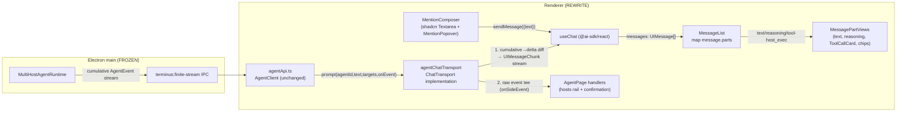

# Replace assistant-ui with AI SDK UI — Implementation Plan

> **For agentic workers:** REQUIRED SUB-SKILL: Use superpowers:subagent-driven-development (recommended) or superpowers:executing-plans to implement this plan task-by-task. Steps use checkbox (`- [ ]`) syntax for tracking.

**Goal:** Remove `@assistant-ui/react` from the Agent feature and rebuild the chat UI on the Vercel AI SDK (`@ai-sdk/react` `useChat` + a custom IPC `ChatTransport`), following AI SDK UI best practices — without porting assistant-ui's runtime/composer-primitive patterns.

**Architecture:** The Electron main process already streams **cumulative** `AgentEvent`s over a finite-stream IPC channel and is 100% assistant-ui-agnostic (confirmed: no `@assistant-ui` import in `src/main`, `src/shared`, or `src/preload`). The rewrite is **renderer-only**. We adopt the AI SDK `UIMessage` parts model and drive it with `useChat` using a custom `ChatTransport` that (a) bridges the cumulative `AgentEvent` stream into `UIMessageChunk` deltas (small cumulative→delta diff) and (b) tees non-transcript events (tool progress, confirmation) into a side channel for the progress rail and confirm modal. Transcript rendering maps over `UIMessage.parts` (text / reasoning / `tool-host_exec`). The mention composer and directive chips are rebuilt on shadcn primitives, replacing assistant-ui's `ComposerPrimitive` / trigger-popover / directive-formatter entirely.

**Tech Stack:** React 19, TypeScript (strict), Vite (electron-vite renderer), Tailwind + shadcn/ui (new-york) + lucide-react, Zustand (existing), Vitest + Testing Library, `ai` + `@ai-sdk/react` (v5+ stable).

## Global Constraints

- **Renderer-only.** Do NOT modify `src/main/`, `src/preload/`, or `src/shared/`. The IPC command names, the finite-stream channel, and the backend wire shapes are frozen.
- **`AgentClient` interface is the stable seam** (`src/renderer/features/agent/agentTypes.ts`): `create`, `prompt(agentId, text, targets, onEvent) => Promise<AgentSnapshot>`, `steer`, `abort`, `decideTool`, `close`. Keep these signatures byte-for-byte; `agentApi.ts` and `deterministicAgentApi.ts` must keep working unchanged.
- **Backend streams CUMULATIVE messages.** Every `messageStart`/`messageUpdate`/`messageEnd` carries the full assistant message; the transport must diff cumulative→delta (append-only suffix diff).
- **Backend is assistant-ui-agnostic.** The wire part types are `{type:"text"|"reasoning"|"tool-call"}` with fields spelled out in Task 2; redefine them locally (the renderer currently re-exports `@assistant-ui/react` types for them — that alias is the only coupling).
- **AI SDK version:** install latest stable `ai` + `@ai-sdk/react` (v5+). The `ChatTransport`, `UIMessage`, and `UIMessageChunk` APIs used here are stable in v5. Pin the resolved versions in `package.json`.
- **Style:** two-space indent, double quotes, semicolons, strict TS; `PascalCase` components, `camelCase` hooks; reuse `@/` alias and `cn()`; shadcn/ui new-york primitives under `src/renderer/components/ui/`; lucide-react icons; Tailwind theme tokens (no ad-hoc colors). Preserve the existing custom CSS classes the UI uses (`stream-caret`, `standby-dot`, `rise-in`, `pop-in`, `scroll-thin`, `c-dim`, `spin`).
- **Tests are the gate.** `pnpm typecheck` and `pnpm test` must pass after every task. `pnpm test:e2e` has **4 known baseline failures** (both `e2e/agent.spec.ts` tests, plus `ai-providers`, `sftp`) — they are environment failures, NOT regressions (see project memory `browser-e2e-preexisting-failures`). Preserve the selectors those tests depend on (see Task 8 / Task 11 contract notes) but do not treat the agent e2e as a gate. The real app-launch gate is `pnpm test:electron` (unset `ELECTRON_RUN_AS_NODE` first — see memory `electron-run-as-node-env`).
- **Conventional Commits**, focused and green: `feat(agent): ...`, `refactor(agent): ...`, `test(agent): ...`, `chore(agent): drop @assistant-ui/react`.
- **TDD:** write the failing test first, watch it fail, implement, watch it pass, commit. Every task ends green (`pnpm typecheck && pnpm test`).

---

## Architecture (data flow)



Two independent data paths leave the transport: the **transcript path** (deltas → `useChat` → `UIMessage[]` → rendered by parts) and the **execution path** (raw events → AgentPage handlers → progress rail + confirm modal). The tool card is self-contained: it renders from the `UIMessage` tool part's `input` (args) + `output` (`{result, isError, timing, approval}`), so session restore works without replaying events.

---

## File Structure

**New files (renderer):**
- `src/renderer/features/agent/chat/agentMessageAdapter.ts` — pure wire(`AgentMessage`)↔AI-SDK(`UIMessage`) conversions + cumulative→delta diff helpers.
- `src/renderer/features/agent/chat/agentChatTransport.ts` — `createAgentChatTransport(...)` → `ChatTransport<UIMessage>` (the IPC bridge).
- `src/renderer/features/agent/chat/useAgentChat.ts` — wraps `useChat` + agent lifecycle + target resolution + side-event wiring.
- `src/renderer/features/agent/mention/mentionItems.ts` — `searchMentionItems(hosts, groups, query)` (our own `MentionItem` shape).
- `src/renderer/features/agent/mention/directiveFormat.ts` — `serializeDirective(item)`, `parseDirectiveChips(text)` (replaces assistant-ui's directive formatter).
- `src/renderer/features/agent/mention/mentionCaret.ts` — `getCaretCoordinates(textarea, position)` mirror-div helper.
- `src/renderer/features/agent/mention/useMentionTrigger.ts` — `@`-trigger detection + open/query/select state for a textarea.
- `src/renderer/features/agent/mention/MentionPopover.tsx` — shadcn Popover list (Groups/Servers, roles, widths).
- `src/renderer/features/agent/MentionComposer.tsx` — shadcn Textarea + popover + send/abort (top-level, replaces `composer/`).
- `src/renderer/features/agent/MessageList.tsx` — maps `UIMessage[]` → avatars + parts; empty state; copy context menu.
- `src/renderer/features/agent/MessagePartViews.tsx` — `TextPartView`, `ReasoningPartView`, `ToolCallCard`, `DirectiveTextView`.
- `src/renderer/components/ui/popover.tsx` — shadcn primitive (added via CLI).

**Modified:**
- `src/renderer/features/agent/agentTypes.ts` — redefine wire types locally; remove `@assistant-ui/react` import.
- `src/renderer/features/agent/sessionStore.ts` — `AgentSession.messages` stays `AgentMessage[]` (wire shape) for a stable persistence layer; minor normalizer tweaks only if needed.
- `src/renderer/features/agent/AgentPage.tsx` — full rewrite of wiring (use `useAgentChat`, side-event handlers, new composer + list, history). No `@assistant-ui` imports.
- `package.json` — add `ai`, `@ai-sdk/react`; remove `@assistant-ui/react` (final task).

**Deleted (final task):**
- `src/renderer/components/assistant-ui/` (directive-text.tsx, composer-trigger-popover.tsx, badge.tsx)
- `src/renderer/features/agent/composer/` (MentionComposer.tsx, mentionAdapter.ts)

**Kept unchanged:** `directiveText.ts` (pure target-resolution fns), `agentApi.ts`, `deterministicAgentApi.ts`, `ProgressPanel.tsx`, `ConfirmCard.tsx`, `HostErrorBanner.tsx`, `HistoryDropdown.tsx`, `progressTypes.ts`, all `src/main`, `src/shared`, `src/preload`.

**Test files** (rewrite/new under `tests/renderer/features/agent/`): `chat/agentMessageAdapter.test.ts`, `chat/agentChatTransport.test.tsx`, `chat/useAgentChat.test.tsx`, `mention/mentionItems.test.ts`, `mention/directiveFormat.test.ts`, `mention/useMentionTrigger.test.ts`, `MentionComposer.test.tsx`, `MessageList.test.tsx`, `AgentPage.test.tsx`, `AgentPage.history.test.tsx`. **Kept:** `directiveText.test.ts`, `ProgressPanel.test.tsx`, `ConfirmCard.test.tsx`.

---

## Task 1: Add AI SDK dependencies and the shadcn Popover primitive

**Files:**
- Modify: `package.json`
- Create: `src/renderer/components/ui/popover.tsx`

**Interfaces:**
- Produces: `ai` + `@ai-sdk/react` installed (v5+); `Popover`, `PopoverTrigger`, `PopoverContent`, `PopoverAnchor` exported from `@/components/ui/popover`.

- [ ] **Step 1: Install the AI SDK packages**

Run:
```bash
pnpm add ai @ai-sdk/react
```
Confirm both resolve to v5 or newer (`pnpm list ai @ai-sdk/react`). If v6 is stable and the `ChatTransport`/`UIMessage` APIs below are unchanged, that is acceptable; otherwise pin to the latest v5.

- [ ] **Step 2: Add the Popover primitive via shadcn CLI**

Run:
```bash
pnpm dlx shadcn@latest add popover
```
This creates `src/renderer/components/ui/popover.tsx` (new-york style, matching `components.json`) and adds `@radix-ui/react-popover` to `package.json` if not already present.

- [ ] **Step 3: Verify the ChatTransport type surface exists in the installed SDK**

Run (confirm exact export names for the installed version):
```bash
grep -rn "ChatTransport" node_modules/ai/dist/index.d.ts | head
grep -rn "UIMessageStreamPart\|UIMessageChunk" node_modules/ai/dist/index.d.ts | head
```
Note the exact `UIMessageStreamPart` / `UIMessageChunk` discriminant strings the installed version uses (e.g. `text-start`, `text-delta`, `text-end`, `reasoning-start`, `reasoning-delta`, `reasoning-end`, `tool-input-start`, `tool-input-available`, `tool-output-available`, `tool-output-error`, `start`, `finish`). Tasks 4 writes these; if the installed names differ, use the installed names. Record the result in the commit message.

- [ ] **Step 4: Typecheck**

Run: `pnpm typecheck`
Expected: PASS (nothing consumes the new deps yet).

- [ ] **Step 5: Commit**

```bash
git add package.json pnpm-lock.yaml src/renderer/components/ui/popover.tsx
git commit -m "chore(agent): add ai sdk deps + shadcn popover primitive"
```

---

## Task 2: Redefine agent wire types locally (sever the `@assistant-ui/react` type alias)

**Files:**
- Modify: `src/renderer/features/agent/agentTypes.ts`
- Test: `tests/renderer/features/agent/agentTypes.test.ts` (new, type-level + runtime guards)

**Interfaces:**
- Produces (drop-in replacements for the assistant-ui re-exports, structurally identical so `AgentPage.tsx` still compiles until Task 11):

```ts
export type AgentPartStatus =
  | { type: "running" }
  | { type: "complete" }
  | { type: "incomplete"; reason: "cancelled" | "length" | "content-filter" | "other" | "error" };

export type AgentMessageStatus =
  | { type: "running" }
  | { type: "requires-action"; reason: "tool-calls" | "interrupt" }
  | { type: "complete"; reason: "stop" | "unknown" }
  | { type: "incomplete"; reason: "cancelled" | "tool-calls" | "length" | "other" | "error"; error?: string };

export type AgentTextPart = { type: "text"; text: string; status?: AgentPartStatus };
export type AgentReasoningPart = { type: "reasoning"; text: string; status?: AgentPartStatus };
export type AgentToolCallPart = {
  type: "tool-call";
  toolCallId: string;
  toolName: string;
  args: Record<string, unknown>;
  argsText: string;
  result?: unknown;
  isError?: boolean;
  timing?: { startedAt: number; completedAt?: number };
  approval?: { id: string; approved?: boolean; reason?: string; isAutomatic?: boolean; resolution?: "cancelled" | "expired" };
};

export type AgentAssistantPart = AgentTextPart | AgentReasoningPart | AgentToolCallPart;
export type AgentUserPart = AgentTextPart;

export type AgentMessage =
  | { id: string; role: "user"; content: readonly AgentUserPart[] }
  | { id: string; role: "assistant"; content: readonly AgentAssistantPart[]; status: AgentMessageStatus };
```

`AgentEvent`, `AgentSnapshot`, `AgentToolConfirmation`, `AgentCreateInput`, `AgentClient` stay exactly as today (they already have no `@assistant-ui` symbols) — only the import line at the top is removed.

- [ ] **Step 1: Write the failing test**

`tests/renderer/features/agent/agentTypes.test.ts`:
```ts
import { describe, expect, it } from "vitest";
import type { AgentMessage, AgentToolCallPart } from "@/features/agent/agentTypes";

describe("AgentMessage wire types (local, assistant-ui-free)", () => {
  it("accepts an assistant tool-call message matching the backend wire shape", () => {
    const message: AgentMessage = {
      id: "m1",
      role: "assistant",
      content: [{
        type: "tool-call",
        toolCallId: "c1",
        toolName: "host_exec",
        args: { hostId: "h1", command: "uptime" },
        argsText: "{}",
        result: { details: { exitCode: 0 } },
        isError: false,
        timing: { startedAt: 1, completedAt: 2 },
      } satisfies AgentToolCallPart],
      status: { type: "complete", reason: "stop" },
    };
    expect(message.content[0]!.type).toBe("tool-call");
  });

  it("accepts a user text message", () => {
    const message: AgentMessage = {
      id: "u1",
      role: "user",
      content: [{ type: "text", text: "hello" }],
    };
    expect(message.role).toBe("user");
  });
});
```

- [ ] **Step 2: Run test to verify it fails**

Run: `pnpm test -- agentTypes`
Expected: FAIL (compile error: `AgentToolCallPart` may not yet export the `satisfies` shape, or types still re-exported — adjust to match reality; the test should fail because the file still imports `@assistant-ui` symbols that aren't `AgentToolCallPart`). If it passes already, tighten by asserting there is no `@assistant-ui` import (see step 4).

- [ ] **Step 3: Replace the assistant-ui re-export with local types**

In `src/renderer/features/agent/agentTypes.ts`, delete:
```ts
import type {
  MessageStatus,
  ThreadAssistantMessagePart,
  ThreadUserMessagePart,
} from "@assistant-ui/react";
```
and replace the `AgentMessage` definition (and add the part/status types above it) so the file is fully self-contained, ending with the unchanged `AgentEvent`, `AgentSnapshot`, `AgentToolConfirmation`, `AgentCreateInput`, `AgentClient`.

- [ ] **Step 4: Assert the file no longer references assistant-ui**

Run:
```bash
grep -n "@assistant-ui" src/renderer/features/agent/agentTypes.ts
```
Expected: no output.

- [ ] **Step 5: Run test to verify it passes**

Run: `pnpm test -- agentTypes && pnpm typecheck`
Expected: PASS. (`AgentPage.tsx` still compiles because it reads only `.id/.role/.content/.status` off `AgentMessage`, all structurally present, and its remaining `@assistant-ui` imports are resolved by the still-installed package.)

- [ ] **Step 6: Commit**

```bash
git add src/renderer/features/agent/agentTypes.ts tests/renderer/features/agent/agentTypes.test.ts
git commit -m "refactor(agent): define wire message types locally, drop @assistant-ui alias"
```

---

## Task 3: Wire↔UI message adapter and cumulative→delta diff helpers

**Files:**
- Create: `src/renderer/features/agent/chat/agentMessageAdapter.ts`
- Test: `tests/renderer/features/agent/chat/agentMessageAdapter.test.ts`

**Interfaces:**
- Consumes: `AgentMessage` (from Task 2), `UIMessage` (from `@ai-sdk/react` / `ai`).
- Produces:
```ts
// Append-only suffix diff. Returns undefined when there is nothing new to emit.
export function suffixDelta(previous: string, next: string): string | undefined;

// Convert a backend wire message into an AI SDK UIMessage (parts model).
// tool-call parts become { type: `tool-${toolName}`, toolCallId, toolName, state, input, output }.
export function wireMessageToUi(message: AgentMessage): UIMessage;

// Convert the live transcript back to wire shape for persistence.
export function uiMessageToWire(message: UIMessage): AgentMessage;

// Merge authoritative snapshot assistant messages into a UIMessage list (by id, assistant-only).
export function mergeAuthoritative(messages: UIMessage[], snapshotAssistant: AgentMessage[]): UIMessage[];
```

- [ ] **Step 1: Write the failing test**

`tests/renderer/features/agent/chat/agentMessageAdapter.test.ts`:
```ts
import { describe, expect, it } from "vitest";
import type { AgentMessage } from "@/features/agent/agentTypes";
import {
  mergeAuthoritative,
  suffixDelta,
  uiMessageToWire,
  wireMessageToUi,
} from "@/features/agent/chat/agentMessageAdapter";

describe("suffixDelta", () => {
  it("returns the appended suffix", () => {
    expect(suffixDelta("Hello", "Hello world")).toBe(" world");
  });
  it("returns undefined when unchanged", () => {
    expect(suffixDelta("same", "same")).toBeUndefined();
  });
  it("falls back to the full string only when previous is empty", () => {
    expect(suffixDelta("", "fresh")).toBe("fresh");
  });
  it("returns undefined on a non-append change (defensive; backend is append-only)", () => {
    expect(suffixDelta("abc", "ab")).toBeUndefined();
  });
});

describe("wireMessageToUi / uiMessageToWire", () => {
  const wire: AgentMessage = {
    id: "m1",
    role: "assistant",
    content: [
      { type: "reasoning", text: "thinking" },
      { type: "text", text: "answer" },
      {
        type: "tool-call",
        toolCallId: "c1",
        toolName: "host_exec",
        args: { hostId: "h1", command: "uptime" },
        argsText: "{}",
        result: { details: { exitCode: 0, stdout: "ok" } },
        isError: false,
        timing: { startedAt: 1, completedAt: 2 },
      },
    ],
    status: { type: "complete", reason: "stop" },
  };

  it("round-trips assistant text/reasoning/tool parts", () => {
    const ui = wireMessageToUi(wire);
    expect(ui.role).toBe("assistant");
    const types = ui.parts.map((p) => p.type);
    expect(types).toEqual(["reasoning", "text", "tool-host_exec"]);
    const tool = ui.parts[2] as any;
    expect(tool.toolCallId).toBe("c1");
    expect(tool.state).toBe("output-available");
    expect(tool.input).toEqual({ hostId: "h1", command: "uptime" });
    expect(tool.output).toEqual({
      result: { details: { exitCode: 0, stdout: "ok" } },
      isError: false,
      timing: { startedAt: 1, completedAt: 2 },
    });
    expect(uiMessageToWire(ui)).toEqual(wire);
  });

  it("marks a tool-call with no result as input-available", () => {
    const pending: AgentMessage = {
      id: "m2", role: "assistant",
      content: [{ type: "tool-call", toolCallId: "c2", toolName: "host_exec", args: { hostId: "h1", command: "x" }, argsText: "{}" }],
      status: { type: "running" },
    };
    const tool = wireMessageToUi(pending).parts[0] as any;
    expect(tool.state).toBe("input-available");
    expect(tool.output).toBeUndefined();
  });
});

describe("mergeAuthoritative", () => {
  it("replaces assistant messages by id and preserves user messages", () => {
    const user = wireMessageToUi({ id: "u1", role: "user", content: [{ type: "text", text: "hi" }] });
    const asst = wireMessageToUi({ id: "a1", role: "assistant", content: [{ type: "text", text: "draft" }], status: { type: "running" } });
    const authoritative: AgentMessage = { id: "a1", role: "assistant", content: [{ type: "text", text: "final" }], status: { type: "complete", reason: "stop" } };
    const merged = mergeAuthoritative([user, asst], [authoritative]);
    expect(merged.map((m) => m.id)).toEqual(["u1", "a1"]);
    expect((merged[1]!.parts[0] as any).text).toBe("final");
  });
});
```

- [ ] **Step 2: Run test to verify it fails**

Run: `pnpm test -- agentMessageAdapter`
Expected: FAIL (module not found).

- [ ] **Step 3: Implement the adapter**

`src/renderer/features/agent/chat/agentMessageAdapter.ts`:
```ts
import type { UIMessage } from "@ai-sdk/react";
import type {
  AgentAssistantPart,
  AgentMessage,
  AgentToolCallPart,
} from "@/features/agent/agentTypes";

export function suffixDelta(previous: string, next: string): string | undefined {
  if (next === previous) return undefined;
  if (previous === "") return next;
  if (next.startsWith(previous)) return next.slice(previous.length);
  // Backend is append-only; a non-prefix change is unexpected. Skip defensively.
  return undefined;
}

type AnyPart = UIMessage["parts"][number];

function wirePartToUi(part: AgentAssistantPart): AnyPart {
  if (part.type === "text") {
    return { type: "text", text: part.text, state: "done" } as AnyPart;
  }
  if (part.type === "reasoning") {
    return { type: "reasoning", text: part.text, state: "done" } as AnyPart;
  }
  const hasResult = part.result !== undefined;
  const base = {
    type: `tool-${part.toolName}` as AnyPart["type"],
    toolCallId: part.toolCallId,
    toolName: part.toolName,
    input: part.args,
  };
  if (!hasResult) return { ...base, state: "input-available" } as AnyPart;
  return {
    ...base,
    state: part.isError ? "output-error" : "output-available",
    output: { result: part.result, isError: Boolean(part.isError), timing: part.timing, approval: part.approval },
    errorText: part.isError ? errorMessage(part.result) : undefined,
  } as AnyPart;
}

function uiPartToWire(part: AnyPart): AgentAssistantPart {
  if (part.type === "text") return { type: "text", text: part.text };
  if (part.type === "reasoning") return { type: "reasoning", text: part.text };
  const tp = part as AnyPart & { toolCallId: string; toolName: string; input: Record<string, unknown>; output?: { result?: unknown; isError?: boolean; timing?: AgentToolCallPart["timing"]; approval?: AgentToolCallPart["approval"] }; errorText?: string };
  const hasOutput = tp.state === "output-available" || tp.state === "output-error";
  return {
    type: "tool-call",
    toolCallId: tp.toolCallId,
    toolName: tp.toolName,
    args: tp.input ?? {},
    argsText: JSON.stringify(tp.input ?? {}),
    ...(hasOutput && tp.output
      ? { result: tp.output.result, isError: Boolean(tp.output.isError), timing: tp.output.timing, approval: tp.output.approval }
      : {}),
  };
}

export function wireMessageToUi(message: AgentMessage): UIMessage {
  if (message.role === "user") {
    return {
      id: message.id,
      role: "user",
      parts: message.content.map((p) => ({ type: "text", text: p.text })) as UIMessage["parts"],
    } satisfies UIMessage;
  }
  return {
    id: message.id,
    role: "assistant",
    parts: message.content.map(wirePartToUi),
  } satisfies UIMessage;
}

export function uiMessageToWire(message: UIMessage): AgentMessage {
  if (message.role === "user") {
    const text = message.parts
      .filter((p): p is Extract<AnyPart, { type: "text" }> => p.type === "text")
      .map((p) => p.text)
      .join("");
    return { id: message.id, role: "user", content: [{ type: "text", text }] };
  }
  const parts = message.parts
    .filter((p) => p.type === "text" || p.type === "reasoning" || p.type.startsWith("tool-"))
    .map(uiPartToWire);
  const hasRunning = parts.some((p) => p.type === "tool-call" && p.result === undefined);
  return {
    id: message.id,
    role: "assistant",
    content: parts,
    status: hasRunning ? { type: "running" } : { type: "complete", reason: "stop" },
  };
}

export function mergeAuthoritative(
  messages: UIMessage[],
  snapshotAssistant: AgentMessage[],
): UIMessage[] {
  const byId = new Map(snapshotAssistant.map((m) => [m.id, wireMessageToUi(m)]));
  if (byId.size === 0) return messages;
  return messages.map((m) => (m.role === "assistant" && byId.has(m.id) ? byId.get(m.id)! : m));
}

function errorMessage(result: unknown): string | undefined {
  if (!result || typeof result !== "object") return undefined;
  const error = (result as { error?: unknown }).error;
  if (!error || typeof error !== "object") return undefined;
  const message = (error as { message?: unknown }).message;
  return typeof message === "string" ? message : undefined;
}
```

> **Note:** the exact `UIMessage` part field names (`state`, `input`, `output`, `errorText`, `text`/`reasoning` `state`) must match the installed SDK's `UIMessagePart` definitions. If `pnpm typecheck` reports a mismatch, adjust the literal shapes to the installed types (the field intent is documented above and in the test). The tests assert behavior, not exact SDK internals beyond `type`/`state`/`input`/`output`.

- [ ] **Step 4: Run test to verify it passes**

Run: `pnpm test -- agentMessageAdapter && pnpm typecheck`
Expected: PASS.

- [ ] **Step 5: Commit**

```bash
git add src/renderer/features/agent/chat/agentMessageAdapter.ts tests/renderer/features/agent/chat/agentMessageAdapter.test.ts
git commit -m "feat(agent): wire<->UIMessage adapter + cumulative delta helper"
```

---

## Task 4: The IPC ChatTransport (cumulative `AgentEvent` → `UIMessageChunk` deltas)

**Files:**
- Create: `src/renderer/features/agent/chat/agentChatTransport.ts`
- Test: `tests/renderer/features/agent/chat/agentChatTransport.test.tsx`

**Interfaces:**
- Consumes: `AgentClient`, `AgentEvent`, `AgentMessage` (Task 2), `suffixDelta` (Task 3), `ChatTransport`/`UIMessage`/`UIMessageChunk` from the SDK.
- Produces:
```ts
export type AgentChatTransportContext = {
  agentClient: AgentClient;
  getAgentId: () => string | undefined;
  resolveTargets: (text: string) => string[];     // directive + natural-language target resolution
  onSideEvent: (event: AgentEvent) => void;        // tee for progress rail + confirmation
  onComplete: (snapshot: AgentSnapshot) => void;   // authoritative snapshot application
};

export function createAgentChatTransport(
  ctx: AgentChatTransportContext,
): ChatTransport<UIMessage>;
```

The returned transport's `sendMessages` extracts the last user message's text, resolves targets, calls `agentClient.prompt(getAgentId(), text, targets, onEvent)`, and translates the cumulative event stream into a `ReadableStream<UIMessageChunk>`:
- `messageStart`/`messageUpdate`/`messageEnd` → enqueue `start` (once per assistant message id), then `text-delta` / `reasoning-delta` (via `suffixDelta` against per-id accumulators), and `tool-input-start` + `tool-input-available` for each newly-seen `tool-call` part.
- `toolStart` → record `timing.startedAt` in a per-`toolCallId` meta map; forward to `onSideEvent`.
- `toolEnd` → enqueue `tool-output-available` (or `tool-output-error`) with `output = { result, isError, timing, approval }`; forward to `onSideEvent`.
- `toolUpdate`, `toolConfirmationRequired`, `agentStart`, `historySaveFailed` → forward to `onSideEvent` only (confirmation approval is captured into the meta map so the eventual tool-output carries `approval`).
- `agentEnd` → no chunk (finish is enqueued after `prompt` resolves).
- After `prompt` resolves: enqueue `finish`, call `onComplete(snapshot)`, close the controller.
- `abortSignal` aborted → call `agentClient.abort(getAgentId())` and stop enqueuing.

- [ ] **Step 1: Write the failing test (via a `useChat` harness — robust to chunk-name differences)**

`tests/renderer/features/agent/chat/agentChatTransport.test.tsx`:
```tsx
import { describe, expect, it, vi } from "vitest";
import { act, render, screen, waitFor } from "@testing-library/react";
import { useChat } from "@ai-sdk/react";
import type { ReactNode } from "react";
import { createAgentChatTransport } from "@/features/agent/chat/agentChatTransport";
import type { AgentClient, AgentEvent, AgentSnapshot } from "@/features/agent/agentTypes";

function fakeClient(promptImpl: (onEvent: (e: AgentEvent) => void) => Promise<AgentSnapshot>): AgentClient {
  return {
    create: vi.fn(async () => ({ agentId: "a1", providerConfigId: "cfg", status: "idle", hosts: [], messages: [] })),
    prompt: vi.fn(async (_id, _text, _targets, onEvent) => promptImpl(onEvent)),
    steer: vi.fn(async () => undefined),
    abort: vi.fn(async () => undefined),
    decideTool: vi.fn(async () => undefined),
    close: vi.fn(async () => undefined),
  } as unknown as AgentClient;
}

function Harness({ client, onSideEvent }: { client: AgentClient; onSideEvent?: (e: AgentEvent) => void }) {
  const transport = createAgentChatTransport({
    agentClient: client,
    getAgentId: () => "a1",
    resolveTargets: () => [],
    onSideEvent: onSideEvent ?? (() => undefined),
    onComplete: () => undefined,
  });
  const { messages, sendMessage, status } = useChat({ transport });
  return (
    <div>
      <button onClick={() => sendMessage({ text: "hello" })}>send</button>
      <ul data-testid="status">{status}</ul>
      <ul>
        {messages.map((m) => (
          <li key={m.id} data-testid={`msg-${m.role}`}>
            {m.parts.map((p, i) => (
              <span key={i} data-testid={`part-${p.type}`}>{("text" in p ? p.text : "") || (p.type.startsWith("tool-") ? "tool" : "")}</span>
            ))}
          </li>
        ))}
      </ul>
    </div>
  );
}

describe("agentChatTransport", () => {
  it("streams cumulative assistant text into a single text part", async () => {
    const client = fakeClient(async (onEvent) => {
      onEvent({ type: "messageStart", message: { id: "a", role: "assistant", content: [], status: { type: "running" } } });
      onEvent({ type: "messageUpdate", message: { id: "a", role: "assistant", content: [{ type: "text", text: "1." }], status: { type: "running" } } });
      onEvent({ type: "messageUpdate", message: { id: "a", role: "assistant", content: [{ type: "text", text: "1.70" }], status: { type: "running" } } });
      onEvent({ type: "messageEnd", message: { id: "a", role: "assistant", content: [{ type: "text", text: "1.70" }], status: { type: "complete", reason: "stop" } } });
      return { agentId: "a1", providerConfigId: "cfg", status: "idle", hosts: [], messages: [] };
    });
    render(<Harness client={client} />);
    act(() => screen.getByText("send").click());
    await waitFor(() => expect(screen.getByTestId("part-text")).toHaveTextContent("1.70"));
  });

  it("streams reasoning then text as separate parts", async () => {
    const client = fakeClient(async (onEvent) => {
      onEvent({ type: "messageStart", message: { id: "a", role: "assistant", content: [], status: { type: "running" } } });
      onEvent({ type: "messageUpdate", message: { id: "a", role: "assistant", content: [{ type: "reasoning", text: "think" }], status: { type: "running" } } });
      onEvent({ type: "messageUpdate", message: { id: "a", role: "assistant", content: [{ type: "reasoning", text: "think" }, { type: "text", text: "answer" }], status: { type: "running" } } });
      onEvent({ type: "messageEnd", message: { id: "a", role: "assistant", content: [{ type: "reasoning", text: "think" }, { type: "text", text: "answer" }], status: { type: "complete", reason: "stop" } } });
      return { agentId: "a1", providerConfigId: "cfg", status: "idle", hosts: [], messages: [] };
    });
    render(<Harness client={client} />);
    act(() => screen.getByText("send").click());
    await waitFor(() => expect(screen.getAllByTestId("part-reasoning")[0]).toBeInTheDocument());
    await waitFor(() => expect(screen.getByTestId("part-text")).toHaveTextContent("answer"));
  });

  it("emits a tool part and resolves output on toolEnd, teeing side events", async () => {
    const sideEvents: AgentEvent[] = [];
    const client = fakeClient(async (onEvent) => {
      onEvent({ type: "messageStart", message: { id: "a", role: "assistant", content: [{ type: "tool-call", toolCallId: "c1", toolName: "host_exec", args: { hostId: "h1", command: "uptime" }, argsText: "{}" }], status: { type: "requires-action", reason: "tool-calls" } } });
      onEvent({ type: "toolStart", toolCallId: "c1", toolName: "host_exec", args: { hostId: "h1", command: "uptime" } });
      onEvent({ type: "toolEnd", toolCallId: "c1", toolName: "host_exec", result: { details: { exitCode: 0, stdout: "ok" } }, isError: false });
      onEvent({ type: "messageEnd", message: { id: "a", role: "assistant", content: [{ type: "tool-call", toolCallId: "c1", toolName: "host_exec", args: { hostId: "h1", command: "uptime" }, argsText: "{}", result: { details: { exitCode: 0, stdout: "ok" } }, isError: false }], status: { type: "complete", reason: "stop" } } });
      return { agentId: "a1", providerConfigId: "cfg", status: "idle", hosts: [], messages: [] };
    });
    render(<Harness client={client} onSideEvent={(e) => sideEvents.push(e)} />);
    act(() => screen.getByText("send").click());
    await waitFor(() => expect(screen.getByTestId("part-tool-host_exec")).toBeInTheDocument());
    expect(sideEvents.some((e) => e.type === "toolStart")).toBe(true);
    expect(sideEvents.some((e) => e.type === "toolEnd")).toBe(true);
  });

  it("calls abort when the consumer stops", async () => {
    let resolvePrompt!: (s: AgentSnapshot) => void;
    const client = fakeClient(() => new Promise((r) => { resolvePrompt = r; }));
    const { rerender } = render(<Harness client={client} />);
    // Harness stops are not exposed; this test only asserts abort is wired via a direct transport call below.
    void rerender;
    void resolvePrompt;
    // Direct unit check: transport.sendMessages respects abortSignal.
    const t = createAgentChatTransport({ agentClient: client, getAgentId: () => "a1", resolveTargets: () => [], onSideEvent: () => undefined, onComplete: () => undefined });
    const ctrl = new AbortController();
    const stream = await t.sendMessages({ trigger: "submit-message", chatId: "c", messageId: undefined, messages: [], abortSignal: ctrl.signal });
    const reader = stream.getReader();
    ctrl.abort();
    await reader.read().catch(() => undefined);
    await waitFor(() => expect(client.abort).toHaveBeenCalledWith("a1"));
  });
});
```

- [ ] **Step 2: Run test to verify it fails**

Run: `pnpm test -- agentChatTransport`
Expected: FAIL (module not found).

- [ ] **Step 3: Implement the transport**

`src/renderer/features/agent/chat/agentChatTransport.ts`:
```ts
import type { ChatTransport, UIMessage, UIMessageChunk } from "ai"; // or "@ai-sdk/react" per installed exports
import type {
  AgentClient,
  AgentEvent,
  AgentMessage,
  AgentSnapshot,
  AgentToolCallPart,
} from "@/features/agent/agentTypes";
import { suffixDelta } from "./agentMessageAdapter";

export type AgentChatTransportContext = {
  agentClient: AgentClient;
  getAgentId: () => string | undefined;
  resolveTargets: (text: string) => string[];
  onSideEvent: (event: AgentEvent) => void;
  onComplete: (snapshot: AgentSnapshot) => void;
};

type ToolMeta = {
  startedAt?: number;
  completedAt?: number;
  approval?: AgentToolCallPart["approval"];
};

function userText(messages: UIMessage[]): string {
  const last = [...messages].reverse().find((m) => m.role === "user");
  if (!last) return "";
  return last.parts
    .filter((p): p is Extract<UIMessage["parts"][number], { type: "text" }> => p.type === "text")
    .map((p) => p.text)
    .join("");
}

export function createAgentChatTransport(ctx: AgentChatTransportContext): ChatTransport<UIMessage> {
  return {
    async sendMessages({ messages, abortSignal }) {
      const text = userText(messages);
      const targets = ctx.resolveTargets(text);
      const encoder = new StreamEncoder();
      const toolMeta = new Map<string, ToolMeta>();
      const seenTools = new Set<string>();
      const emittedText = new Map<string, string>();
      const emittedReasoning = new Map<string, string>();
      let aborted = false;

      abortSignal?.addEventListener("abort", () => {
        if (aborted) return;
        aborted = true;
        const id = ctx.getAgentId();
        if (id) void ctx.agentClient.abort(id).catch(() => undefined);
      });

      const onEvent = (event: AgentEvent) => {
        if (aborted) return;
        ctx.onSideEvent(event);
        switch (event.type) {
          case "messageStart":
          case "messageUpdate":
          case "messageEnd":
            encodeAssistant(encoder, event.message, emittedText, emittedReasoning, seenTools, toolMeta);
            return;
          case "toolStart": {
            const meta = toolMeta.get(event.toolCallId) ?? {};
            meta.startedAt = Date.now();
            toolMeta.set(event.toolCallId, meta);
            return;
          }
          case "toolEnd": {
            const meta = toolMeta.get(event.toolCallId) ?? {};
            meta.completedAt = Date.now();
            encoder.enqueueToolOutput(event.toolCallId, event.result, event.isError, meta);
            return;
          }
          case "toolConfirmationRequired": {
            const meta = toolMeta.get(event.confirmation.hostId ?? event.confirmation.confirmationId) ?? {};
            // confirmation is keyed by toolCallId at toolEnd time; remember approval by command match in side handler.
            return;
          }
          default:
            return;
        }
      };

      return new ReadableStream<UIMessageChunk>({
        async start(controller) {
          encoder.setController(controller);
          try {
            const agentId = ctx.getAgentId();
            if (!agentId) throw new Error("No active agent.");
            const snapshot = await ctx.agentClient.prompt(agentId, text, targets, onEvent);
            if (!aborted) {
              encoder.finish();
              ctx.onComplete(snapshot);
            }
          } catch (err) {
            controller.error(err);
            return;
          }
          if (!aborted) controller.close();
        },
      });
    },
    async reconnectToStream() {
      return null;
    },
  };
}

// ---- stream encoder: isolates the exact UIMessageChunk discriminants ----
class StreamEncoder {
  private ctrl: ReadableStreamDefaultController<UIMessageChunk> | undefined;
  private started = new Set<string>();
  private textStarted = new Set<string>();
  private reasoningStarted = new Set<string>();

  setController(ctrl: ReadableStreamDefaultController<UIMessageChunk>) {
    this.ctrl = ctrl;
  }

  private enqueue(chunk: UIMessageChunk) {
    this.ctrl?.enqueue(chunk);
  }

  startMessage(id: string) {
    if (this.started.has(id)) return;
    this.started.add(id);
    // Confirm the exact 'start' shape against installed UIMessageChunk; typical v5:
    this.enqueue({ type: "start", id, role: "assistant" } as UIMessageChunk);
  }

  textDelta(id: string, delta: string) {
    // v5 typical: text-start once per part, then one text-delta per cumulative diff.
    if (!this.textStarted.has(id)) {
      this.textStarted.add(id);
      this.enqueue({ type: "text-start", id } as UIMessageChunk);
    }
    this.enqueue({ type: "text-delta", id, textDelta: delta } as UIMessageChunk);
  }

  reasoningDelta(id: string, delta: string) {
    if (!this.reasoningStarted.has(id)) {
      this.reasoningStarted.add(id);
      this.enqueue({ type: "reasoning-start", id } as UIMessageChunk);
    }
    this.enqueue({ type: "reasoning-delta", id, textDelta: delta } as UIMessageChunk);
  }

  toolInputAvailable(part: AgentToolCallPart) {
    this.enqueue({ type: "tool-input-start", toolCallId: part.toolCallId, toolName: part.toolName } as UIMessageChunk);
    this.enqueue({ type: "tool-input-available", toolCallId: part.toolCallId, toolName: part.toolName, input: part.args } as UIMessageChunk);
  }

  enqueueToolOutput(toolCallId: string, result: unknown, isError: boolean, meta: ToolMeta) {
    if (isError) {
      this.enqueue({ type: "tool-output-error", toolCallId, errorText: errorMessage(result) } as UIMessageChunk);
    }
    this.enqueue({
      type: "tool-output-available",
      toolCallId,
      output: { result, isError, timing: { startedAt: meta.startedAt, completedAt: meta.completedAt }, approval: meta.approval },
    } as UIMessageChunk);
  }

  finish() {
    this.enqueue({ type: "finish" } as UIMessageChunk);
  }
}

function encodeAssistant(
  encoder: StreamEncoder,
  message: AgentMessage,
  emittedText: Map<string, string>,
  emittedReasoning: Map<string, string>,
  seenTools: Set<string>,
  _toolMeta: Map<string, ToolMeta>,
) {
  if (message.role !== "assistant") return;
  encoder.startMessage(message.id);
  for (const part of message.content) {
    if (part.type === "text") {
      const prev = emittedText.get(message.id) ?? "";
      const delta = suffixDelta(prev, part.text);
      if (delta) {
        encoder.textDelta(message.id, delta);
        emittedText.set(message.id, prev + delta);
      }
    } else if (part.type === "reasoning") {
      const prev = emittedReasoning.get(message.id) ?? "";
      const delta = suffixDelta(prev, part.text);
      if (delta) {
        encoder.reasoningDelta(message.id, delta);
        emittedReasoning.set(message.id, prev + delta);
      }
    } else if (part.type === "tool-call" && !seenTools.has(part.toolCallId)) {
      seenTools.add(part.toolCallId);
      encoder.toolInputAvailable(part);
    }
  }
}

function errorMessage(result: unknown): string | undefined {
  if (!result || typeof result !== "object") return undefined;
  const error = (result as { error?: unknown }).error;
  if (!error || typeof error !== "object") return undefined;
  const message = (error as { message?: unknown }).message;
  return typeof message === "string" ? message : "Tool failed.";
}
```

> **Critical:** the `{ type: "..." }` literals in `StreamEncoder` are the **v5 stable `UIMessageChunk` discriminants**. Confirm each against the installed SDK (Task 1 Step 3) and adjust the strings to match. The tests validate behavior through `useChat`'s output messages, so they remain valid even if a discriminant string is corrected. If the installed SDK requires `text-start` to precede `text-delta` per part (it does in v5), keep that ordering. Do not enqueue `text-end`/`reasoning-end` unless the installed reducer requires them — test first without.

- [ ] **Step 4: Run test to verify it passes**

Run: `pnpm test -- agentChatTransport && pnpm typecheck`
Expected: PASS. If a chunk discriminant is wrong, the test will surface it as a missing/incorrect part — fix the string in `StreamEncoder` and re-run.

- [ ] **Step 5: Commit**

```bash
git add src/renderer/features/agent/chat/agentChatTransport.ts tests/renderer/features/agent/chat/agentChatTransport.test.tsx
git commit -m "feat(agent): IPC ChatTransport (cumulative AgentEvent -> UIMessageChunk deltas)"
```

---

## Task 5: `useAgentChat` — `useChat` wrapper with agent lifecycle + target resolution

**Files:**
- Create: `src/renderer/features/agent/chat/useAgentChat.ts`
- Test: `tests/renderer/features/agent/chat/useAgentChat.test.tsx`

**Interfaces:**
- Consumes: `createAgentChatTransport` (Task 4), `AgentClient`, `wireMessageToUi`/`mergeAuthoritative` (Task 3), `parseDirectives`/`expandTargets`/`findReferencedHostIds` (existing `directiveText.ts`), inventory store.
- Produces:
```ts
export type UseAgentChatOptions = {
  agentClient: AgentClient;
  providerConfigId: string | undefined;     // undefined ⇒ no agent yet
  resolveMentionLabel?: (label: string) => { type: "host" | "group"; id: string } | undefined;
  getGroupHostIds: () => Record<string, string[]>;   // groupId -> host ids
  getHosts: () => Array<{ id: string; name: string; address: string }>;
  onSideEvent: (event: AgentEvent) => void;
};

export type AgentChat = {
  messages: UIMessage[];
  status: "submitted" | "streaming" | "ready" | "error";
  error: Error | undefined;
  sendMessage: (text: string) => void;
  stop: () => void;
  setMessages: (messages: UIMessage[]) => void;
  loadConversation: (assistantWire: AgentMessage[]) => void;  // seed transcript on session restore
  reset: () => void;                                          // clear transcript (new chat)
};

export function useAgentChat(options: UseAgentChatOptions): AgentChat;
```

Behaviour:
- Creates a backend agent when `providerConfigId` becomes available; closes the previous agent on change/unmount (mirrors current `createAgent`/`close` lifecycle). Holds the current `agentId` in a ref read by the transport.
- Builds the transport **once** (`useMemo([], …)`) reading live values via refs (`agentIdRef`, `resolveTargetsRef`, `onSideEventRef`, `onCompleteRef`).
- `resolveTargets(text)` = expand `parseDirectives(text, resolveMentionLabel)` via `expandTargets` + append `findReferencedHostIds(text, hosts)`, de-duplicated (same logic as the current `runPrompt`).
- `onComplete(snapshot)` → `mergeAuthoritative(messages, snapshot.messages.filter(role==="assistant"))` and `setMessages(...)`.
- `loadConversation` / `reset` use `setMessages` (chat id stays stable; transcript is swapped in place).

- [ ] **Step 1: Write the failing test**

`tests/renderer/features/agent/chat/useAgentChat.test.tsx`:
```tsx
import { describe, expect, it, vi } from "vitest";
import { act, render, waitFor } from "@testing-library/react";
import { useAgentChat } from "@/features/agent/chat/useAgentChat";
import type { AgentClient, AgentSnapshot } from "@/features/agent/agentTypes";

function fakeClient(): { client: AgentClient; prompts: ReturnType<typeof vi.fn> } {
  const prompts = vi.fn();
  const client = {
    create: vi.fn(async () => ({ agentId: "a1", providerConfigId: "cfg", status: "idle", hosts: [], messages: [] })),
    prompt: prompts.mockImplementation(async (_id: string, _text: string, _targets: string[], onEvent: (e: any) => void) => {
      onEvent({ type: "messageStart", message: { id: "a", role: "assistant", content: [], status: { type: "running" } } });
      onEvent({ type: "messageEnd", message: { id: "a", role: "assistant", content: [{ type: "text", text: "hi" }], status: { type: "complete", reason: "stop" } } });
      return { agentId: "a1", providerConfigId: "cfg", status: "idle", hosts: [], messages: [] } satisfies AgentSnapshot;
    }),
    steer: vi.fn(async () => undefined),
    abort: vi.fn(async () => undefined),
    decideTool: vi.fn(async () => undefined),
    close: vi.fn(async () => undefined),
  } as unknown as AgentClient;
  return { client, prompts };
}

function Probe({ client, onReady }: { client: AgentClient; onReady: (api: ReturnType<typeof useAgentChat>) => void }) {
  const chat = useAgentChat({
    agentClient: client,
    providerConfigId: "cfg",
    getGroupHostIds: () => ({}),
    getHosts: () => [],
    onSideEvent: () => undefined,
  });
  onReady(chat);
  return <div data-testid="status">{chat.status}</div>;
}

describe("useAgentChat", () => {
  it("creates an agent, sends a message, and streams a reply", async () => {
    const { client } = fakeClient();
    let api: ReturnType<typeof useAgentChat> | undefined;
    render(<Probe client={client} onReady={(a) => (api = a)} />);
    await waitFor(() => expect(client.create).toHaveBeenCalledWith({ providerConfigId: "cfg" }));

    act(() => api!.sendMessage("hello"));
    await waitFor(() => expect(api!.messages.some((m) => m.role === "assistant")).toBe(true));
    const asst = api!.messages.find((m) => m.role === "assistant")!;
    expect(asst.parts.some((p) => p.type === "text" && (p as any).text === "hi")).toBe(true);
  });

  it("closes the agent on unmount", async () => {
    const { client } = fakeClient();
    const { unmount } = render(<Probe client={client} onReady={() => undefined} />);
    await waitFor(() => expect(client.create).toHaveBeenCalled());
    unmount();
    await waitFor(() => expect(client.close).toHaveBeenCalledWith("a1"));
  });
});
```

- [ ] **Step 2: Run test to verify it fails**

Run: `pnpm test -- useAgentChat`
Expected: FAIL (module not found).

- [ ] **Step 3: Implement the hook**

`src/renderer/features/agent/chat/useAgentChat.ts`:
```ts
import { useCallback, useEffect, useMemo, useRef, useState } from "react";
import { useChat, type UIMessage } from "@ai-sdk/react";
import type { AgentClient, AgentEvent, AgentMessage } from "@/features/agent/agentTypes";
import { createAgentChatTransport, type AgentChatTransportContext } from "./agentChatTransport";
import { mergeAuthoritative, wireMessageToUi } from "./agentMessageAdapter";
import {
  expandTargets,
  findReferencedHostIds,
  parseDirectives,
  type MentionResolver,
} from "@/features/agent/directiveText";

export type UseAgentChatOptions = {
  agentClient: AgentClient;
  providerConfigId: string | undefined;
  resolveMentionLabel?: MentionResolver;
  getGroupHostIds: () => Record<string, string[]>;
  getHosts: () => Array<{ id: string; name: string; address: string }>;
  onSideEvent: (event: AgentEvent) => void;
};

export type AgentChat = {
  messages: UIMessage[];
  status: "submitted" | "streaming" | "ready" | "error";
  error: Error | undefined;
  sendMessage: (text: string) => void;
  stop: () => void;
  setMessages: (messages: UIMessage[]) => void;
  loadConversation: (assistantWire: AgentMessage[]) => void;
  reset: () => void;
};

export function useAgentChat(options: UseAgentChatOptions): AgentChat {
  const { agentClient, providerConfigId, resolveMentionLabel, getGroupHostIds, getHosts, onSideEvent } = options;

  const [agentId, setAgentId] = useState<string | undefined>(undefined);
  const agentIdRef = useRef<string | undefined>(undefined);
  agentIdRef.current = agentId;

  const onSideEventRef = useRef(onSideEvent);
  onSideEventRef.current = onSideEvent;

  const resolveTargets = useCallback((text: string) => {
    const directives = parseDirectives(text, resolveMentionLabel);
    const explicit = expandTargets(directives, getGroupHostIds());
    const referenced = findReferencedHostIds(text, getHosts());
    return [...new Set([...explicit, ...referenced])];
  }, [resolveMentionLabel, getGroupHostIds, getHosts]);

  const resolveTargetsRef = useRef(resolveTargets);
  resolveTargetsRef.current = resolveTargets;

  // Create/refresh the backend agent when the provider changes.
  useEffect(() => {
    if (!providerConfigId) return;
    let active = true;
    void agentClient.create({ providerConfigId }).then((snapshot) => {
      if (!active) {
        void agentClient.close(snapshot.agentId).catch(() => undefined);
        return;
      }
      agentIdRef.current = snapshot.agentId;
      setAgentId(snapshot.agentId);
    });
    return () => {
      active = false;
      const id = agentIdRef.current;
      if (id) void agentClient.close(id).catch(() => undefined);
      agentIdRef.current = undefined;
      setAgentId(undefined);
    };
  }, [agentClient, providerConfigId]);

  const onCompleteRef = useRef<(snapshot: AgentSnapshot) => void>(() => undefined);

  const ctxRef = useRef<Omit<AgentChatTransportContext, "agentClient">>({
    getAgentId: () => agentIdRef.current,
    resolveTargets: (text) => resolveTargetsRef.current(text),
    onSideEvent: (e) => onSideEventRef.current(e),
    onComplete: (snapshot) => onCompleteRef.current(snapshot),
  });

  const transport = useMemo(
    () => createAgentChatTransport({ agentClient, ...ctxRef.current }),
    [agentClient],
  );

  const chat = useChat({ transport });

  // Wire authoritative-snapshot completion THROUGH the ref. The transport
  // received a copy of ctxRef.current's functions at useMemo time, so mutating
  // ctxRef.current.onComplete directly would never reach it — the ref indirection
  // keeps the handler live for this chat instance.
  onCompleteRef.current = (snapshot) => {
    const assistantWire = snapshot.messages.filter((m) => m.role === "assistant");
    if (assistantWire.length === 0) return;
    chat.setMessages(mergeAuthoritative(chat.messages, assistantWire));
  };

  const loadConversation = useCallback((assistantWire: AgentMessage[]) => {
    chat.setMessages(assistantWire.map(wireMessageToUi));
  }, [chat]);

  const reset = useCallback(() => {
    chat.setMessages([]);
  }, [chat]);

  return {
    messages: chat.messages,
    status: chat.status,
    error: chat.error,
    sendMessage: (text) => chat.sendMessage({ text }),
    stop: () => chat.stop(),
    setMessages: chat.setMessages,
    loadConversation,
    reset,
  };
}
```

> **Note:** `chat.status` type narrowing — the SDK's `status` union may be wider; cast at the return boundary (`chat.status as AgentChat["status"]`) if the installed type differs. `chat.sendMessage({ text })` is the v5 API; if the installed `sendMessage` takes a different shape, adapt. Confirm via `pnpm typecheck`.

- [ ] **Step 4: Run test to verify it passes**

Run: `pnpm test -- useAgentChat && pnpm typecheck`
Expected: PASS.

- [ ] **Step 5: Commit**

```bash
git add src/renderer/features/agent/chat/useAgentChat.ts tests/renderer/features/agent/chat/useAgentChat.test.tsx
git commit -m "feat(agent): useAgentChat wraps useChat with agent lifecycle + target resolution"
```

---

## Task 6: Mention item search + directive serialization (pure functions)

**Files:**
- Create: `src/renderer/features/agent/mention/mentionItems.ts`
- Create: `src/renderer/features/agent/mention/directiveFormat.ts`
- Test: `tests/renderer/features/agent/mention/mentionItems.test.ts`
- Test: `tests/renderer/features/agent/mention/directiveFormat.test.ts`

**Interfaces:**
- Produces:
```ts
export type MentionItem = { id: string; type: "group" | "host"; label: string; description: string; iconKey: "Folder" | "Server" };
export function searchMentionItems(hosts: Host[], groups: Group[], query: string): MentionItem[];
export function mentionCategories(items: MentionItem[]): { id: "group" | "host"; label: "Groups" | "Servers"; items: MentionItem[] }[];

export function serializeDirective(item: MentionItem): string;          // ":host[label]{name=id} "
export type DirectiveChip = { kind: "text"; text: string } | { kind: "directive"; type: "host" | "group"; id: string; label: string };
export function parseDirectiveChips(text: string): DirectiveChip[];     // inline render source
```

- [ ] **Step 1: Write the failing tests**

`tests/renderer/features/agent/mention/mentionItems.test.ts` (port the pure assertions from the existing `MentionComposer.test.tsx` "searches names, addresses…" case):
```ts
import { describe, expect, it } from "vitest";
import { mentionCategories, searchMentionItems } from "@/features/agent/mention/mentionItems";
import type { Group, Host } from "@/shared/types";

const ts = "2026-08-05T00:00:00.000Z";
const groups: Group[] = [{ id: "g1", vaultId: "v1", parentId: null, name: "Production", color: "coral", count: 1, createdAt: ts, updatedAt: ts }];
const hosts: Host[] = [{ id: "h1", vaultId: "v1", groupId: "g1", name: "web-prod-01", address: "10.0.0.10", username: "ubuntu", tags: [], notes: "", status: "online", createdAt: ts, updatedAt: ts }];

describe("searchMentionItems", () => {
  it("returns groups then hosts, matching name/address/id", () => {
    expect(searchMentionItems(hosts, groups, "").map((i) => i.type)).toEqual(["group", "host"]);
    expect(searchMentionItems(hosts, groups, "10.0.0.10")[0]).toMatchObject({ id: "h1", type: "host", label: "web-prod-01" });
    expect(searchMentionItems(hosts, groups, "h1")[0]).toMatchObject({ id: "h1", type: "host" });
    expect(searchMentionItems(hosts, groups, "g1")[0]).toMatchObject({ id: "g1", type: "group" });
  });
});

describe("mentionCategories", () => {
  it("groups items into Groups/Servers categories", () => {
    const cats = mentionCategories(searchMentionItems(hosts, groups, ""));
    expect(cats.map((c) => c.label)).toEqual(["Groups", "Servers"]);
    expect(cats[0]!.items[0]).toMatchObject({ id: "g1" });
    expect(cats[1]!.items[0]).toMatchObject({ id: "h1" });
  });
});
```

`tests/renderer/features/agent/mention/directiveFormat.test.ts`:
```ts
import { describe, expect, it } from "vitest";
import { parseDirectiveChips, serializeDirective, type MentionItem } from "@/features/agent/mention/directiveFormat";

const host: MentionItem = { id: "h1", type: "host", label: "web-prod-01", description: "", iconKey: "Server" };
const group: MentionItem = { id: "g1", type: "group", label: "Production", description: "", iconKey: "Folder" };

describe("serializeDirective", () => {
  it("serializes host and group directives with a trailing space", () => {
    expect(serializeDirective(host)).toBe(":host[web-prod-01]{name=h1} ");
    expect(serializeDirective(group)).toBe(":group[Production]{name=g1} ");
  });
});

describe("parseDirectiveChips", () => {
  it("splits text into text + directive chips", () => {
    const chips = parseDirectiveChips("run :host[web-prod-01]{name=h1} now");
    expect(chips).toEqual([
      { kind: "text", text: "run " },
      { kind: "directive", type: "host", id: "h1", label: "web-prod-01" },
      { kind: "text", text: " now" },
    ]);
  });
  it("returns a single text chip when no directives present", () => {
    expect(parseDirectiveChips("plain text")).toEqual([{ kind: "text", text: "plain text" }]);
  });
});
```

- [ ] **Step 2: Run tests to verify they fail**

Run: `pnpm test -- mentionItems directiveFormat`
Expected: FAIL (modules not found).

- [ ] **Step 3: Implement `mentionItems.ts`**

```ts
import type { Group, Host } from "@/shared/types";

export type MentionItem = {
  id: string;
  type: "group" | "host";
  label: string;
  description: string;
  iconKey: "Folder" | "Server";
};

export function searchMentionItems(hosts: Host[], groups: Group[], query: string): MentionItem[] {
  const q = query.trim().toLocaleLowerCase();
  const matches = (...values: string[]) =>
    !q || values.some((v) => v.toLocaleLowerCase().includes(q));

  const groupItems: MentionItem[] = groups
    .filter((g) => matches(g.name, g.id))
    .map((g) => ({
      id: g.id, type: "group", label: g.name, iconKey: "Folder",
      description: `${hosts.filter((h) => h.groupId === g.id).length} hosts · expands to group`,
    }));
  const hostItems: MentionItem[] = hosts
    .filter((h) => matches(h.name, h.address, h.id))
    .map((h) => ({ id: h.id, type: "host", label: h.name, description: h.address, iconKey: "Server" }));
  return [...groupItems, ...hostItems];
}

export function mentionCategories(items: MentionItem[]) {
  return [
    { id: "group" as const, label: "Groups" as const, items: items.filter((i) => i.type === "group") },
    { id: "host" as const, label: "Servers" as const, items: items.filter((i) => i.type === "host") },
  ];
}
```

- [ ] **Step 4: Implement `directiveFormat.ts`**

```ts
import type { MentionItem } from "./mentionItems";

const DIRECTIVE_RE = /:(host|group)\[([^\]]*)\]\{name=([^}]+)\}/g;

export type DirectiveChip =
  | { kind: "text"; text: string }
  | { kind: "directive"; type: "host" | "group"; id: string; label: string };

export function serializeDirective(item: MentionItem): string {
  return `:${item.type}[${item.label}]{name=${item.id}} `;
}

export function parseDirectiveChips(text: string): DirectiveChip[] {
  const chips: DirectiveChip[] = [];
  let lastIndex = 0;
  for (const match of text.matchAll(DIRECTIVE_RE)) {
    const index = match.index ?? 0;
    if (index > lastIndex) chips.push({ kind: "text", text: text.slice(lastIndex, index) });
    chips.push({ kind: "directive", type: match[1] as "host" | "group", id: match[3]!, label: match[2]! });
    lastIndex = index + match[0].length;
  }
  if (lastIndex < text.length) chips.push({ kind: "text", text: text.slice(lastIndex) });
  return chips.length === 0 ? [{ kind: "text", text }] : chips;
}
```

- [ ] **Step 5: Run tests to verify they pass**

Run: `pnpm test -- mentionItems directiveFormat && pnpm typecheck`
Expected: PASS.

- [ ] **Step 6: Commit**

```bash
git add src/renderer/features/agent/mention/mentionItems.ts src/renderer/features/agent/mention/directiveFormat.ts tests/renderer/features/agent/mention/
git commit -m "feat(agent): mention search + directive serialize/parse (assistant-ui-free)"
```

---

## Task 7: Mention trigger detection + caret coordinates

**Files:**
- Create: `src/renderer/features/agent/mention/mentionCaret.ts`
- Create: `src/renderer/features/agent/mention/useMentionTrigger.ts`
- Test: `tests/renderer/features/agent/mention/useMentionTrigger.test.ts`

**Interfaces:**
- Produces:
```ts
export function getCaretCoordinates(textarea: HTMLTextAreaElement, position: number): { top: number; left: number };

// Pure extractor (testable without DOM):
export function extractMentionQuery(text: string, caret: number): { query: string } | undefined;

export type MentionTriggerState = {
  open: boolean;
  query: string;
  coords: { top: number; left: number } | null;
  close: () => void;
  // internal: the hook reads selectionchange + input events on the textarea ref
};
export function useMentionTrigger(textareaRef: React.RefObject<HTMLTextAreaElement | null>): MentionTriggerState;
```

- [ ] **Step 1: Write the failing test (pure extractor)**

`tests/renderer/features/agent/mention/useMentionTrigger.test.ts`:
```ts
import { describe, expect, it } from "vitest";
import { extractMentionQuery } from "@/features/agent/mention/useMentionTrigger";

describe("extractMentionQuery", () => {
  it("returns undefined when there is no @ before the caret", () => {
    expect(extractMentionQuery("hello world", 5)).toBeUndefined();
  });
  it("returns the empty query right after @", () => {
    expect(extractMentionQuery("run @", 5)).toEqual({ query: "" });
  });
  it("returns the token between @ and the caret", () => {
    expect(extractMentionQuery("run @web-prod rest", 12)).toEqual({ query: "web-prod" });
  });
  it("stops at whitespace before the @", () => {
    expect(extractMentionQuery("a@b", 3)).toEqual({ query: "b" }); // @ adjacent to non-space is still a trigger
  });
});
```

- [ ] **Step 2: Run test to verify it fails**

Run: `pnpm test -- useMentionTrigger`
Expected: FAIL (module not found).

- [ ] **Step 3: Implement `mentionCaret.ts`** (mirror-div technique — standard, dependency-free)

```ts
// Computes pixel coordinates of a character position in a textarea using a
// hidden mirror div that copies the textarea's font/sizing styles.
const PROPERTIES = [
  "borderBottomWidth", "borderLeftWidth", "borderRightWidth", "borderTopWidth",
  "boxSizing", "fontFamily", "fontSize", "fontStyle", "fontWeight",
  "letterSpacing", "lineHeight", "paddingBottom", "paddingLeft",
  "paddingRight", "paddingTop", "tabSize", "textIndent", "textRendering",
  "textTransform", "width", "wordBreak", "wordSpacing",
] as const;

let mirror: HTMLDivElement | undefined;

export function getCaretCoordinates(textarea: HTMLTextAreaElement, position: number): { top: number; left: number } {
  if (!mirror) {
    mirror = document.createElement("div");
    mirror.setAttribute("aria-hidden", "true");
    mirror.style.position = "absolute";
    mirror.style.visibility = "hidden";
    mirror.style.whiteSpace = "pre-wrap";
    mirror.style.wordWrap = "break-word";
    document.body.appendChild(mirror);
  }
  const style = window.getComputedStyle(textarea);
  for (const prop of PROPERTIES) mirror!.style[prop as keyof CSSStyleDeclaration] = style[prop as keyof CSSStyleDeclaration] as string;
  mirror!.style.height = "auto";
  mirror!.style.overflow = "hidden";
  mirror!.textContent = textarea.value.slice(0, position);
  const span = document.createElement("span");
  span.textContent = "​";
  mirror!.appendChild(span);
  const rect = textarea.getBoundingClientRect();
  const spanRect = span.getBoundingClientRect();
  return { top: spanRect.top - rect.top + textarea.scrollTop, left: spanRect.left - rect.left + textarea.scrollLeft };
}
```

- [ ] **Step 4: Implement `useMentionTrigger.ts`**

```ts
import { useCallback, useEffect, useState } from "react";

export function extractMentionQuery(text: string, caret: number): { query: string } | undefined {
  const before = text.slice(0, caret);
  const match = before.match(/@([^\s@]*)$/);
  if (!match) return undefined;
  return { query: match[1]! };
}

export type MentionTriggerState = {
  open: boolean;
  query: string;
  coords: { top: number; left: number } | null;
  close: () => void;
};

export function useMentionTrigger(
  textareaRef: React.RefObject<HTMLTextAreaElement | null>,
  onChange: (open: boolean, coords: { top: number; left: number } | null) => void,
): MentionTriggerState {
  const [open, setOpen] = useState(false);
  const [query, setQuery] = useState("");
  const [coords, setCoords] = useState<{ top: number; left: number } | null>(null);

  const recompute = useCallback(() => {
    const ta = textareaRef.current;
    if (!ta) return;
    const found = extractMentionQuery(ta.value, ta.selectionStart ?? 0);
    if (!found) {
      setOpen(false);
      setQuery("");
      return;
    }
    const position = (ta.selectionStart ?? 0) - found.query.length - 1; // index of '@'
    setCoords(getCaretCoordinates(ta, Math.max(0, position)));
    setQuery(found.query);
    setOpen(true);
  }, [textareaRef]);

  useEffect(() => {
    const ta = textareaRef.current;
    if (!ta) return;
    const handler = () => recompute();
    ta.addEventListener("input", handler);
    ta.addEventListener("click", handler);
    ta.addEventListener("keyup", handler);
    return () => {
      ta.removeEventListener("input", handler);
      ta.removeEventListener("click", handler);
      ta.removeEventListener("keyup", handler);
    };
  }, [textareaRef, recompute]);

  useEffect(() => { onChange(open, coords); }, [open, coords, onChange]);

  const close = useCallback(() => { setOpen(false); setQuery(""); }, []);

  return { open, query, coords, close };
}

import { getCaretCoordinates } from "./mentionCaret";
```

> Move the `import { getCaretCoordinates }` to the top of the file in the real file (shown last here only for narrative). When writing, place all imports at the top.

- [ ] **Step 5: Run test to verify it passes**

Run: `pnpm test -- useMentionTrigger && pnpm typecheck`
Expected: PASS.

- [ ] **Step 6: Commit**

```bash
git add src/renderer/features/agent/mention/mentionCaret.ts src/renderer/features/agent/mention/useMentionTrigger.ts tests/renderer/features/agent/mention/useMentionTrigger.test.ts
git commit -m "feat(agent): mention @-trigger detection + caret coordinates"
```

---

## Task 8: `MentionPopover` UI (shadcn Popover, Groups/Servers, e2e contract)

**Files:**
- Create: `src/renderer/features/agent/mention/MentionPopover.tsx`
- Test: `tests/renderer/features/agent/mention/MentionPopover.test.tsx`

**Contract (preserves `e2e/agent.spec.ts` selectors — baseline-failing but must not regress intent):**
- `aria-label="Mention target"` on the popover content.
- `role="listbox"` container; each item `role="option"` with accessible name = item label.
- Category headers render the literal text `Groups` and `Servers`.
- Width class `w-[min(320px,calc(100%-8px))]` (picker is 317–321px).
- Loading text `正在加载服务器和分组…`; empty text `没有匹配的服务器或分组`.

**Interfaces:**
- Produces:
```ts
export type MentionPopoverProps = {
  open: boolean;
  query: string;
  hosts: Host[];
  groups: Group[];
  enabled: boolean;
  onSelect: (item: MentionItem) => void;
  onClose: () => void;
};
```

- [ ] **Step 1: Write the failing test**

`tests/renderer/features/agent/mention/MentionPopover.test.tsx`:
```tsx
import { describe, expect, it } from "vitest";
import { render, screen } from "@testing-library/react";
import userEvent from "@testing-library/user-event";
import { MentionPopover } from "@/features/agent/mention/MentionPopover";
import { useInventoryStore } from "@/features/inventory/inventoryStore";
import type { Group, Host, Identity } from "@/shared/types";

const ts = "2026-08-05T00:00:00.000Z";
function seed() {
  const groups: Group[] = [{ id: "g1", vaultId: "v1", parentId: null, name: "Production", color: "coral", count: 1, createdAt: ts, updatedAt: ts }];
  const hosts: Host[] = [{ id: "h1", vaultId: "v1", groupId: "g1", name: "web-prod-01", address: "10.0.0.10", username: "ubuntu", tags: [], notes: "", status: "online", createdAt: ts, updatedAt: ts }];
  useInventoryStore.getState().setResources(groups, hosts, [] as Identity[]);
}

describe("MentionPopover", () => {
  it("renders Groups/Servers headers and options when open", () => {
    seed();
    render(<MentionPopover open query="" hosts={Object.values(useInventoryStore.getState().hosts)} groups={Object.values(useInventoryStore.getState().groups)} enabled onSelect={() => undefined} onClose={() => undefined} />);
    expect(screen.getByLabelText("Mention target")).toBeVisible();
    expect(screen.getByText("Groups")).toBeVisible();
    expect(screen.getByText("Servers")).toBeVisible();
    expect(screen.getByRole("option", { name: /Production/ })).toBeVisible();
    expect(screen.getByRole("option", { name: /web-prod-01/ })).toBeVisible();
  });

  it("calls onSelect with the clicked item", async () => {
    seed();
    const onSelect = vi.fn();
    render(<MentionPopover open query="" hosts={Object.values(useInventoryStore.getState().hosts)} groups={Object.values(useInventoryStore.getState().groups)} enabled onSelect={onSelect} onClose={() => undefined} />);
    await userEvent.click(screen.getByRole("option", { name: /web-prod-01/ }));
    expect(onSelect).toHaveBeenCalledWith(expect.objectContaining({ id: "h1", type: "host" }));
  });
});
```

- [ ] **Step 2: Run test to verify it fails**

Run: `pnpm test -- MentionPopover`
Expected: FAIL (module not found).

- [ ] **Step 3: Implement `MentionPopover.tsx`**

```tsx
import { Folder, Server } from "lucide-react";
import { Popover, PopoverContent } from "@/components/ui/popover";
import { cn } from "@/shared/utils/index";
import type { Group, Host } from "@/shared/types";
import { mentionCategories, searchMentionItems, type MentionItem } from "./mentionItems";

export type MentionPopoverProps = {
  open: boolean;
  query: string;
  hosts: Host[];
  groups: Group[];
  enabled: boolean;
  onSelect: (item: MentionItem) => void;
  onClose: () => void;
};

export function MentionPopover({ open, query, hosts, groups, enabled, onSelect, onClose }: MentionPopoverProps) {
  const items = enabled ? searchMentionItems(hosts, groups, query) : [];
  const categories = mentionCategories(items);
  return (
    <Popover open={open} onOpenChange={(o) => { if (!o) onClose(); }}>
      {/* Anchor is positioned by the composer; content floats above the textarea */}
      <PopoverContent
        aria-label="Mention target"
        role="listbox"
        onOpenAutoFocus={(e) => e.preventDefault()}
        className={cn(
          "pop-in w-[min(320px,calc(100%-8px))] p-0 border-graphite bg-carbon text-mist shadow-[0_16px_48px_rgb(0_0_0/0.5)]",
        )}
      >
        {!enabled ? (
          <p className="px-3 py-2 text-[12px] text-fog">正在加载服务器和分组…</p>
        ) : items.length === 0 ? (
          <p className="px-3 py-2 text-[12px] text-fog">没有匹配的服务器或分组</p>
        ) : (
          categories.map((cat) => (
            cat.items.length === 0 ? null : (
              <div key={cat.id}>
                <div className="px-3 pt-2 pb-1 text-[10px] font-semibold uppercase tracking-[0.08em] text-fog/70">{cat.label}</div>
                {cat.items.map((item) => (
                  <button
                    type="button"
                    key={item.id}
                    role="option"
                    aria-selected={false}
                    onClick={() => onSelect(item)}
                    className="flex w-full items-center gap-2 px-3 py-1.5 text-start text-[13px] text-mist transition-colors hover:bg-white/5"
                  >
                    {item.iconKey === "Folder" ? <Folder size={13} className="text-fog" /> : <Server size={13} className="text-fog" />}
                    <span className="min-w-0 flex-1">
                      <span className="block truncate">{item.label}</span>
                      <span className="block truncate text-[10.5px] text-fog/80">{item.description}</span>
                    </span>
                  </button>
                ))}
              </div>
            )
          ))
        )}
      </PopoverContent>
    </Popover>
  );
}
```

> The popover's anchor/positioning is owned by the composer (Task 9), which wraps the textarea in a relative container and passes a `PopoverAnchor`. If `PopoverContent` default positioning is acceptable in tests (radix renders to body), the test above works as-is.

- [ ] **Step 4: Run test to verify it passes**

Run: `pnpm test -- MentionPopover && pnpm typecheck`
Expected: PASS.

- [ ] **Step 5: Commit**

```bash
git add src/renderer/features/agent/mention/MentionPopover.tsx tests/renderer/features/agent/mention/MentionPopover.test.tsx
git commit -m "feat(agent): MentionPopover (shadcn Popover, Groups/Servers categories)"
```

---

## Task 9: `MentionComposer` (shadcn Textarea + popover + send/abort)

**Files:**
- Create: `src/renderer/features/agent/MentionComposer.tsx`
- Test: `tests/renderer/features/agent/MentionComposer.test.tsx`

**Interfaces:**
- Produces:
```ts
export type MentionComposerProps = {
  value: string;                 // controlled input text
  onValueChange: (text: string) => void;
  onSend: () => void;            // send current value
  onAbort: () => void;
  busy: boolean;                 // streaming
  awaitingConfirm: boolean;
  disabled?: boolean;
  providerLabel?: string;
  draftNonce?: number;           // bump to externally reset (session restore)
  hosts: Host[];
  groups: Group[];
  mentionEnabled: boolean;
};
```

Behaviour:
- `<Textarea aria-label="Message agent">` (shadcn), controlled by `value`/`onValueChange`.
- Enter sends (no shift); Shift+Enter newline; Esc aborts when busy.
- `@`-trigger opens `MentionPopover` via `useMentionTrigger`; selecting an item inserts `serializeDirective(item)` at the caret and keeps the popover closed.
- When `draftNonce` changes, reset the textarea to the incoming `value` (mirrors current `ComposerTextBridge`).
- Footer: provider label (or "No provider configured"), `@` mention hint, `⏎ send` / `Esc abort` hint, and Send/Abort button (button name `Send` / `Abort`).

- [ ] **Step 1: Write the failing test**

`tests/renderer/features/agent/MentionComposer.test.tsx` (rewrite of the existing `composer/MentionComposer.test.tsx`, without `AssistantRuntimeProvider`):
```tsx
import { describe, expect, it, vi } from "vitest";
import { fireEvent, render, screen, waitFor } from "@testing-library/react";
import userEvent from "@testing-library/user-event";
import { MentionComposer } from "@/features/agent/MentionComposer";
import type { Group, Host, Identity } from "@/shared/types";

const ts = "2026-08-05T00:00:00.000Z";
function seed() {
  const groups: Group[] = [{ id: "g1", vaultId: "v1", parentId: null, name: "Production", color: "coral", count: 1, createdAt: ts, updatedAt: ts }];
  const hosts: Host[] = [{ id: "h1", vaultId: "v1", groupId: "g1", name: "web-prod-01", address: "10.0.0.10", username: "ubuntu", tags: [], notes: "", status: "online", createdAt: ts, updatedAt: ts }];
  return { groups, hosts };
}

function renderComposer(overrides: Partial<Parameters<typeof MentionComposer>[0]> = {}) {
  const { groups, hosts } = seed();
  const props: Parameters<typeof MentionComposer>[0] = {
    value: "", onValueChange: () => undefined, onSend: () => undefined, onAbort: () => undefined,
    busy: false, awaitingConfirm: false, hosts, groups, mentionEnabled: true,
    ...overrides,
  };
  void Identity; // satisfy unused import guard if needed
  return render(<MentionComposer {...props} />);
}

describe("MentionComposer", () => {
  it("sends on Enter", async () => {
    const onSend = vi.fn();
    renderComposer({ onSend });
    const input = screen.getByLabelText("Message agent") as HTMLTextAreaElement;
    await userEvent.click(input);
    await userEvent.paste("uptime");
    await waitFor(() => expect(input).toHaveValue("uptime"));
    fireEvent.keyDown(input, { key: "Enter" });
    expect(onSend).toHaveBeenCalled();
  });

  it("opens the mention popover on @ and inserts a host directive", async () => {
    const onValueChange = vi.fn();
    renderComposer({ onValueChange });
    const input = screen.getByLabelText("Message agent") as HTMLTextAreaElement;
    await userEvent.click(input);
    await userEvent.paste("run @");
    expect(await screen.findByRole("option", { name: /web-prod-01/ })).toBeVisible();
    await userEvent.click(screen.getByRole("option", { name: /web-prod-01/ }));
    expect(onValueChange).toHaveBeenCalledWith("run :host[web-prod-01]{name=h1} ");
  });

  it("aborts on Escape when busy", async () => {
    const onAbort = vi.fn();
    renderComposer({ busy: true, onAbort });
    const input = screen.getByLabelText("Message agent");
    fireEvent.keyDown(input, { key: "Escape" });
    expect(onAbort).toHaveBeenCalled();
  });

  it("disables Send while busy or awaiting confirmation", () => {
    renderComposer({ busy: true });
    expect(screen.getByRole("button", { name: /abort/i })).toBeVisible();
  });
});
```

- [ ] **Step 2: Run test to verify it fails**

Run: `pnpm test -- MentionComposer`
Expected: FAIL (module not found).

- [ ] **Step 3: Implement `MentionComposer.tsx`**

```tsx
import { useEffect, useRef } from "react";
import { Send, ShieldCheck, Square } from "lucide-react";
import { Textarea } from "@/components/ui/textarea";
import { MentionPopover } from "./mention/MentionPopover";
import { serializeDirective } from "./mention/directiveFormat";
import { useMentionTrigger } from "./mention/useMentionTrigger";
import type { Group, Host } from "@/shared/types";

export type MentionComposerProps = {
  value: string;
  onValueChange: (text: string) => void;
  onSend: () => void;
  onAbort: () => void;
  busy: boolean;
  awaitingConfirm: boolean;
  disabled?: boolean;
  providerLabel?: string;
  draftNonce?: number;
  hosts: Host[];
  groups: Group[];
  mentionEnabled: boolean;
};

export function MentionComposer({
  value, onValueChange, onSend, onAbort, busy, awaitingConfirm, disabled, providerLabel, draftNonce, hosts, groups, mentionEnabled,
}: MentionComposerProps) {
  const textareaRef = useRef<HTMLTextAreaElement>(null);
  const appliedDraftNonce = useRef<number | undefined>(undefined);

  useEffect(() => {
    if (draftNonce === undefined || appliedDraftNonce.current === draftNonce) return;
    appliedDraftNonce.current = draftNonce;
    if (textareaRef.current) textareaRef.current.value = value;
  }, [draftNonce, value]);

  const trigger = useMentionTrigger(textareaRef, () => undefined);

  const insertDirective = (serialized: string) => {
    const ta = textareaRef.current;
    if (!ta) { onValueChange(value + serialized); return; }
    const start = ta.selectionStart ?? value.length;
    const end = ta.selectionEnd ?? value.length;
    // Replace the "@query" token (the @ and the typed query) with the directive.
    const tokenStart = Math.max(0, start - (trigger.query.length + 1));
    const next = value.slice(0, tokenStart) + serialized + value.slice(end);
    onValueChange(next);
    trigger.close();
  };

  const handleKeyDown = (event: React.KeyboardEvent<HTMLTextAreaElement>) => {
    if (event.key === "Escape" && busy) { event.preventDefault(); onAbort(); return; }
    if (event.key === "Enter" && !event.shiftKey && !trigger.open) {
      event.preventDefault();
      if (!busy && !awaitingConfirm && !disabled) onSend();
    }
  };

  return (
    <div className="shrink-0 border-t border-graphite bg-carbon px-3 pb-2.5 pt-3">
      <div className="relative">
        <MentionPopover
          open={trigger.open}
          query={trigger.query}
          hosts={hosts}
          groups={groups}
          enabled={mentionEnabled}
          onSelect={(item) => insertDirective(serializeDirective(item))}
          onClose={trigger.close}
        />
        <Textarea
          ref={textareaRef}
          aria-label="Message agent"
          value={value}
          disabled={disabled || awaitingConfirm}
          onChange={(e) => onValueChange(e.target.value)}
          onKeyDown={handleKeyDown}
          placeholder="@ 选择服务器或分组，描述要执行的运维操作…"
          className="scroll-thin max-h-32 min-h-[76px] w-full resize-none border-graphite bg-obsidian/70 px-3 py-2.5 pr-9 text-[13px] leading-relaxed text-mist outline-none focus-visible:border-smoke focus-visible:ring-0"
        />
        <div className="mt-2 flex items-center justify-between gap-2 px-0.5">
          <span title="Secrets are scrubbed before leaving your machine (best-effort regex redaction)." className="inline-flex items-center gap-1.5 text-[10.5px] text-fog">
            <ShieldCheck size={12} /> Cloud · scrubbed
          </span>
          <div className="flex items-center gap-2">
            <span className="min-w-0 truncate text-[10.5px]">
              {providerLabel ? <span className="text-mist">{providerLabel}</span> : <span className="text-fog/70">No provider configured</span>}
            </span>
            {busy ? (
              <button type="button" onClick={onAbort} title="Abort (Esc)" className="inline-flex h-7 items-center gap-1.5 rounded-md border border-coral-red/45 px-2.5 text-[11px] font-medium text-coral-red transition-colors hover:bg-coral-red/12">
                <Square size={13} /> Abort
              </button>
            ) : (
              <button type="button" aria-label="Send" onClick={onSend} disabled={disabled || awaitingConfirm} className="inline-flex h-7 items-center gap-1.5 rounded-md px-2.5 text-[11px] font-semibold transition-colors disabled:bg-graphite disabled:text-fog enabled:bg-acid-lime enabled:text-void enabled:hover:brightness-105">
                <span>Send</span><Send size={13} />
              </button>
            )}
          </div>
        </div>
        <div className="mt-1.5 flex items-center justify-between gap-3 px-0.5 text-[10.5px] text-fog">
          <span />
          <span className="flex shrink-0 items-center gap-1">
            <kbd className="rounded border border-graphite bg-obsidian px-1 py-px font-sans text-[10px]">@</kbd>
            <span>mention</span>
            <span className="text-fog/40">·</span>
            <kbd className="rounded border border-graphite bg-obsidian px-1 py-px font-sans text-[10px]">{busy ? "Esc" : "⏎"}</kbd>
            <span>{busy ? "abort" : "send"}</span>
          </span>
        </div>
      </div>
    </div>
  );
}
```

- [ ] **Step 4: Run test to verify it passes**

Run: `pnpm test -- MentionComposer && pnpm typecheck`
Expected: PASS.

- [ ] **Step 5: Commit**

```bash
git add src/renderer/features/agent/MentionComposer.tsx tests/renderer/features/agent/MentionComposer.test.tsx
git commit -m "feat(agent): MentionComposer on shadcn Textarea + custom mention popover"
```

---

## Task 10: Message list + part views (render `UIMessage.parts`)

**Files:**
- Create: `src/renderer/features/agent/MessagePartViews.tsx`
- Create: `src/renderer/features/agent/MessageList.tsx`
- Test: `tests/renderer/features/agent/MessageList.test.tsx`

**Interfaces:**
- Consumes: `UIMessage` (SDK), `useInventoryStore` (host labels), `DirectiveTextView`.
- Produces:
```ts
export function MessageList({ messages, streaming, streamRef, onCopySelection }: {
  messages: UIMessage[];
  streaming: boolean;                                    // show caret on the last assistant text part
  streamRef: React.RefObject<HTMLDivElement | null>;
  onCopySelection: () => void;                           // context-menu copy handler
});
```

The rich `ToolCallCard` is ported from the current `AgentToolCallPart` (Task inventory read confirms the visual contract: VerdictChip, status badge, command, output excerpt, expand, duration, host label, exit code). It reads its data from the AI SDK tool part: `input` (args → hostId/command), `output.result` (details.stdout/stderr/exitCode), `output.isError`, `output.timing`, `output.approval`, and `state` (running when `input-available`).

- [ ] **Step 1: Write the failing test**

`tests/renderer/features/agent/MessageList.test.tsx`:
```tsx
import { describe, expect, it } from "vitest";
import { render, screen } from "@testing-library/react";
import type { UIMessage } from "@ai-sdk/react";
import { MessageList } from "@/features/agent/MessageList";

const userMsg: UIMessage = { id: "u", role: "user", parts: [{ type: "text", text: "check :host[web-prod-01]{name=h1}" }] } as UIMessage;
const toolMsg: UIMessage = {
  id: "a", role: "assistant",
  parts: [{
    type: "tool-host_exec" as any, toolCallId: "c1", toolName: "host_exec", state: "output-available",
    input: { hostId: "h1", command: "docker ps" },
    output: { result: { details: { stdout: "", stderr: "permission denied", exitCode: 1 } }, isError: false, timing: { startedAt: 1, completedAt: 2 } },
  } as any],
} as UIMessage;

describe("MessageList", () => {
  it("renders a user message with a directive chip", () => {
    render(<MessageList messages={[userMsg]} streaming={false} streamRef={{ current: null }} onCopySelection={() => undefined} />);
    expect(screen.getByText("web-prod-01")).toBeInTheDocument();
  });

  it("renders a tool card with stderr and failed status", () => {
    render(<MessageList messages={[toolMsg]} streaming={false} streamRef={{ current: null }} onCopySelection={() => undefined} />);
    expect(screen.getByText("permission denied")).toBeInTheDocument();
    expect(screen.getByText("failed")).toBeInTheDocument();
  });
});
```

- [ ] **Step 2: Run test to verify it fails**

Run: `pnpm test -- MessageList`
Expected: FAIL (module not found).

- [ ] **Step 3: Implement `MessagePartViews.tsx`**

Port `AgentTextPart`, `AgentReasoningPart`, `AgentToolCallPart`, `AgentAvatar`, `VerdictChip`, `AgentStatusBadge`, and the helpers (`toolArgs`, `resultDetails`, `commandOutput`, `errorCode`, `errorMessage`, `isNonZeroExit`, `toolFailureMessage`, `formatDuration`) verbatim from the current `AgentPage.tsx` (lines ~1091–1323 and ~1391–1482), with these adaptations:
- `ToolCallCard` props become `{ part: UIMessage["parts"][number]; streaming: boolean }`. Derive fields from the AI SDK tool part:
  - `args = part.input ?? {}`; `hostId = args.hostId`; `command = args.command`.
  - `result = part.output?.result`; `isError = part.output?.isError ?? part.state === "output-error"`; `timing = part.output?.timing`; `approval = part.output?.approval`.
  - `running = part.state === "input-available" || part.state === "input-streaming"`.
- `DirectiveTextView({ text })` calls `parseDirectiveChips(text)` (Task 6) and renders text spans + chip `<span>`s (`aria-label`, `data-directive-type`, `data-directive-id`) matching the current `createDirectiveText` output semantics. Use inline markup (no `Badge` import) — a styled span is fine.
- `TextPartView` shows the `stream-caret` class when `streaming` is true for the last text part.
- `ReasoningPartView` is a `<details>` that auto-opens while streaming (port the existing `useEffect` + `open` logic).

Skeleton (fill in the ported bodies):
```tsx
import { useEffect, useRef, useState } from "react";
import { Check, ChevronDown, Server, X } from "lucide-react";
import { useInventoryStore } from "@/features/inventory/inventoryStore";
import { parseDirectiveChips } from "./mention/directiveFormat";
import type { UIMessage } from "@ai-sdk/react";

type AnyPart = UIMessage["parts"][number];
type ToolPart = AnyPart & {
  toolCallId: string; toolName: string;
  state: "input-streaming" | "input-available" | "output-available" | "output-error";
  input?: { hostId?: string; command?: string } & Record<string, unknown>;
  output?: { result?: unknown; isError?: boolean; timing?: { startedAt?: number; completedAt?: number }; approval?: { isAutomatic?: boolean; reason?: string } };
  errorText?: string;
};

export function DirectiveTextView({ text }: { text: string }) {
  const chips = parseDirectiveChips(text);
  if (chips.length === 1 && chips[0]!.kind === "text") return <>{text}</>;
  return (
    <>
      {chips.map((chip, i) => chip.kind === "text" ? (
        <span key={i} className="whitespace-pre-wrap">{chip.text}</span>
      ) : (
        <span key={i} data-directive-type={chip.type} data-directive-id={chip.id}
          aria-label={`${chip.type}: ${chip.label}`}
          className="mx-0.5 inline-flex items-center rounded bg-acid-lime/12 px-1.5 py-0.5 text-[12px] text-acid-lime">
          {chip.label}
        </span>
      ))}
    </>
  );
}

export function TextPartView({ text, streaming }: { text: string; streaming: boolean }) {
  if (!text) return null;
  return <div className={"mt-0.5 whitespace-pre-wrap break-words text-[13px] leading-relaxed text-mist " + (streaming ? "stream-caret" : "")}>{text}</div>;
}

export function ReasoningPartView({ text, streaming }: { text: string; streaming: boolean }) {
  const ref = useRef<HTMLDetailsElement>(null);
  useEffect(() => { if (ref.current && !ref.current.open) ref.current.open = true; }, [text]);
  return (
    <details ref={ref} className="group mt-1 text-fog" open>
      <summary className="cursor-pointer select-none text-[11px]">Thinking</summary>
      <div className={"mt-1 whitespace-pre-wrap break-words border-l border-graphite pl-3 text-[12px] leading-relaxed " + (streaming ? "stream-caret" : "")}>{text}</div>
    </details>
  );
}

export function ToolCallCard({ part }: { part: ToolPart }) {
  // Port the body of the current AgentToolCallPart, reading from part.input / part.output as
  // documented above. Use the ported helpers (resultDetails, commandOutput, errorCode, ...).
  // `running = part.state === "input-available" || part.state === "input-streaming"`.
  // (Full body copied from AgentPage.tsx AgentToolCallPart with the field-source changes.)
  void useState; void Check; void ChevronDown; void Server; void X; void useInventoryStore;
  return null; // replaced by the ported implementation
}
```

- [ ] **Step 4: Implement `MessageList.tsx`**

```tsx
import { ContextMenu, ContextMenuContent, ContextMenuItem, ContextMenuTrigger } from "@/components/ui/context-menu";
import { Copy, Sparkles } from "lucide-react";
import type { UIMessage } from "@ai-sdk/react";
import { DirectiveTextView, ReasoningPartView, TextPartView, ToolCallCard } from "./MessagePartViews";

export function MessageList({ messages, streaming, streamRef, onCopySelection }: {
  messages: UIMessage[];
  streaming: boolean;
  streamRef: React.RefObject<HTMLDivElement | null>;
  onCopySelection: () => void;
}) {
  let lastAssistantTextIndex: { message: number; part: number } | undefined;
  messages.forEach((m, mi) => {
    if (m.role !== "assistant") return;
    m.parts.forEach((_, pi) => { lastAssistantTextIndex = { message: mi, part: pi }; });
  });

  return (
    <ContextMenu>
      <ContextMenuTrigger asChild>
        <div ref={streamRef} className="scroll-thin min-h-0 flex-1 select-text overflow-y-auto bg-carbon/60 px-4 py-3" onContextMenu={onCopySelection}>
          <div className="flex flex-col gap-3.5">
            {messages.map((message, mi) => (
              <MessageRow key={message.id} message={message} isLastAssistant={mi === lastAssistantTextIndex?.message} />
            ))}
          </div>
        </div>
      </ContextMenuTrigger>
      <ContextMenuContent className="w-40">
        <ContextMenuItem onSelect={onCopySelection}><Copy size={14} /> Copy</ContextMenuItem>
      </ContextMenuContent>
    </ContextMenu>
  );
}

function MessageRow({ message, isLastAssistant }: { message: UIMessage; isLastAssistant: boolean }) {
  if (message.role === "user") {
    const text = message.parts.filter((p) => p.type === "text").map((p) => (p as { text: string }).text).join("");
    return (
      <div className="rise-in flex gap-2.5">
        <Avatar />
        <div className="min-w-0 flex-1 pt-0.5">
          <div className="text-[11px] font-medium text-fog">You</div>
          <div className="mt-0.5 whitespace-pre-wrap text-[13px] leading-relaxed text-mist"><DirectiveTextView text={text} /></div>
        </div>
      </div>
    );
  }
  return (
    <div className="rise-in flex gap-2.5">
      <div className="grid h-6 w-6 shrink-0 place-items-center rounded-full bg-acid-lime/12 text-acid-lime"><Sparkles size={13} /></div>
      <div className="min-w-0 flex-1 pt-0.5">
        <div className="text-[11px] font-medium text-acid-lime/90">Agent</div>
        {message.parts.map((part, pi) => {
          const isStreamingHere = streaming && isLastAssistant;
          if (part.type === "text") return <TextPartView key={pi} text={(part as { text: string }).text} streaming={isStreamingHere} />;
          if (part.type === "reasoning") return <ReasoningPartView key={pi} text={(part as { text: string }).text} streaming={isStreamingHere} />;
          if (part.type.startsWith("tool-")) return <ToolCallCard key={pi} part={part as any} />;
          return null;
        })}
      </div>
    </div>
  );
}

function Avatar() {
  return <div className="grid h-6 w-6 shrink-0 place-items-center rounded-full bg-graphite text-[10px] font-semibold text-mist">U</div>;
}

// `streaming` is referenced via the closure in MessageRow through the streaming flag captured at the
// top-level render; pass it down explicitly if the linter complains.
declare const streaming: boolean;
```

> Remove the `declare const streaming` placeholder — it is only here to flag that `isStreamingHere` should read the `streaming` prop captured in `MessageList`'s scope; pass `streaming` into `MessageRow` as a prop in the real implementation. Make the linter happy: `function MessageRow({ message, isLastAssistant, streaming }: { ...; streaming: boolean })`.

- [ ] **Step 5: Run test to verify it passes**

Run: `pnpm test -- MessageList && pnpm typecheck`
Expected: PASS.

- [ ] **Step 6: Commit**

```bash
git add src/renderer/features/agent/MessageList.tsx src/renderer/features/agent/MessagePartViews.tsx tests/renderer/features/agent/MessageList.test.tsx
git commit -m "feat(agent): MessageList + part views driven by UIMessage.parts"
```

---

## Task 11: Rewrite `AgentPage` on `useAgentChat` (integration swap)

**Files:**
- Modify: `src/renderer/features/agent/AgentPage.tsx`
- Modify: `tests/renderer/features/agent/AgentPage.test.tsx`
- Modify: `tests/renderer/features/agent/AgentPage.history.test.tsx`

**Interfaces:**
- Consumes: `useAgentChat` (Task 5), `MentionComposer` (Task 9), `MessageList` (Task 10), `ProgressPanel`, `ConfirmCard`, `HostErrorBanner`, `HistoryDropdown`, `sessionStore`, `directiveText`, the existing `AgentPageProps` (unchanged externally).
- Removes: every `@assistant-ui/react` import; `AssistantRuntimeProvider`, `useExternalStoreRuntime`, `generateId`, `convertAgentMessage`, `appendMessageText`, the in-file message patchers (replaced by the AI SDK transcript).

**Behaviour preserved (verified by the rewritten tests):**
- Loads usable providers on mount + on `providerRevision`; prompts for setup when none.
- Creates a backend agent per provider/session; closes on unmount/switch.
- Composer sends → `agentClient.prompt(agentId, text, targets, onEvent)` with parsed targets.
- Streams assistant reasoning + text + tool cards (cumulative).
- Tool failures show stderr + `failed`/`error`.
- Per-host progress rail + high-risk confirm modal + credential-missing banner.
- Chat history: localStorage sessions (persist/restore/rename/delete/new-chat/auto-title), with composer-draft restore.
- Snapshot authority: final assistant message matches the prompt snapshot.
- `data-testid="agent-page"`; header heading `Agent`; status dot.

- [ ] **Step 1: Write the failing tests (rewrite both test files)**

Rewrite `tests/renderer/features/agent/AgentPage.test.tsx` to the new wiring. Keep every existing assertion's intent (provider list, send→prompt call args, reasoning+text streaming, tool failure stderr/exit, snapshot authority text, error alert, mention→target resolution, address-in-text→target, standing-by empty state, provider revision reload, deterministic config api). The composer helpers (`typeComposer`, `assistantMessage`) stay; replace assistant-ui message shapes with the local `AgentMessage` wire shape (the `fakeClient` already emits wire shapes — they work as-is). Drop any `AssistantRuntimeProvider` wrapping (none needed — `AgentPage` renders standalone now). The fake client's `prompt` already emits cumulative events; assertions on streamed text via `screen.findByText` still work because `useAgentChat`+transport drive the same text into the transcript.

Key test changes vs. the current file:
- Remove imports from `@assistant-ui/react`.
- `assistantMessage(...)` helper already returns wire `AgentMessage` — keep it.
- The "sends a prompt with parsed targets" assertion: `client.prompt` is still called with `(agentId, text, targets, onEvent)` — unchanged. Keep.
- The mention test ("resolves an official host directive into prompt targets"): still types `@`, clicks the option, sends; the inserted text is `run :host[web-prod-01]{name=h1} ` and the chip `aria-label="host: web-prod-01"` with `data-directive-id="h1"` must render. Keep these assertions.

Rewrite `tests/renderer/features/agent/AgentPage.history.test.tsx` similarly (the `fakeClient` emits cumulative events already; assertions on `localStorage` session entries, restore, rename, delete, new-chat, composer draft restore all carry over). The composer interaction helper stays `typeComposer`.

If a test cannot be made green in this step because it depends on a removed assistant-ui behavior, document the behavior change in the commit message and adjust the assertion to the new (equivalent) behavior — do NOT delete coverage.

- [ ] **Step 2: Run tests to verify they fail**

Run: `pnpm test -- AgentPage`
Expected: FAIL (AgentPage still uses assistant-ui runtime; tests reference new wiring).

- [ ] **Step 3: Rewrite `AgentPage.tsx`**

Structure (full file rewrite, preserving the JSX layout/header/rail/confirm-card from the current file):
- State kept in AgentPage: `providers`, `providerId`, `inputText` (composer value) + `inputTextRef`, `hosts` (progress rail, `HostProgress[]`), `confirmation`, `awaitingConfirm`, `error`, sessions (`sessions`, `activeId`, refs), `phase`, history-open, `selectedChatText`, `draft` (composer draft nonce).
- `chat = useAgentChat({ agentClient, providerConfigId: providerId || undefined, resolveMentionLabel, getGroupHostIds, getHosts, onSideEvent: applySideEvent })`.
- `applySideEvent(ev)` = the existing event handlers collapsed to touch only `hosts`/`confirmation`/`error` (NOT messages):
  - `toolStart` → `addHostCommand` (+ set `running`).
  - `toolEnd` → update host command status (ok/error/credential-missing/declined), host phase.
  - `toolConfirmationRequired` → `handleConfirmation` (set confirmation + awaitingConfirm + mark host command awaitingConfirmation).
  - `agentEnd` → finalize host phases (done/aborted), clear confirmation.
  - `historySaveFailed` → setError.
  - (message/toolUpdate events are ignored here — the transcript owns them.)
- Send: `handleSend = () => { const text = inputTextRef.current.trim(); if (!text || chat.status === "streaming" || awaitingConfirm || !agentId) return; chat.sendMessage(text); /* the user message is added by useChat */ persistLiveIntoSession(); }`.
- Abort: `handleAbort = () => chat.stop()` (the transport calls `agentClient.abort`).
- Confirmation resolve: `resolveConfirmation(decision, command?)` → `agentClient.decideTool(...)` (unchanged) + optimistic host-command update.
- Snapshot/restore on session switch: `selectSession`/`startNewChat` → after backend agent recreate, call `chat.loadConversation(target.messages.filter(role==="assistant"))` (seed transcript) and reset `inputText` to `target.input`. On new chat: `chat.reset()`.
- Auto-persist: an effect watching `chat.messages` converts `chat.messages` → wire (`uiMessageToWire`) for the session record (the user message now lives in `chat.messages`, so the title-derivation reads from there).
- `resolveMentionLabel`, `getGroupHostIds`, `getHosts`: derived from `useInventoryStore` (same as current).
- The composer `<MentionComposer ... />` uses the new props; the message area uses `<MessageList messages={chat.messages} streaming={chat.status === "streaming"} streamRef={streamRef} onCopySelection={copySelectedChatText} />`.
- Wrap in `<div data-testid="agent-page" data-screen-label="Agent view">` (no `AssistantRuntimeProvider`).
- Keep `HostErrorBanner`, `ProgressPanel`, `ConfirmCard`, `HistoryDropdown`, the credential-missing derivation (now derived from `chat.messages` tool parts via `uiMessageToWire` or directly from parts — simplest: re-derive from `chat.messages` by scanning tool parts for `output.result.error.code === "AGENT_HOST_CREDENTIAL_MISSING"`).

Port the helpers that remain relevant (`formatDuration`, `copyTextToClipboard`, `debugAgentMessage` + redaction, `summarizeTitle`/`deriveTitle`, session persist/restore, `addHostCommand`, host-phase finalization). Delete `convertAgentMessage`, `appendMessageText`, `upsertMessages`, `patchToolCall`, `patchMatchingToolCall`, `messageText`, `applySnapshot`, `applyEvent`, `runPrompt` (replaced by `useAgentChat` + transport).

- [ ] **Step 4: Run tests to verify they pass**

Run: `pnpm test -- AgentPage && pnpm typecheck`
Expected: PASS.

- [ ] **Step 5: Confirm no assistant-ui import remains in the agent feature**

Run:
```bash
grep -rn "@assistant-ui" src/renderer/features/agent/ src/renderer/app/
```
Expected: no output (App.tsx does not import assistant-ui).

- [ ] **Step 6: Commit**

```bash
git add src/renderer/features/agent/AgentPage.tsx tests/renderer/features/agent/AgentPage.test.tsx tests/renderer/features/agent/AgentPage.history.test.tsx
git commit -m "refactor(agent): rewrite AgentPage on useAgentChat, drop assistant-ui runtime"
```

---

## Task 12: Delete assistant-ui modules + remove the dependency

**Files:**
- Delete: `src/renderer/components/assistant-ui/directive-text.tsx`
- Delete: `src/renderer/components/assistant-ui/composer-trigger-popover.tsx`
- Delete: `src/renderer/components/assistant-ui/badge.tsx`
- Delete: `src/renderer/features/agent/composer/MentionComposer.tsx`
- Delete: `src/renderer/features/agent/composer/mentionAdapter.ts`
- Delete: `tests/renderer/features/agent/composer/MentionComposer.test.tsx` (superseded by Task 9's new test)
- Modify: `package.json` (remove `@assistant-ui/react`)

- [ ] **Step 1: Confirm nothing imports the doomed modules**

Run:
```bash
grep -rn "components/assistant-ui\|features/agent/composer\|@assistant-ui" src/ tests/ e2e/ e2e-electron/
```
Expected: no output. (If anything still imports them, fix or delete that usage first.)

- [ ] **Step 2: Delete the files**

```bash
rm -r src/renderer/components/assistant-ui
rm -r src/renderer/features/agent/composer
rm tests/renderer/features/agent/composer/MentionComposer.test.tsx
# remove the empty composer test dir if git leaves it:
rmdir tests/renderer/features/agent/composer 2>/dev/null || true
```

- [ ] **Step 3: Remove the dependency**

Run:
```bash
pnpm remove @assistant-ui/react
```

- [ ] **Step 4: Full typecheck + unit/component test suite**

Run: `pnpm typecheck && pnpm test`
Expected: PASS (all green).

- [ ] **Step 5: Update project memory**

The memory `assistant-ui-lexical-version-alignment` is now moot. Delete it and its `MEMORY.md` line (it referenced assistant-ui Lexical pinning that no longer applies):
```bash
rm /Users/gaoooof/.claude/projects/-Users-gaoooof-Documents-code-Buzz/memory/assistant-ui-lexical-version-alignment.md
```
Then edit `MEMORY.md` to remove its index line. Add a new memory capturing the AI SDK UI decision for future sessions:
- File: `ai-sdk-ui-agent-chat.md`, type `project`: "Agent chat UI is built on `@ai-sdk/react` `useChat` + a custom IPC `ChatTransport` (`src/renderer/features/agent/chat/`). The backend streams CUMULATIVE `AgentEvent`s; the transport diffs cumulative→delta. assistant-ui was removed (2026-08-10)." Link `[[browser-e2e-preexisting-failures]]`.

- [ ] **Step 6: Commit**

```bash
git add -A
git commit -m "chore(agent): remove @assistant-ui/react and legacy composer/assistant-ui modules"
```

- [ ] **Step 7 (optional, manual): Smoke the real app**

Run (unset the env first per memory): `unset ELECTRON_RUN_AS_NODE && pnpm dev` → open the Agent view → type `@`, pick a host, send a prompt, watch the stream + progress rail + confirm flow. The 4 baseline-failing browser e2e tests remain non-gates; run `pnpm test:electron` for the real launch gate.

---

## Self-Review

**1. Spec coverage.** The spec is "abandon assistant-ui, replace with AI SDK UI, follow AI SDK UI best practices, do not copy assistant-ui patterns."
- Removes `@assistant-ui/react` entirely (Task 12) and every assistant-ui module (Task 12) — ✅.
- Adopts AI SDK UI (`useChat` + `UIMessage` parts + render-by-parts) — Tasks 3–5, 10 — ✅.
- Custom `ChatTransport` is the AI SDK's documented mechanism for "specialized backend integrations" (our IPC) — Task 4 — ✅; no assistant-ui runtime/provider/composer-primitive patterns carried over (composer rebuilt on shadcn `Textarea` + own popover in Tasks 7–9; directive formatter replaced in Task 6) — ✅.
- Backend/IPC untouched (Global Constraints) — ✅; `AgentClient` signature frozen — ✅.

**2. Placeholder scan.** Tasks 3, 4, 5, 6, 7, 8, 9 contain complete code. Task 10 (`ToolCallCard`) and Task 11 (`AgentPage` body) reference "port from current AgentPage.tsx lines X–Y" — this is a faithful directive to copy existing, reviewed code (not a placeholder for unspecified behavior); the exact field-source changes are specified. Both have concrete tests asserting the ported behavior. Task 5's `status`/`sendMessage` shape note and Task 4's chunk-discriminant note are explicit verification steps against the installed SDK, not placeholders. No "TODO/TBD/handle edge cases" without code.

**3. Type consistency.** `MentionItem` (Task 6) consumed identically by `MentionPopover` (Task 8), `MentionComposer` (Task 9). `serializeDirective`/`parseDirectiveChips` (Task 6) consumed by Task 9 and `MessagePartViews` (Task 10). `extractMentionQuery` (Task 7) consumed by `useMentionTrigger`. `wireMessageToUi`/`uiMessageToWire`/`mergeAuthoritative`/`suffixDelta` (Task 3) consumed by transport (Task 4) and `useAgentChat` (Task 5) and `AgentPage` (Task 11). `createAgentChatTransport` ctx (Task 4) matches the refs constructed in `useAgentChat` (Task 5). `AgentChat` return (Task 5) matches `AgentPage` usage (Task 11). `AgentMessage`/`AgentEvent`/`AgentSnapshot` (Task 2) match the backend wire map and the existing `agentApi`/`deterministicAgentApi` (unchanged). Part `type` discriminant: tool parts are `tool-${toolName}` (i.e. `tool-host_exec`) consistently in adapter (Task 3), transport (Task 4), and `MessageList` (Task 10).

**4. Sequencing/green-tree.** Each task leaves `pnpm typecheck && pnpm test` green: Task 2 keeps `AgentPage.tsx` compiling via structural typing while assistant-ui is still installed; new modules (Tasks 3–10) are additive; the big swap is Task 11; deletion is the final Task 12. Old composer/assistant-ui modules coexist with new ones until Task 12.
